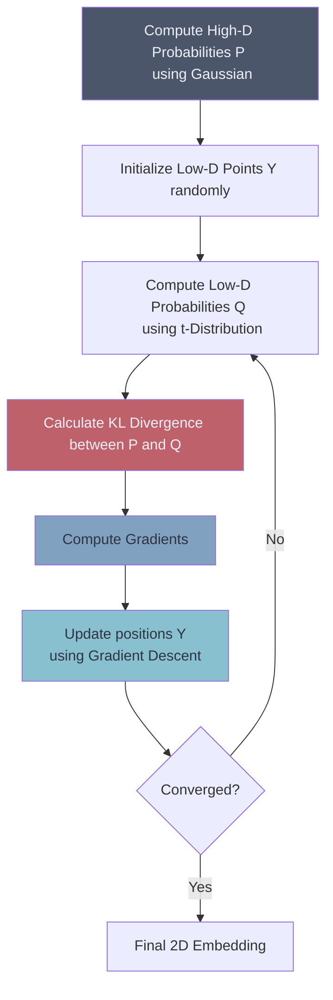

# 🌌 t-Distributed Stochastic Neighbor Embedding (t-SNE)

> **Difficulty**: ⭐⭐⭐⭐⭐ Expert | **Prerequisites**: PCA, Probability Distributions | **Estimated Reading Time**: 35 Minutes

---

## 📋 Table of Contents
1. [What Problem Does This Solve?](#1-what-problem-does-this-solve)
2. [Intuition](#2-intuition)
3. [Core Mathematics](#3-core-mathematics)
4. [Algorithm Workflow](#4-algorithm-workflow)
5. [Scikit-Learn Implementation](#5-scikit-learn-implementation)
6. [Hyperparameter Deep Dive](#6-hyperparameter-deep-dive)
7. [Failure Cases](#7-failure-cases)
8. [Industry Applications](#8-industry-applications)
9. [What's Next?](#9-whats-next)

---

## 1. What Problem Does This Solve?

PCA is a linear algorithm. If your high-dimensional data is twisted up like a ball of yarn, PCA will just squash it flat. It preserves *global* structure (the overall spread of the data) but completely destroys *local* structure (which specific points are close to each other).

**t-SNE** solves the problem of non-linear dimensionality reduction. It takes unbelievably complex, twisted, high-dimensional datasets and maps them down to 2D or 3D while flawlessly preserving local neighborhoods. It is arguably the best algorithm in the world for data visualization.

---

## 2. Intuition

### 🟢 Beginner
Imagine you have a map of the world drawn on a 3D globe. You want to draw it on a flat 2D piece of paper. If you just squash the globe flat (PCA), continents will overlap and tear. 
Instead, imagine connecting every city on the globe with a rubber band. Close cities have thick, tight rubber bands. Far cities have thin, loose rubber bands. You take all these cities and throw them randomly onto a flat 2D floor. The rubber bands will pull the close cities together and push the far cities apart until they reach a stable, flat map that respects the original relationships.

### 🟡 Intermediate
t-SNE stands for t-Distributed Stochastic Neighbor Embedding. 
*   **Stochastic Neighbor**: It calculates the probability that point A would pick point B as its neighbor. 
*   **Embedding**: It tries to find a lower-dimensional embedding (2D/3D map) that has the exact same neighborhood probabilities.
*   **t-Distributed**: It uses a Student's t-distribution in the low-dimensional space to solve the "Crowding Problem" (preventing points from collapsing into a single dense dot).

### 🔴 Advanced
t-SNE minimizes the Kullback-Leibler (KL) divergence between two probability distributions over pairs of points. $P$ measures pairwise similarities in the high-dimensional space using a Gaussian distribution. $Q$ measures pairwise similarities in the low-dimensional space using a heavy-tailed Student's t-distribution. It uses gradient descent to move the points in the low-dimensional space to minimize this KL divergence.

---

## 3. Core Mathematics

### 1. High-Dimensional Affinities (P)
We define the conditional probability $p_{j|i}$ that point $x_i$ would pick $x_j$ as its neighbor based on a Gaussian centered at $x_i$:
$$ p_{j|i} = \frac{\exp(-||x_i - x_j||^2 / 2\sigma_i^2)}{\sum_{k \neq i} \exp(-||x_i - x_k||^2 / 2\sigma_i^2)} $$
We symmetrize this to get the joint probability $p_{ij}$:
$$ p_{ij} = \frac{p_{j|i} + p_{i|j}}{2N} $$

### 2. Low-Dimensional Affinities (Q)
In the 2D/3D space, we map $x_i$ to $y_i$. Instead of a Gaussian, we use a Student's t-distribution with 1 degree of freedom (which has heavy tails) to calculate $q_{ij}$:
$$ q_{ij} = \frac{(1 + ||y_i - y_j||^2)^{-1}}{\sum_{k \neq l} (1 + ||y_k - y_l||^2)^{-1}} $$
*The heavy tail allows moderately distant points in high-dimensional space to be pushed much further apart in low-dimensional space, solving the crowding problem.*

### 3. Gradient Descent (KL Divergence)
We minimize the KL Divergence between $P$ and $Q$:
$$ C = KL(P || Q) = \sum_{i} \sum_{j} p_{ij} \log \frac{p_{ij}}{q_{ij}} $$
The gradient used to update the 2D points $y_i$ is akin to an N-body physics simulation (attractive and repulsive forces).

---

## 4. Algorithm Workflow



1.  **Pre-processing (Optional but recommended)**: If you have >50 dimensions, use PCA to reduce the data to ~50 dimensions first. This suppresses noise and massively speeds up t-SNE.
2.  **Calculate $P$**: Calculate pairwise distances in the high-dimensional space.
3.  **Optimize**: Use gradient descent to arrange the points in 2D space until the map $Q$ perfectly mimics $P$.

*(Note: Because t-SNE relies on complex N-body force gradients, writing it from scratch in pure Python is extremely slow and requires Barnes-Hut approximations ($O(N \log N)$). Therefore, we skip the from-scratch implementation and rely on Scikit-Learn's highly optimized C++ backend).*

---

## 5. Scikit-Learn Implementation

```python
from sklearn.manifold import TSNE
from sklearn.decomposition import PCA
from sklearn.preprocessing import StandardScaler

# 1. Scale Data
X_scaled = StandardScaler().fit_transform(X)

# 2. (Optional but Best Practice) PCA down to 50 dimensions first
pca = PCA(n_components=50)
X_pca = pca.fit_transform(X_scaled)

# 3. Initialize and Fit t-SNE
tsne = TSNE(
    n_components=2, 
    perplexity=30,      # Balance between local/global structure
    learning_rate=200, 
    n_iter=1000, 
    random_state=42
)
X_tsne = tsne.fit_transform(X_pca) # Note: t-SNE does NOT have a .transform() method

print(f"Original shape: {X.shape}")
print(f"t-SNE shape: {X_tsne.shape}")
```

---

## 6. Hyperparameter Deep Dive

t-SNE is **extremely** sensitive to hyperparameters. Changing them completely alters the resulting plot.

*   **`perplexity`**: Think of this as a smooth measure of the effective number of neighbors. 
    *   Typical values: 5 to 50. 
    *   *Too low (e.g., 2)*: The plot will look like random speckles of tiny clusters. 
    *   *Too high*: The plot merges into one giant, unstructured blob.
*   **`n_iter`**: Number of iterations for gradient descent. If the clusters look "pinched" or dense in the center, it probably hasn't converged. Increase to 2000-5000.
*   **`learning_rate`**: Typically between 10 and 1000. If too high, data looks like a uniform ball. If too low, data is compressed into a tight, dense cloud with few outliers.

---

## 7. Failure Cases

t-SNE is a visualization tool, NOT a general-purpose dimensionality reduction tool.

1.  **No `transform` method**: You cannot train a t-SNE model on training data and then apply it to test data. It learns an embedding specifically for the points it is given.
2.  **Distance is Meaningless**: The distance between two distinct clusters in a t-SNE plot means *nothing*. Cluster A might be right next to Cluster B, but in reality, they could be millions of miles apart. t-SNE only guarantees that points *inside* a cluster are close.
3.  **Size is Meaningless**: A large, spread-out cluster in t-SNE does not mean it has high variance in the original space. t-SNE expands dense clusters and shrinks sparse ones.
4.  **Computational Complexity**: Even with approximations, it scales terribly beyond 100,000 records.

---

## 8. Industry Applications

*   **Genomics (Single-Cell RNA Sequencing)**: Visualizing millions of cells to identify distinct cell types. t-SNE revolutionized modern biology.
*   **NLP Word Embeddings**: Taking 300-dimensional Word2Vec or GloVe vectors and mapping them to 2D to see how words cluster by semantic meaning.
*   **Computer Vision**: Visualizing the internal hidden layers of a Convolutional Neural Network (CNN) to see what features the network is learning.

---

## 9. What's Next?

### Summary
t-SNE is a masterpiece of non-linear visualization. It uses probability distributions to pull similar points together and push dissimilar points apart, generating stunning 2D islands of data.

### Why it matters
Before t-SNE, visualizing anything beyond linear PCA was nearly impossible. It allows humans to actually "see" the structure of complex datasets like MNIST, word vectors, and gene sequences.

### Next Topic
t-SNE is brilliant, but it is slow, it destroys global distances, and it cannot be applied to new test data. What if we could fix all three of these flaws? We will look at **UMAP** (Uniform Manifold Approximation and Projection), the modern successor that has largely dethroned t-SNE in the data science community.

[← Principal Component Analysis](07-Principal-Component-Analysis.md) | [Return to Unsupervised Index](../README.md) | [Next: UMAP →](09-UMAP-Introduction.md)
