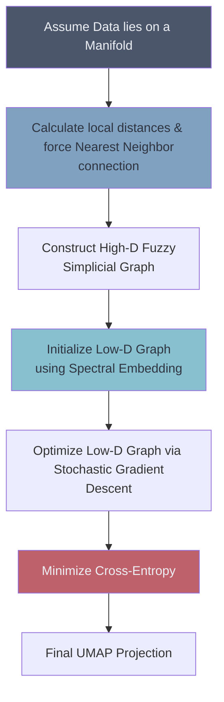

# 🌌 Uniform Manifold Approximation and Projection (UMAP)

> **Difficulty**: ⭐⭐⭐⭐⭐ Expert | **Prerequisites**: t-SNE, Topology | **Estimated Reading Time**: 30 Minutes

---

## 📋 Table of Contents
1. [What Problem Does This Solve?](#1-what-problem-does-this-solve)
2. [Intuition](#2-intuition)
3. [Core Mathematics](#3-core-mathematics)
4. [Algorithm Workflow](#4-algorithm-workflow)
5. [Python Implementation](#5-python-implementation)
6. [Hyperparameter Deep Dive](#6-hyperparameter-deep-dive)
7. [Failure Cases](#7-failure-cases)
8. [Industry Applications](#8-industry-applications)
9. [What's Next?](#9-whats-next)

---

## 1. What Problem Does This Solve?

t-SNE is brilliant for visualization, but it has three severe limitations:
1.  **Speed**: It scales terribly ($O(N^2)$ without approximations, $O(N \log N)$ with).
2.  **Global Structure**: It completely destroys the macro-level relationships between clusters. Cluster A might be similar to Cluster B, but t-SNE will place them randomly on the map.
3.  **No New Data**: You cannot train a t-SNE model and then easily project *new, unseen* data into the same space.

**UMAP** solves all three. It is significantly faster, it preserves both local and global structure, and it allows for the transformation of new data, making it suitable as a general-purpose dimensionality reduction technique for Machine Learning pipelines (not just visualization).

---

## 2. Intuition

### 🟢 Beginner
Imagine the t-SNE rubber band analogy. UMAP uses a similar rubber band concept, but with a crucial difference. UMAP assumes that the data is uniformly distributed across some complex shape (a manifold) in high-dimensional space. To make this assumption true, UMAP individually warps the notion of "distance" around every single data point. It guarantees that every data point has at least one neighbor right next to it. Then, it uses a highly efficient optimization technique to lay the rubber bands out flat.

### 🟡 Intermediate
UMAP constructs a high-dimensional graph representing the data. It connects points with edges whose weights represent the likelihood that two points are connected. Unlike t-SNE, UMAP forces a local connectivity constraint—every point *must* connect to its nearest neighbor with a weight of 1.0. It then optimizes a low-dimensional graph to be as structurally similar to the high-dimensional graph as possible.

### 🔴 Advanced
UMAP's foundation is pure Riemannian Geometry and Algebraic Topology. It assumes:
1. The data is uniformly distributed on a Riemannian manifold.
2. The Riemannian metric is locally constant (or can be approximated as such).
3. The manifold is locally connected.
UMAP constructs a fuzzy topological representation (a fuzzy simplicial complex) of the data and optimizes the low-dimensional embedding by minimizing the **Cross-Entropy** between the high-dimensional and low-dimensional fuzzy sets.

---

## 3. Core Mathematics

### 1. High-Dimensional Fuzzy Set (Graph)
For each point $x_i$, UMAP defines a local Riemannian metric. The probability of an edge existing between $x_i$ and $x_j$ is:
$$ p_{i|j} = \exp\left(-\frac{d(x_i, x_j) - \rho_i}{\sigma_i}\right) $$
Where:
*   $d(x_i, x_j)$ is the distance.
*   $\rho_i$ is the distance to the *nearest* neighbor (ensuring local connectivity).
*   $\sigma_i$ is the smoothing parameter (similar to t-SNE's variance, tuned via a target number of nearest neighbors).

The probabilities are symmetrized using fuzzy set union:
$$ p_{ij} = p_{i|j} + p_{j|i} - p_{i|j}p_{j|i} $$

### 2. Low-Dimensional Fuzzy Set
In the low-dimensional space (points $y$), the edge probability is modeled as:
$$ q_{ij} = \left( 1 + a ||y_i - y_j||^{2b} \right)^{-1} $$
*(Where $a$ and $b$ are parameters fitted to mimic the `min_dist` hyperparameter).*

### 3. Optimization (Cross-Entropy)
t-SNE minimizes KL Divergence (which only cares about preserving points that are close together). 
UMAP minimizes **Cross-Entropy**:
$$ C = \sum_{i \neq j} \left( p_{ij} \log \frac{p_{ij}}{q_{ij}} + (1 - p_{ij}) \log \frac{1 - p_{ij}}{1 - q_{ij}} \right) $$
The second term is the magic. It explicitly penalizes the algorithm if points that are *far apart* in high-D are placed *close together* in low-D. This is why UMAP preserves global structure better than t-SNE.

---

## 4. Algorithm Workflow



1.  **Graph Construction**: Find the $k$-nearest neighbors for each point. Compute the fuzzy edge weights.
2.  **Initialization**: Use Spectral Embedding (a fast graph layout algorithm) to initially place the points in 2D. (This is much better than t-SNE's random initialization).
3.  **Optimization**: Use Stochastic Gradient Descent (SGD) to minimize the cross-entropy, applying attractive forces along edges and repulsive forces between randomly sampled non-edges.

---

## 5. Python Implementation

UMAP is not built into Scikit-Learn. It is maintained as an independent library: `pip install umap-learn`.

```python
import umap
from sklearn.preprocessing import StandardScaler

# 1. Scale Data
X_scaled = StandardScaler().fit_transform(X)

# 2. Initialize UMAP
reducer = umap.UMAP(
    n_neighbors=15, 
    min_dist=0.1, 
    n_components=2, 
    metric='euclidean',
    random_state=42
)

# 3. Fit and Transform
X_umap = reducer.fit_transform(X_scaled)

# MAGIC! UMAP can project NEW data into the existing space!
# X_test_umap = reducer.transform(X_test_scaled)
```

---

## 6. Hyperparameter Deep Dive

*   **`n_neighbors`**: The number of nearest neighbors used to construct the initial graph. 
    *   *Low values (e.g., 5)*: Focuses heavily on local, fine-grained structure (lots of tiny clusters).
    *   *High values (e.g., 50)*: Focuses on the "big picture" global structure.
*   **`min_dist`**: Controls how tightly UMAP packs points together.
    *   *Low values (e.g., 0.01)*: Points clump together tightly (great for finding clear cluster boundaries).
    *   *High values (e.g., 0.5)*: Points are spread out (great for seeing the internal continuous structure of a cluster).
*   **`metric`**: UMAP supports dozens of metrics, including `cosine`, `manhattan`, and even custom functions.

---

## 7. Failure Cases

1.  **Over-interpretation**: Like t-SNE, the sizes of the clusters and the vast empty spaces between them in a UMAP plot do not necessarily correlate to true variance or true distances in the high-D space.
2.  **Hyperparameter Sensitivity**: While more robust than t-SNE, a bad choice of `n_neighbors` can still yield a misleading map.

---

## 8. Industry Applications

*   **Machine Learning Pipelines**: Because UMAP has a `.transform()` method and is fast, it is heavily used to reduce 10,000 dimensions down to 50 dimensions *before* feeding the data into an XGBoost classifier.
*   **Bioinformatics**: Replaced t-SNE as the industry standard for clustering Single-Cell RNA data.
*   **NLP**: Visualizing document embeddings (BERT vectors) to cluster themes and topics across millions of text documents.

---

## 9. What's Next?

### Summary
UMAP is the state-of-the-art in dimensionality reduction. By utilizing algebraic topology and cross-entropy, it delivers stunning 2D visualizations that preserve both local neighborhoods and global structures, while executing exponentially faster than t-SNE.

### Why it matters
UMAP bridged the gap between visualization (t-SNE) and feature engineering (PCA). It is now considered a mandatory tool in a Data Scientist's arsenal.

### Next Topic
We are now moving entirely away from geometry and distance. What if our data isn't numbers? What if it's items in a shopping cart? We will dive into **Association Rule Mining**, beginning the quest to find out why people who buy Diapers also buy Beer.

[← t-SNE](08-tSNE.md) | [Return to Unsupervised Index](../README.md) | [Next: Association Rule Mining →](10-Association-Rule-Mining.md)
