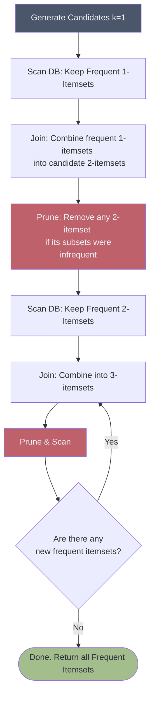

# 🌳 The Apriori Algorithm

> **Difficulty**: ⭐⭐☆☆☆ Intermediate | **Prerequisites**: Association Rule Mining | **Estimated Reading Time**: 25 Minutes

---

## 📋 Table of Contents
1. [What Problem Does This Solve?](#1-what-problem-does-this-solve)
2. [Intuition](#2-intuition)
3. [Core Mathematics (The Apriori Principle)](#3-core-mathematics-the-apriori-principle)
4. [Visual Explanation](#4-visual-explanation)
5. [Algorithm Workflow](#5-algorithm-workflow)
6. [From Scratch Implementation](#6-from-scratch-implementation)
7. [Python Implementation (MLxtend)](#7-python-implementation)
8. [Hyperparameter Deep Dive](#8-hyperparameter-deep-dive)
9. [Failure Cases](#9-failure-cases)
10. [Industry Applications](#10-industry-applications)
11. [What's Next?](#11-whats-next)

---

## 1. What Problem Does This Solve?

In Association Rule Mining, the first step is to find all "Frequent Itemsets" (combinations of items that appear together often). 
If a store has 1,000 unique items, there are $2^{1000} - 1$ possible combinations. Even a supercomputer cannot calculate the Support for every single one of those combinations.

The **Apriori Algorithm** solves this computational nightmare by introducing a mathematical property that allows us to prune (skip) evaluating millions of combinations, making Association Rule Mining actually feasible on modern hardware.

---

## 2. Intuition

### 🟢 Beginner
Imagine you want to find groups of 3 friends who all hang out together frequently. 
Instead of checking every single possible group of 3 people in the city, you use logic: If Alice, Bob, and Charlie hang out frequently together, then it **must** be true that Alice and Bob hang out frequently just the two of them.
So, you first find all pairs of 2 friends who hang out. If Alice and Dave NEVER hang out, you immediately know you never need to check the group [Alice, Dave, Charlie] or [Alice, Dave, Bob]. By building up from small groups to large groups, you save massive amounts of time.

### 🟡 Intermediate
The Apriori Algorithm generates frequent itemsets in a "bottom-up" approach. It starts by finding frequent individual items (size $k=1$). Then it combines them to form candidate pairs ($k=2$). It scans the database to find which pairs are frequent. Then it combines the frequent pairs into triplets ($k=3$), and so on.

### 🔴 Advanced
Apriori's efficiency relies entirely on the **anti-monotone property of support**. This means the support of an itemset never exceeds the support of its subsets. By utilizing a hash tree data structure to count candidate supports and applying the pruning step before the database scan, the algorithm avoids evaluating the entire powerset lattice.

---

## 3. Core Mathematics (The Apriori Principle)

The entire algorithm rests on one unbreakable mathematical law:

**The Apriori Principle**:
> *If an itemset is frequent, then all of its subsets must also be frequent.*

Conversely (and more importantly for pruning):
> *If an itemset is infrequent, then all of its supersets must also be infrequent.*

**Mathematical Proof Intuition**:
Let $A$ and $B$ be items. The subset $\{A\}$ occurs every time the superset $\{A, B\}$ occurs, plus potentially more times when $A$ occurs without $B$. Therefore:
$$ \text{Support}(\{A\}) \ge \text{Support}(\{A, B\}) $$

If $\text{Support}(\{A\}) < \text{min\_support}$, then $\text{Support}(\{A, B\})$ is mathematically guaranteed to be $< \text{min\_support}$. We do not even need to scan the database to check $\{A, B\}$.

---

## 4. Visual Explanation



*The Join-Prune-Scan loop of the Apriori algorithm.*

---

## 5. Algorithm Workflow

Let `min_support` = 3.

1.  **Iteration $k=1$**: Count the support of all single items `{A}, {B}, {C}, {D}`. 
    *   Result: `{A}:4, {B}:3, {C}:4, {D}:1`. 
    *   *Prune*: `{D}` is infrequent. Discard it.
2.  **Iteration $k=2$ (Join)**: Create combinations of the surviving items: `{A,B}, {A,C}, {B,C}`. (Notice we completely skipped `{A,D}, {B,D}, {C,D}`).
3.  **Iteration $k=2$ (Scan)**: Scan the DB to count these pairs. 
    *   Result: `{A,B}:2, {A,C}:3, {B,C}:2`.
    *   *Prune*: `{A,B}` and `{B,C}` are $<3$. Discard them.
4.  **Iteration $k=3$ (Join)**: Try to create triplets from the survivors. The only survivor is `{A,C}`. We cannot make a triplet.
5.  **Stop**: The algorithm terminates. Frequent itemsets are `{A}, {B}, {C}, {A,C}`.

---

## 6. From Scratch Implementation

*(Pseudo-code demonstrating the Join and Prune logic)*

```python
def get_frequent_1_itemsets(transactions, min_support):
    # Counts single items and filters them
    pass

def apriori_gen(Lk_minus_1, k):
    # JOIN STEP: Combine itemsets of size k-1 to make size k
    candidates = []
    for itemset1 in Lk_minus_1:
        for itemset2 in Lk_minus_1:
            # Combine if they share the first k-2 items
            new_candidate = itemset1.union(itemset2)
            if len(new_candidate) == k:
                # PRUNE STEP: Check if all subsets of size k-1 are in Lk_minus_1
                if all(subset in Lk_minus_1 for subset in get_subsets(new_candidate, k-1)):
                    candidates.append(new_candidate)
    return set(candidates)

# Main Loop
# L1 = get_frequent_1_itemsets(DB, min_support)
# k = 2
# while Lk_minus_1 is not empty:
#     Ck = apriori_gen(Lk_minus_1, k)
#     Lk = scan_db_and_filter(DB, Ck, min_support)
#     k += 1
```

---

## 7. Python Implementation (MLxtend)

```python
import pandas as pd
from mlxtend.frequent_patterns import apriori

# Assuming 'df' is a One-Hot Encoded pandas DataFrame
# where columns are items and rows are transactions

# use_colnames=True replaces item indices with their actual string names
frequent_itemsets = apriori(df, min_support=0.05, use_colnames=True)

# Add a column for the length (k) of the itemset
frequent_itemsets['length'] = frequent_itemsets['itemsets'].apply(lambda x: len(x))

# Filter to see only itemsets of length 2 or more
multi_itemsets = frequent_itemsets[frequent_itemsets['length'] >= 2]
print(multi_itemsets)
```

---

## 8. Hyperparameter Deep Dive

*   **`min_support`**: The only true hyperparameter of Apriori.
    *   If `min_support` is too high, you only find obvious rules (e.g., Milk $\rightarrow$ Bread).
    *   If `min_support` is too low, the Apriori pruning property loses its power. The algorithm will have to evaluate massive candidate trees and will take hours or days to run.

---

## 9. Failure Cases

1.  **Multiple Database Scans**: Apriori must scan the ENTIRE database on every single iteration $k$. If you have 100 million transactions on disk, reading it 10 times (to find 10-itemsets) is incredibly slow.
2.  **Massive Candidate Generation**: If the frequent 1-itemsets are very large (e.g., 10,000 frequent items), the join step to create 2-itemsets will generate $\approx 50,000,000$ candidates that must be held in memory.
3.  **The FP-Growth Solution**: Because of these flaws, modern systems almost exclusively use the **FP-Growth** (Frequent Pattern Growth) algorithm, which builds a compressed tree in memory and finds rules without candidate generation and with only 2 database scans.

---

## 10. Industry Applications

*   **Market Basket Analysis**: Retailers use it to plan store layouts and cross-selling campaigns.
*   **Auto-Complete & Search**: Analyzing sequences of typed words to suggest the next word.
*   **Intrusion Detection**: Finding frequent patterns of sequential network packets that correlate with a cyber attack.

---

## 11. What's Next?

### Summary
The Apriori Algorithm makes Association Rule Mining computationally possible by leveraging the anti-monotone property of support. By generating candidates bottom-up and pruning any candidate that contains an infrequent subset, it avoids searching the infinite powerset of items.

### Why it matters
Apriori is one of the most famous algorithms in Data Mining. While FP-Growth is faster today, the *logic* of the Apriori Principle is a foundational concept in computer science optimization.

### Next Topic
We are moving to the final pillar of unsupervised learning. We have grouped data, compressed data, and found rules in data. Now, we must find the data that *doesn't belong*. We dive into **Anomaly Detection**.

[← Association Rule Mining](10-Association-Rule-Mining.md) | [Return to Unsupervised Index](../README.md) | [Next: Anomaly Detection →](12-Anomaly-Detection.md)
