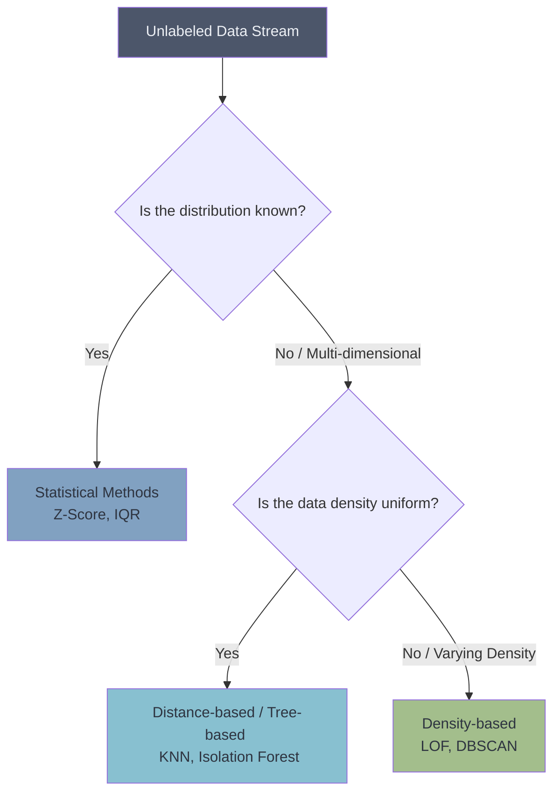

# 🚨 Introduction to Anomaly Detection

> **Difficulty**: ⭐☆☆☆☆ Beginner | **Prerequisites**: Probability Distributions, Statistics | **Estimated Reading Time**: 20 Minutes

---

## 📋 Table of Contents
1. [What Problem Does This Solve?](#1-what-problem-does-this-solve)
2. [Intuition](#2-intuition)
3. [Statistical Foundations](#3-statistical-foundations)
4. [Visual Taxonomy](#4-visual-taxonomy)
5. [Failure Cases of 1D Statistics](#5-failure-cases-of-1d-statistics)
6. [Industry Applications](#6-industry-applications)
7. [What's Next?](#7-whats-next)

---

## 1. What Problem Does This Solve?

The vast majority of machine learning models assume that all the data they are trained on represents "normal" behavior. But what happens when 0.01% of your data represents a hacker breaching your server, a fraudulent credit card swipe, or a tumor on an MRI scan?

**Anomaly Detection (or Outlier Detection)** solves the problem of identifying rare, unusual observations that deviate so significantly from the majority of the data that they arouse suspicion of being generated by a different, abnormal mechanism.

---

## 2. Intuition

### 🟢 Beginner
Imagine you own a coffee shop. Every morning between 7 AM and 9 AM, you have a line out the door, and you sell 300 coffees. One Tuesday, at 8 AM, absolutely no one comes in. You sell 0 coffees. You immediately know something is wrong. You check outside, and a water main broke, flooding the street. 
You didn't need to be trained on 500 examples of water main breaks to know something was wrong. You simply knew what "normal" looked like, and this wasn't it.

### 🟡 Intermediate
Anomaly detection is fundamentally an unsupervised problem because anomalies are, by definition, rare. You almost never have enough labeled examples of anomalies to train a Supervised Classifier (like a Random Forest) to find them. Instead, we train algorithms to build a mathematical fence around the "normal" data. Anything that falls outside the fence is flagged as an anomaly.

### 🔴 Advanced
Anomalies are broadly categorized into three types:
1.  **Point Anomalies**: A single data point is far off from the rest (e.g., a $1,000,000 credit card purchase).
2.  **Contextual Anomalies**: A data point is normal in general, but abnormal in a specific context (e.g., spending $100 on heating in July).
3.  **Collective Anomalies**: Individual points are normal, but their occurrence together as a sequence is abnormal (e.g., a user logging in and out 50 times in 1 minute).

---

## 3. Statistical Foundations

Before jumping into complex machine learning models, we must understand the foundational statistical methods for finding outliers in simple 1-Dimensional data.

### 1. Z-Score Method (Parametric)
Assumes the data follows a Gaussian (Normal) Distribution. The Z-score measures how many standard deviations $\sigma$ a data point $x_i$ is away from the mean $\mu$.
$$ z_i = \frac{x_i - \mu}{\sigma} $$
*   **Rule**: If $|z_i| > 3$, the point is considered an anomaly (covers 99.7% of the data under a normal curve).

### 2. Interquartile Range (IQR) Method (Non-Parametric)
Does not assume a normal distribution. It relies on the median and percentiles, making it highly robust to the outliers themselves.
*   **Q1**: 25th percentile.
*   **Q3**: 75th percentile.
*   **IQR**: $Q3 - Q1$.
*   **Lower Bound**: $Q1 - 1.5 \times \text{IQR}$
*   **Upper Bound**: $Q3 + 1.5 \times \text{IQR}$
*   **Rule**: Any point outside the bounds is an anomaly.

---

## 4. Visual Taxonomy

*Choosing an Anomaly Detection strategy.*

---

## 5. Failure Cases of 1D Statistics

1.  **Multi-dimensional Data**: Z-Score and IQR completely fail when looking at multiple features simultaneously. A person who is 6 feet tall is normal. A person who weighs 100 lbs is normal. But a person who is 6 feet tall AND weighs 100 lbs might be an outlier. 1D methods cannot see this.
2.  **Non-Gaussian Distributions**: If the data follows a power-law distribution (like wealth distribution), the Z-score method will flag 20% of your data as anomalies.
3.  **Masking**: If there are many extreme anomalies, they pull the Mean and Standard Deviation toward themselves, "masking" their own anomalous nature. (This is why IQR is preferred, as medians are robust).

---

## 6. Industry Applications

*   **Cybersecurity**: Detecting network intrusions, DDOS attacks, or unusual lateral movement within a corporate network.
*   **Manufacturing (Predictive Maintenance)**: Sensors on a factory motor measure vibration. A sudden, sustained spike in vibration is an anomaly that indicates the bearing is about to fail.
*   **Finance**: Credit card fraud detection. 
*   **Healthcare**: Detecting tumors in medical imaging or anomalous heartbeat rhythms in ECG data.

---

## 7. What's Next?

### Summary
Anomaly Detection focuses on finding the rare, the strange, and the suspicious. For simple 1-dimensional data, classical statistical methods like the Z-Score and the Interquartile Range (IQR) provide robust mathematical boundaries to flag outliers.

### Why it matters
In many real-world businesses, finding the 1 anomaly is worth more than classifying the 99 normal points. A single undetected fraudulent transaction can cost a bank millions.

### Next Topic
What do we do when our data has 50 dimensions, and classical statistics fail? We must turn to machine learning algorithms specifically engineered to hunt outliers in high-dimensional forests. We will look at the brilliant **Isolation Forest**.

[← Apriori Algorithm](11-Apriori-Algorithm.md) | [Return to Unsupervised Index](../README.md) | [Next: Isolation Forest →](13-Isolation-Forest.md)
