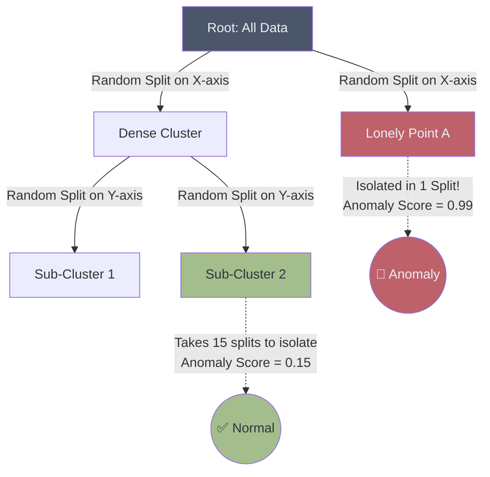

# 🌲 Isolation Forest

> **Difficulty**: ⭐⭐☆☆☆ Intermediate | **Prerequisites**: Decision Trees, Random Forest | **Estimated Reading Time**: 25 Minutes

---

## 📋 Table of Contents
1. [What Problem Does This Solve?](#1-what-problem-does-this-solve)
2. [Intuition](#2-intuition)
3. [Core Mathematics](#3-core-mathematics)
4. [Algorithm Workflow](#4-algorithm-workflow)
5. [Scikit-Learn Implementation](#5-scikit-learn-implementation)
6. [Hyperparameter Deep Dive](#6-hyperparameter-deep-dive)
7. [Failure Cases](#7-failure-cases)
8. [Industry Applications](#8-industry-applications)
9. [What's Next?](#9-whats-next)

---

## 1. What Problem Does This Solve?

Most anomaly detection algorithms (like density-based or distance-based methods) work by defining what is "normal" and then flagging anything that falls outside that definition. This is computationally expensive ($O(N^2)$) and scales terribly to high-dimensional datasets.

**Isolation Forest** completely flips the script. Instead of trying to build a complex profile of "normal" data, it explicitly seeks to *isolate* anomalies. Because anomalies are "few and different," they are incredibly easy to isolate using random splits. Isolation Forest is blazing fast, scales linearly $O(N)$, and works phenomenally well in high-dimensional space.

---

## 2. Intuition

### 🟢 Beginner
Imagine you have a giant jar of 10,000 white marbles and 1 red marble. If you randomly drop a physical divider into the jar to split the marbles in half, and keep dropping dividers into the sections, it will take *many* dividers to isolate a single specific white marble, because there are thousands of them clumped together. 
But because the red marble is an anomaly (perhaps it's slightly larger or sits away from the center), a random divider is highly likely to trap it alone very quickly. Isolation Forest uses random splits to see how quickly a point gets trapped alone. Fast trap = Anomaly.

### 🟡 Intermediate
Isolation Forest builds an ensemble of completely Random Decision Trees (Isolation Trees or iTrees). At each node, it picks a random feature and a random split value. It tracks how many splits (path length) it takes to isolate a data point into a leaf node of size 1. 
*   Normal points are clustered tightly together in the center of the data, so it takes many random cuts to separate them.
*   Anomalies are far away and sparse, so a random cut will slice them off into their own leaf node very early in the tree (short path length).

### 🔴 Advanced
The algorithm leverages the mathematical properties of Binary Search Trees (BSTs). The average path length of an unsuccessful search in a BST is analogous to the path length of an external node in an iTree. By comparing the path length of a data point $x$ against the theoretical average path length of a tree built with $n$ nodes, the algorithm produces a normalized Anomaly Score between 0 and 1.

---

## 3. Core Mathematics

### Path Length $h(x)$
The path length $h(x)$ of an observation $x$ is the number of edges $x$ traverses from the root node to a terminating node.

### Average Path Length $c(n)$
To normalize $h(x)$, we calculate the average path length of an unsuccessful search in a BST given $n$ data points:
$$ c(n) = 2H(n-1) - \frac{2(n-1)}{n} $$
Where $H(i)$ is the harmonic number (approximated as $\ln(i) + 0.5772156649$).

### The Anomaly Score $s(x, n)$
The final anomaly score is calculated as:
$$ s(x, n) = 2^{-\frac{E(h(x))}{c(n)}} $$
Where $E(h(x))$ is the average path length of $x$ across all isolation trees in the forest.

**Interpretation:**
*   If $s \approx 1$, the point is an anomaly (short path length).
*   If $s < 0.5$, the point is safely normal (long path length).
*   If all points return $s \approx 0.5$, there are no distinct anomalies.

---

## 4. Algorithm Workflow



**Training Phase:**
1.  **Sub-sampling**: Randomly select a small sub-sample (e.g., 256 records) from the dataset.
2.  **Tree Building**: Build an iTree by recursively selecting a random feature and a random split value between the min and max of that feature. Stop when every point is isolated or a max depth limit is reached.
3.  **Ensemble**: Repeat this process to build $T$ trees (e.g., 100 trees).

**Scoring Phase:**
1.  Pass every data point down all $T$ trees.
2.  Calculate the average path length $E(h(x))$.
3.  Convert the path length to the normalized Anomaly Score $s(x, n)$.

---

## 5. Scikit-Learn Implementation

```python
from sklearn.ensemble import IsolationForest
import numpy as np

# 1. Initialize Model
# contamination is the expected percentage of anomalies in the dataset
iso_forest = IsolationForest(
    n_estimators=100, 
    max_samples='auto', 
    contamination=0.05, # Expecting 5% anomalies
    random_state=42
)

# 2. Fit and Predict
# Returns 1 for normal, -1 for anomaly
predictions = iso_forest.fit_predict(X)

# 3. Extract raw anomaly scores (Negative values are anomalies in sklearn's implementation)
scores = iso_forest.decision_function(X)

anomalies = X[predictions == -1]
print(f"Found {len(anomalies)} anomalies out of {len(X)} records.")
```

---

## 6. Hyperparameter Deep Dive

*   **`contamination`**: Extremely important. This is the proportion of outliers in the dataset. If you set it to 0.1, the algorithm will literally flag the top 10% of points with the shortest path lengths as anomalies. If you don't know the exact proportion, set it to `'auto'`.
*   **`n_estimators`**: Number of trees. 100 is usually sufficient because the path lengths converge very quickly.
*   **`max_samples`**: The number of samples to draw to train each tree. Sub-sampling is the secret to Isolation Forest's success. It prevents "swamping" (normal points masking anomalies) and "masking" (anomalies clustering together to look normal). `256` is the standard default and mathematically proven to be sufficient for almost any dataset size.

---

## 7. Failure Cases

1.  **Axis-Parallel Splits**: Because iTrees use standard decision tree splits (one feature at a time), they can only draw axis-parallel boxes. They struggle with anomalies that exist on diagonal manifolds. (This is solved by *Extended Isolation Forest*, which draws random hyperplanes at any angle).
2.  **High-Density Anomalies**: If a hacker injects 5,000 identical fraudulent transactions into a system, those transactions will form a dense micro-cluster. Isolation Forest might view this dense cluster as "normal" because it takes many splits to isolate them. (This is why the `max_samples` sub-sampling limit is strictly enforced).

---

## 8. Industry Applications

*   **Fraud Detection at Scale**: The default algorithm for credit card and e-commerce fraud because it can process millions of transactions linearly without collapsing RAM.
*   **Server Log Monitoring**: Analyzing millions of server requests per minute to find anomalous IP behaviors or DDOS vectors.
*   **IoT Sensor Data**: Processing high-dimensional telemetry data from industrial equipment.

---

## 9. What's Next?

### Summary
Isolation Forest flips the paradigm of anomaly detection. Instead of profiling normal data, it explicitly hunts anomalies by seeing how fast a point gets isolated by random geometric cuts. By utilizing sub-sampling and tree ensembles, it operates with staggering speed and accuracy in high dimensions.

### Why it matters
For modern Big Data, distance-based methods like KNN are dead due to $O(N^2)$ complexity. Isolation Forest is the undisputed king of high-volume, high-dimensional anomaly detection in production systems.

### Next Topic
Isolation forest looks at global isolation. But what if a point is normal in a global sense, but an anomaly relative to its specific local neighborhood? We will look at our final algorithm, **Local Outlier Factor (LOF)**, which uses density to find these sneaky contextual anomalies.

[← Anomaly Detection](12-Anomaly-Detection.md) | [Return to Unsupervised Index](../README.md) | [Next: Local Outlier Factor →](14-Local-Outlier-Factor.md)
