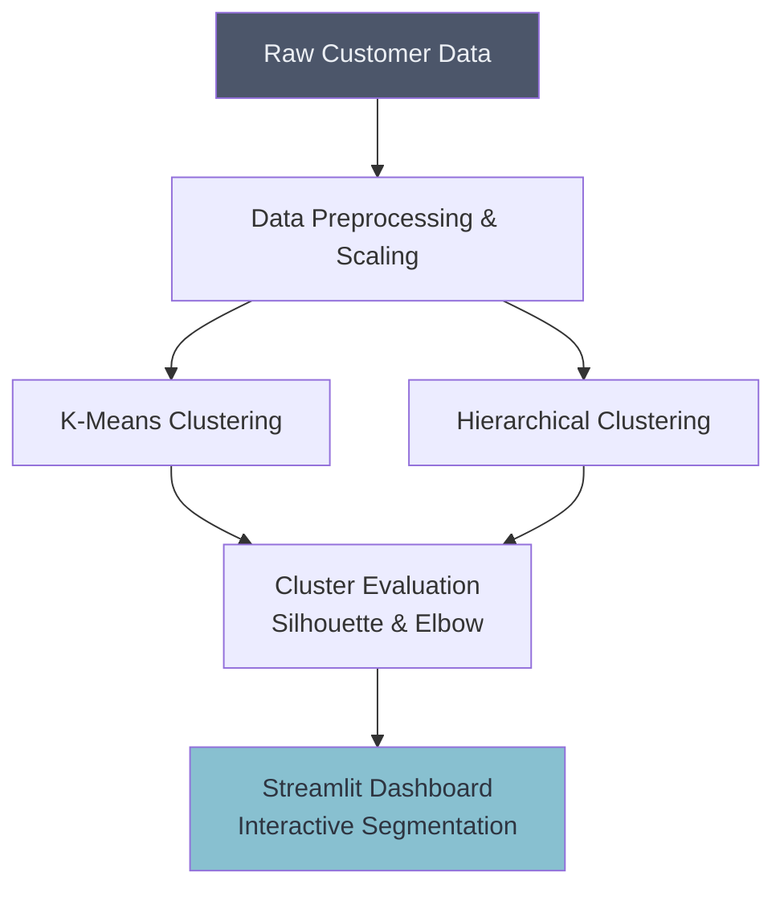

# 👥 Customer Segmentation System

## Overview
This project applies K-Means and Hierarchical Clustering to group customers based on their purchasing behavior. By segmenting customers into distinct clusters, businesses can deploy targeted marketing strategies.

## Architecture

## Project Structure
*   `data/`: Contains the customer datasets (e.g., Mall_Customers.csv).
*   `notebooks/`: Jupyter notebooks with EDA and cluster training.
*   `src/`: Python scripts for data processing and model definitions.
*   `app.py`: Streamlit dashboard for interactive visualization.

## How to Run
1. Install dependencies: `pip install streamlit scikit-learn pandas matplotlib seaborn plotly`
2. Run the dashboard: `streamlit run app.py`
