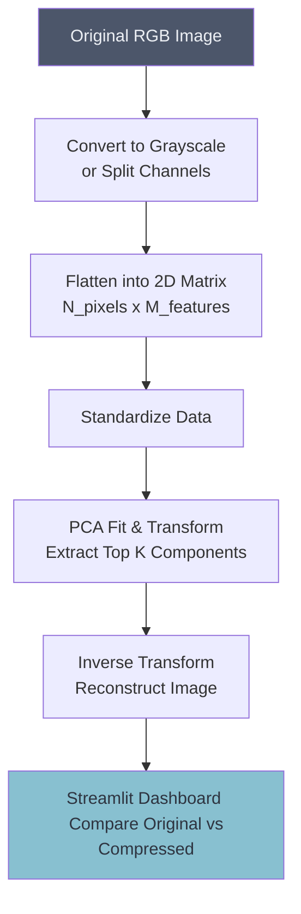

# 🖼️ PCA Image Compression

## Overview
This project demonstrates the power of Principal Component Analysis (PCA) by compressing high-resolution images. By retaining only the principal components that explain the vast majority of the variance (e.g., 95%), we can drastically reduce the dimensionality and storage size of the image with minimal perceptual loss.

## Architecture

## Project Structure
*   `data/`: Image datasets for compression testing.
*   `notebooks/`: Eigenface exploration and manual PCA compression.
*   `src/`: Python scripts containing the PCA compression pipeline.
*   `app.py`: Streamlit dashboard for interactive image upload and real-time compression.

## How to Run
1. Install dependencies: `pip install streamlit scikit-learn pillow numpy matplotlib`
2. Run the dashboard: `streamlit run app.py`
