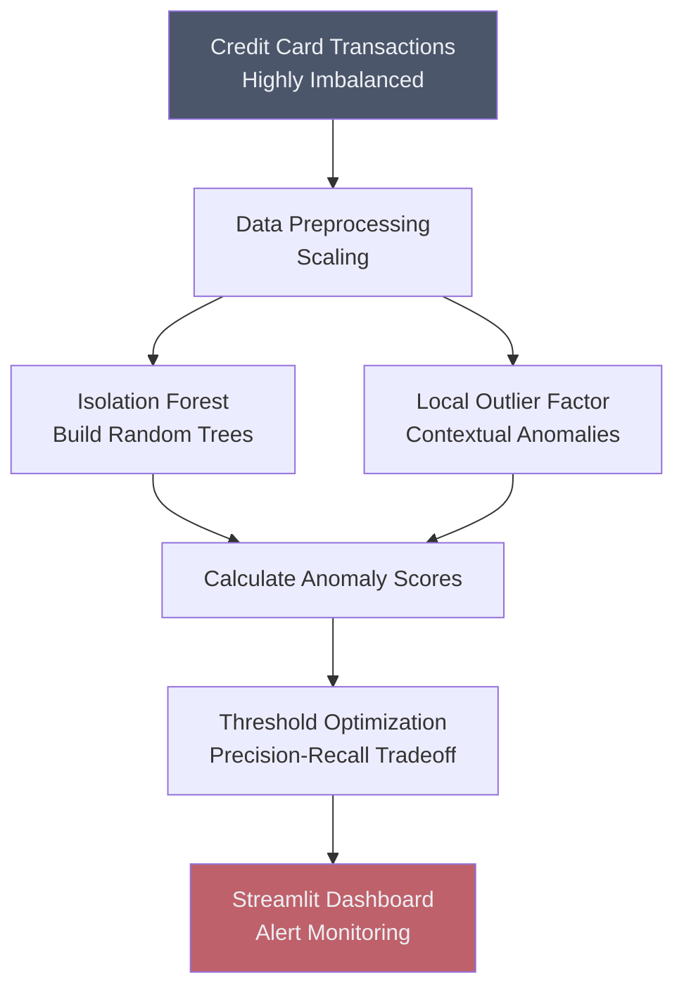

# 🕵️ Credit Card Fraud Detection

## Overview
This project uses unsupervised anomaly detection to identify fraudulent credit card transactions. Traditional supervised learning struggles here because fraud is extremely rare (highly imbalanced data). Isolation Forest is perfectly suited to isolate these rare events rapidly in high-dimensional space.

## Architecture

## Project Structure
*   `data/`: Transaction logs (e.g., creditcard.csv).
*   `notebooks/`: Comparison between Isolation Forest and LOF.
*   `src/`: Python scripts for model training and inference.
*   `app.py`: Streamlit dashboard for real-time transaction monitoring.

## How to Run
1. Install dependencies: `pip install streamlit scikit-learn pandas numpy matplotlib seaborn`
2. Run the dashboard: `streamlit run app.py`
