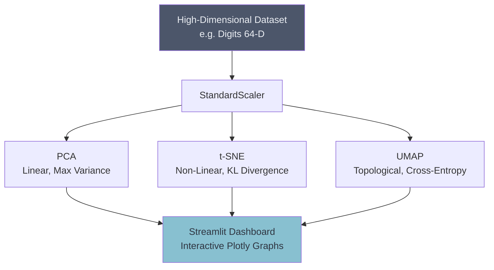

# 🌌 Dimensionality Reduction Dashboard

## Overview
This project provides an interactive playground to compare the three titans of dimensionality reduction: Principal Component Analysis (PCA), t-SNE, and UMAP. It allows users to project high-dimensional datasets (like the Digits dataset) into 2D or 3D and visually observe how each algorithm handles global variance vs. local neighborhood preservation.

## Architecture

## Project Structure
*   `data/`: High-dimensional datasets.
*   `notebooks/`: Algorithm timing comparisons.
*   `src/`: Python scripts for algorithm wrappers.
*   `app.py`: Streamlit dashboard for interactive plotting.

## How to Run
1. Install dependencies: `pip install streamlit scikit-learn umap-learn plotly pandas numpy matplotlib`
2. Run the dashboard: `streamlit run app.py`
