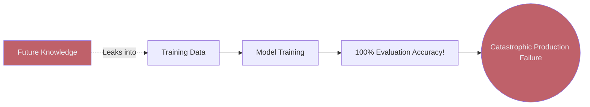
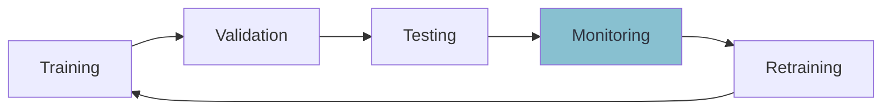

# 📏 Introduction to Model Evaluation

> **Difficulty**: ⭐☆☆☆☆ Beginner | **Prerequisites**: Basic Machine Learning Concepts | **Estimated Reading Time**: 20 Minutes

---

## 📋 Table of Contents
1. [The Great Machine Learning Illusion](#1-the-great-machine-learning-illusion)
2. [Why Evaluation Matters More Than Training](#2-why-evaluation-matters-more-than-training)
3. [Common Misconceptions](#3-common-misconceptions)
4. [Data Leakage: The Silent Killer](#4-data-leakage-the-silent-killer)
5. [Real-World Evaluation Workflow](#5-real-world-evaluation-workflow)
6. [Industry Case Studies](#6-industry-case-studies)
7. [Key Takeaways](#7-key-takeaways)
8. [What's Next?](#8-whats-next)

---

## 1. The Great Machine Learning Illusion

### 🟢 Beginner Intuition
When you first learn Machine Learning, the workflow seems deceptively simple:
1. Load data.
2. Call `model.fit(X, y)`.
3. Call `model.predict(X_new)`.

You look at the predictions, they match the labels perfectly, and you feel like a genius. **This is an illusion.** 

Training a model to memorize data is trivial. Even a simple Decision Tree can achieve 100% accuracy on its training data if allowed to grow deep enough. The true goal of Machine Learning is **Generalization**: the ability of a model to perform well on *unseen* data it has never encountered before.

---

## 2. Why Evaluation Matters More Than Training

Model evaluation is often more challenging and far more important than model training. Anyone can train a model, but proving that it works reliably in production requires extreme rigor.

### 🟡 Intermediate Understanding
In the real world, models are deployed to make decisions that impact money, health, and human lives.
*   If a spam filter is wrong, an important email goes to the junk folder.
*   If a Zillow housing model is wrong, the company loses hundreds of millions of dollars.
*   If an autonomous driving model is wrong, people die.

If your evaluation pipeline is flawed, you will deploy a terrible model while believing it is a great one. Examples of model failures caused by poor evaluation include models degrading silently over time because nobody monitored their real-world performance, or models that learned racial/gender biases because the evaluation metric hid subgroup performance.

---

## 3. Common Misconceptions

### 🔴 Advanced Concepts
Let's shatter the most common myths regarding model evaluation:

*   **High accuracy $\neq$ good model**: If your dataset has 99% non-fraudulent transactions and 1% fraud, a model that simply predicts "Not Fraud" every time will have 99% accuracy. It is also completely useless. (We will cover this in Imbalanced Classification).
*   **More data $\neq$ better model**: Feeding a model terabytes of noisy, mislabeled, or biased data will simply yield a confident, wrong model ("Garbage in, garbage out").
*   **Test set leakage**: If you look at your test set performance and then go back and tweak your model's hyperparameters, your test set is no longer unseen. You have leaked information, invalidating your evaluation.
*   **Metric misuse**: Using Mean Squared Error (MSE) to evaluate a model predicting house prices when there are massive outliers will heavily skew your results. Choosing the right metric is an art.

---

## 4. Data Leakage: The Silent Killer

Data Leakage occurs when information from outside the training dataset is used to create the model. It causes models to perform incredibly well during training/evaluation, and then fail catastrophically in production.

### Visual Explanation

### Examples of Data Leakage:
1.  **Target Leakage**: Including a feature in the training data that will not be available at the time of prediction (e.g., predicting pneumonia but including `took_pneumonia_medication` as a feature).
2.  **Train-Test Contamination**: Applying a transformation (like `StandardScaler` or `PCA`) to the *entire* dataset before splitting it into Train and Test. The scaler learns the Mean and Variance of the *entire* dataset, meaning the Training data now secretly contains mathematical information about the Test data.

---

## 5. Real-World Evaluation Workflow

The industry-standard machine learning lifecycle is an infinite loop, not a straight line.

### ML Lifecycle Diagram

1.  **Training**: The model learns patterns from the data.
2.  **Validation**: Hyperparameters are tuned and model architectures are compared using a validation set.
3.  **Testing**: The final, completely unseen test set provides an unbiased estimate of generalization performance.
4.  **Monitoring**: Once in production, the model's inputs and outputs are tracked for data drift and concept drift.
5.  **Retraining**: As the real-world environment changes, the model is retrained on fresh data to maintain performance.

---

## 6. Industry Case Studies

Why do we care so much about rigorous evaluation and leakage? Because history is full of disasters caused by bad evaluation:

### 🏥 Healthcare
A model was built to predict which pneumonia patients needed intensive care. It incorrectly learned that patients with asthma had a *lower* risk of severe complications. Why? Because asthmatic patients were automatically sent directly to the ICU, where aggressive treatment saved them. The model learned the *effect of the intervention*, not the baseline risk.

### 💳 Finance & Fraud Detection
A credit card fraud model achieved 98% accuracy during testing but missed 80% of actual fraud in production. The team evaluated using Accuracy instead of Recall and Precision on a highly imbalanced dataset.

### 🛒 Recommendation Systems
An e-commerce model boosted click-through rates (CTR) by 20% in offline testing. When deployed, sales plummeted. The model had learned to recommend clickbait items that users clicked but never actually purchased. The team was optimizing for clicks, but the business objective was revenue.

---

## 7. Key Takeaways

*   **Memorization $\neq$ Generalization**: A model's performance on its training data is completely irrelevant.
*   **The Vault**: The Test Set must be kept in a vault. Do not use it to make decisions about your model.
*   **Paranoia is a Virtue**: If your model gets 99.9% accuracy on your first try, you are probably not a genius. You almost certainly have Data Leakage.
*   **Align Metrics with Business**: Your evaluation metric must directly map to the actual business problem you are trying to solve.

---

## 8. What's Next?

Now that we understand the philosophical goal of evaluation, we need to learn the mechanics of how to properly partition our data to simulate the unknown future. 

In the next chapter, we dive into the mechanics of Data Splitting: Holdout Sets, Stratification, and Time-Series splits.

Navigation:

[← Previous Topic](../README.md) | [Back to Index](../README.md) | [Next Topic →](02-Train-Test-Validation-Split.md)
