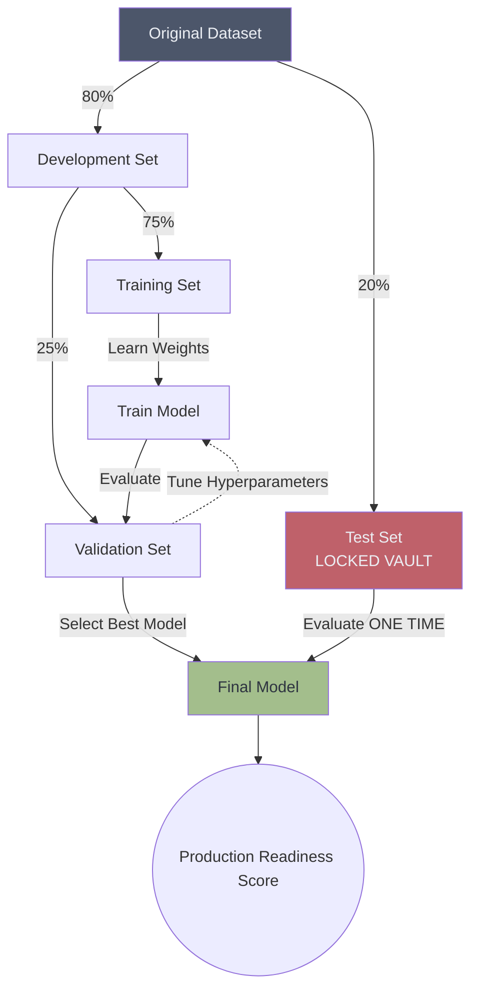
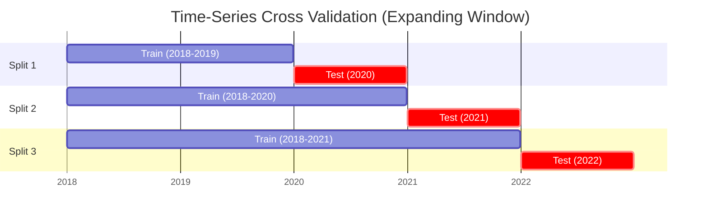
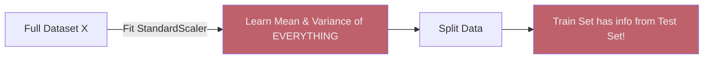

# ✂️ Train, Test, and Validation Splits

> **Difficulty**: ⭐☆☆☆☆ Beginner | **Prerequisites**: Introduction to Model Evaluation | **Estimated Reading Time**: 20 Minutes

---

## 📋 Table of Contents
1. [Holdout Validation & The Three-Way Split](#1-holdout-validation--the-three-way-split)
2. [Visualizing the Split Workflow](#2-visualizing-the-split-workflow)
3. [Stratified Splitting (Handling Imbalance)](#3-stratified-splitting-handling-imbalance)
4. [Time-Series Splitting (The Cardinal Rule)](#4-time-series-splitting-the-cardinal-rule)
5. [Leakage Prevention during Data Prep](#5-leakage-prevention-during-data-prep)
6. [Key Takeaways](#6-key-takeaways)
7. [What's Next?](#7-whats-next)

---

## 1. Holdout Validation & The Three-Way Split

In the introduction, we established that evaluating a model on its training data is a cardinal sin. But simply splitting data into "Train" and "Test" is often not enough for a production Machine Learning workflow.

### 🟢 Beginner Intuition
If you train a model, evaluate it on the Test set, and then adjust the model's hyperparameters (like maximum tree depth) to improve the Test score, **you are leaking Test Set information into the model**. The Test set is no longer an unbiased estimate of future performance.

### 🟡 Intermediate Understanding
To solve this, we use the **Three-Way Split** (also known as Holdout Validation):
1.  **Training Set (60-80%)**: The data the model learns from. It updates its internal weights based on this data.
2.  **Validation Set (10-20%)**: The "Practice Exam". Used by the Data Scientist to tune hyperparameters, compare different algorithms (e.g., Random Forest vs. XGBoost), and perform early stopping. The model *does not* learn from this directly, but the human does.
3.  **Test Set (10-20%)**: The "Final Exam". Locked in a vault. It is used **exactly once** at the very end of the project to get the final metric to report to stakeholders.

---

## 2. Visualizing the Split Workflow

Here is how data flows through a typical Holdout Validation pipeline:



---

## 3. Stratified Splitting (Handling Imbalance)

### The Problem
Imagine a dataset with 1,000 patients, where 50 have a rare disease (5%) and 950 are healthy (95%).
If you perform a completely random 80/20 train/test split, statistical variance might accidentally place all 50 sick patients into the Training set, leaving 0 sick patients in the Test set. Your model's evaluation on the Test set will be completely meaningless.

### The Solution: Stratification
**Stratified Splitting** guarantees that the original distribution of the target class is preserved across all splits.

```python
from sklearn.model_selection import train_test_split, StratifiedKFold
import numpy as np

# ❌ Wrong (Random Split)
X_train, X_test, y_train, y_test = train_test_split(X, y, test_size=0.2)

# ✅ Correct (Stratified Split)
X_train, X_test, y_train, y_test = train_test_split(X, y, test_size=0.2, stratify=y)
```

By using `stratify=y`, Scikit-Learn ensures that both the Training set and the Test set will contain exactly 5% sick patients.

### 🔴 Advanced: Stratified K-Fold
For smaller datasets, we might want to create multiple stratified splits. `StratifiedKFold` ensures every single fold maintains the target distribution:

```python
skf = StratifiedKFold(n_splits=5, shuffle=True, random_state=42)
for train_index, test_index in skf.split(X, y):
    X_train, X_test = X[train_index], X[test_index]
    y_train, y_test = y[train_index], y[test_index]
    # Train and evaluate...
```

---

## 4. Time-Series Splitting (The Cardinal Rule)

If your data has a temporal component (e.g., Stock Prices, Daily Weather, Monthly Sales), **never use a random split.**

### The Problem
If you randomly shuffle 5 years of stock market data and then split it, your Training set will contain data from 2023, and your Test set will contain data from 2021. You are asking the model to predict the *past* using the *future*. This is massive temporal data leakage.

### Time-Series Splitting Diagram


### The Solution: Chronological Splitting
Always split on a specific date. Train on the past, test on the future.

```python
from sklearn.model_selection import TimeSeriesSplit

tscv = TimeSeriesSplit(n_splits=3)
for train_index, test_index in tscv.split(X):
    X_train, X_test = X[train_index], X[test_index]
    y_train, y_test = y[train_index], y[test_index]
    # The training set grows chronologically, the test set is always in the future
```

---

## 5. Leakage Prevention during Data Prep

A common trap for beginners is applying data transformations to the *entire* dataset before splitting. 

### Data Leakage Visualization


### The Bad Workflow (Data Leakage)
```python
# ❌ WRONG! The scaler looks at test data to calculate mean/variance
scaler = StandardScaler()
X_scaled = scaler.fit_transform(X) 

X_train, X_test, y_train, y_test = train_test_split(X_scaled, y)
```

### The Correct Workflow (No Leakage)
```python
# ✅ CORRECT! Split first!
X_train, X_test, y_train, y_test = train_test_split(X, y)

scaler = StandardScaler()
# Scaler ONLY learns from the Training Set
X_train_scaled = scaler.fit_transform(X_train) 

# Scaler applies those learned metrics to the Test Set
X_test_scaled = scaler.transform(X_test) 
```

The easiest way to guarantee you never make this mistake is to use **Scikit-Learn Pipelines**, which strictly enforce this rule internally.

---

## 6. Key Takeaways

1.  **Three splits are better than two**: Train, Validate, Test.
2.  **Stratify Classification Targets**: Always use `stratify=y` for classification to maintain class balance.
3.  **Respect Time**: Never shuffle time-series data. Train on the past, test on the future.
4.  **Split FIRST**: Never apply scalers, PCA, or target encoding to the entire dataset before splitting.

---

## 7. What's Next?

Now that we have securely cordoned off our Validation and Test sets, we need to understand what happens during the Training phase. Why do some models get 100% accuracy on training data but 50% on validation data? Why do others get 60% on both? 

To understand this, we must dive into the most profound theoretical concept in all of Machine Learning: **The Bias-Variance Tradeoff.**

Navigation:

[← Previous Topic](01-Introduction-To-Model-Evaluation.md) | [Back to Index](../README.md) | [Next Topic →](03-Bias-Variance-Tradeoff.md)
