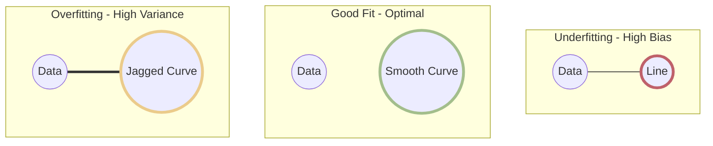
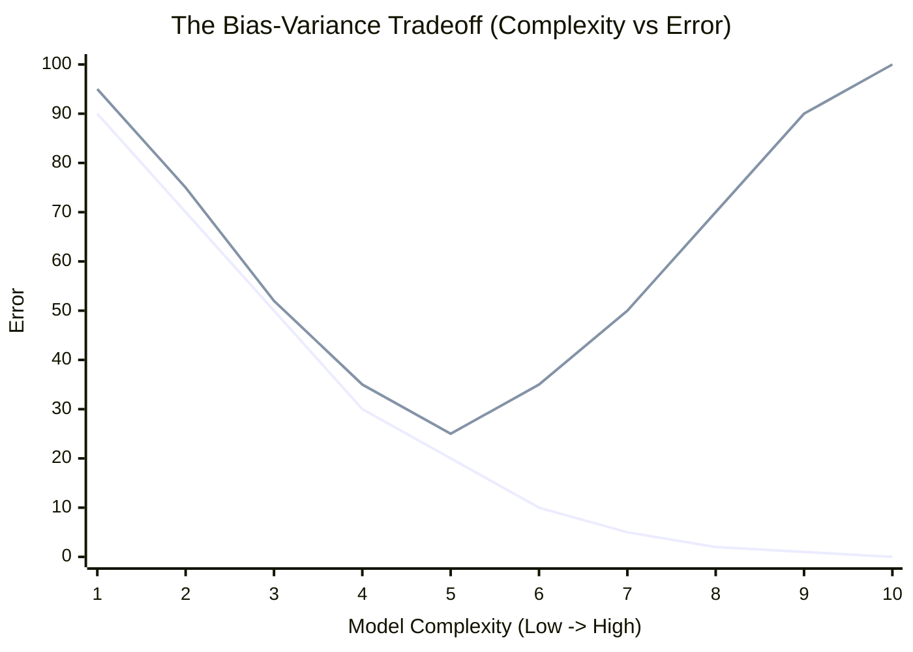

# ⚖️ The Bias-Variance Tradeoff

> **Difficulty**: ⭐⭐⭐☆☆ Intermediate | **Prerequisites**: Train/Test splits, basic calculus/statistics | **Estimated Reading Time**: 25 Minutes

---

## 📋 Table of Contents
1. [The Two Demons of Machine Learning](#1-the-two-demons-of-machine-learning)
2. [Underfitting (High Bias)](#2-underfitting-high-bias)
3. [Overfitting (High Variance)](#3-overfitting-high-variance)
4. [The Good Fit (Generalization)](#4-the-good-fit-generalization)
5. [Visualizing Model Fits](#5-visualizing-model-fits)
6. [Mathematical Decomposition of Error](#6-mathematical-decomposition-of-error)
7. [The Sweet Spot (Visualized)](#7-the-sweet-spot-visualized)
8. [How to Fix Bias and Variance](#8-how-to-fix-bias-and-variance)
9. [Key Takeaways](#9-key-takeaways)
10. [What's Next?](#10-whats-next)

---

## 1. The Two Demons of Machine Learning

When a model makes a mistake, the error is usually caused by one of two completely opposite problems. 

### 🟢 Beginner Intuition
Imagine you are studying for a math exam. 
*   **Demon 1 (Bias)**: You don't study at all. You assume every answer is `C`. You fail because your approach was too simple.
*   **Demon 2 (Variance)**: You memorize the textbook perfectly, word for word. But the exam has a question formatted slightly differently than the textbook. Because you memorized rather than understood, you completely panic and fail.

In Machine Learning, we call these **Underfitting (High Bias)** and **Overfitting (High Variance)**.

---

## 2. Underfitting (High Bias)

**Bias** is the error introduced by approximating a real-world problem with a simplified model.
If the relationship between housing size and price is highly exponential, but you use a simple Linear Regression model, your model has a *bias* towards linearity. It physically cannot capture the true complexity of the data.

### Symptoms of High Bias:
*   Terrible performance on the Training Set.
*   Terrible performance on the Validation Set.
*   The model looks like a straight line cutting through a massive cloud of complex data points.

---

## 3. Overfitting (High Variance)

**Variance** is the error introduced by the model being overly sensitive to small fluctuations in the training data.
If you train a massive 1000-layer Neural Network on 10 data points, the network will weave a completely insane, squiggly mathematical line that touches every single data point perfectly. It has learned the *noise* rather than the *signal*.

### Symptoms of High Variance:
*   Incredible performance on the Training Set (nearly 100% accuracy or 0 Error).
*   Terrible performance on the Validation Set.
*   The model fails to generalize because it thinks the random noise in the training set is a fundamental law of physics.

---

## 4. The Good Fit (Generalization)

The ultimate goal is **Generalization**: the ability to perform well on unseen data. A "Good Fit" model captures the underlying signal (the true trend) while completely ignoring the noise. It strikes the perfect balance between Bias and Variance.

---

## 5. Visualizing Model Fits

Below is a conceptual visualization of how a model fits a curved dataset (like a sine wave with added noise).

*(Imagine the line completely missing the trend for Underfitting, smoothly following the trend for Good Fit, and connecting every single dot erratically for Overfitting).*

---

## 6. Mathematical Decomposition of Error

### 🔴 Advanced Concepts
If we look at the Expected Mean Squared Error (MSE) of an algorithm on an unseen test dataset, we can prove mathematically that the error is composed of three distinct parts:

$$ Expected Error = Bias^2 + Variance + Irreducible Error $$

Let:
*   $y = f(x) + \epsilon$ (The true function plus some random noise $\epsilon$ with zero mean and variance $\sigma^2$)
*   $\hat{f}(x)$ be our Machine Learning model's estimate of $f(x)$.

The Expected Error is:
$$ E\Big[\big(y - \hat{f}(x)\big)^2\Big] = \Big(E[\hat{f}(x)] - f(x)\Big)^2 + E\Big[\big(\hat{f}(x) - E[\hat{f}(x)]\big)^2\Big] + \sigma^2 $$

### The 3 Components:
1.  **Bias ($ \big(E[\hat{f}(x)] - f(x)\big)^2 $)**: The difference between the *average* prediction of our model and the true value. High Bias means the model's fundamental assumptions are wrong.
2.  **Variance ($ E\big[\big(\hat{f}(x) - E[\hat{f}(x)]\big)^2\big] $)**: The variability of the model prediction for a given data point. High Variance means the model is unstable and highly dependent on the exact training data it was given.
3.  **Noise / Irreducible Error ($\sigma^2$)**: The inherent noise in the universe. Even if your model is perfect, you cannot predict a coin flip. This error cannot be reduced by any algorithm.

> [!NOTE]
> Notice the **Tradeoff**. If you use a more complex model (like a Random Forest), you decrease Bias but increase Variance. If you use a simpler model (like Linear Regression), you decrease Variance but increase Bias. You cannot simultaneously decrease both indefinitely.

---

## 7. The Sweet Spot (Visualized)

To find the optimal model, we look at the **Validation Curve**. We plot Model Complexity (x-axis) vs Error (y-axis) for both the Training set and the Validation set.

### Training vs Validation Error Curve

### The Three Zones:
1.  **Left Zone (Underfitting)**: Both Training and Validation errors are extremely high. The model is too simple.
2.  **Right Zone (Overfitting)**: Training error is zero, but Validation error rockets upwards. The model is memorizing noise.
3.  **The Sweet Spot (Complexity = 5)**: The exact point where Validation Error hits its absolute minimum before it starts climbing again. This is where we stop training.

---

## 8. How to Fix Bias and Variance

### Diagnosing High Bias (Underfitting)
If your model is underfitting, getting more data **will not help**. A straight line fed 1 million data points is still just a straight line.
*   **Fix 1**: Increase model complexity (e.g., switch from Linear Regression to a Decision Tree).
*   **Fix 2**: Add more features (Feature Engineering).
*   **Fix 3**: Decrease regularization (e.g., lower the alpha penalty in Ridge/Lasso).

### Diagnosing High Variance (Overfitting)
If your model is overfitting, it is too powerful for the amount of data it has.
*   **Fix 1**: Get more training data (the best solution).
*   **Fix 2**: Decrease model complexity (e.g., limit the maximum depth of your tree).
*   **Fix 3**: Increase regularization (force the model to have smaller weights).
*   **Fix 4**: Use ensemble methods like Random Forests or Dropout (in Neural Networks).

---

## 9. Key Takeaways

*   **Bias** = Underfitting. The model is too simple.
*   **Variance** = Overfitting. The model is too complex and memorizes noise.
*   **The Tradeoff**: As you decrease one, you inevitably increase the other. Your job is to find the minimum point of the Validation curve.

---

## 10. What's Next?

Now that we understand the philosophical and theoretical underpinnings of model error, how do we actually *calculate* it? "Error" is a generic term. 

In the next chapter, we will look at the specific mathematical metrics used to calculate error for continuous numbers: **Regression Metrics**.

Navigation:

[← Previous Topic](02-Train-Test-Validation-Split.md) | [Back to Index](../README.md) | [Next Topic →](04-Regression-Metrics.md)
