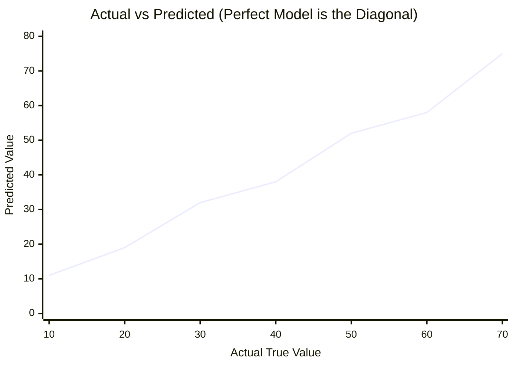
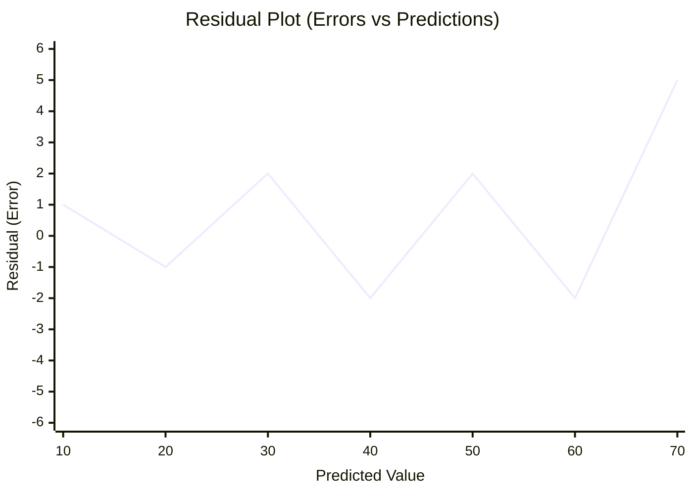
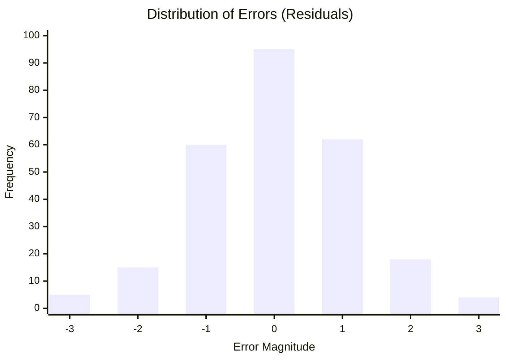

# 📈 Regression Metrics

> **Difficulty**: ⭐⭐☆☆☆ Intermediate | **Prerequisites**: Bias-Variance Tradeoff | **Estimated Reading Time**: 25 Minutes

---

## 📋 Table of Contents
1. [What is Regression Evaluation?](#1-what-is-regression-evaluation)
2. [Absolute Error Metrics (MAE, MAPE, SMAPE)](#2-absolute-error-metrics-mae-mape-smape)
3. [Squared Error Metrics (MSE, RMSE, RMSLE)](#3-squared-error-metrics-mse-rmse-rmsle)
4. [Variance Explained Metrics (R², Adjusted R²)](#4-variance-explained-metrics-r²-adjusted-r²)
5. [Visualizing Regression Performance](#5-visualizing-regression-performance)
6. [Key Takeaways](#6-key-takeaways)
7. [What's Next?](#7-whats-next)

---

## 1. What is Regression Evaluation?

### 🟢 Beginner Intuition
When a model predicts a continuous number (like House Price, Temperature, or Stock Value), it is extremely rare for the prediction to be 100.000% perfect. Therefore, we don't just ask "Is it right or wrong?", we ask **"How wrong is it, on average?"**

Different metrics penalize errors differently. Some forgive small errors and punish massive ones, while others treat all errors equally based on percentages.

---

## 2. Absolute Error Metrics (MAE, MAPE, SMAPE)

These metrics evaluate the absolute distance between the prediction and the true value, without disproportionately penalizing large outliers.

### Mean Absolute Error (MAE)
*   **Formula**: $\frac{1}{n}\sum_{i=1}^{n}|y_i - \hat{y}_i|$
*   **Intuition**: "On average, my house price predictions are off by exactly $5,000."
*   **Advantages**: Very easy to explain to non-technical stakeholders. Robust to massive outliers.
*   **Limitations**: Its gradient is constant, making it harder to optimize mathematically using gradient descent near the minimum.
*   **Business Use Case**: When predicting Uber fare prices, where occasional massive surge-pricing outliers shouldn't completely dominate the model's objective.

### Mean Absolute Percentage Error (MAPE)
*   **Formula**: $\frac{1}{n}\sum_{i=1}^{n}\left|\frac{y_i - \hat{y}_i}{y_i}\right| \times 100\%$
*   **Intuition**: "On average, my predictions are off by 5%."
*   **Advantages**: Scale-independent. It’s easier to tell a CEO "We are off by 5%" than "We are off by 3.5 million units."
*   **Limitations**: It blows up to infinity if the true value $y_i$ is zero. It also penalizes over-predictions more heavily than under-predictions.
*   **Business Use Case**: Retail forecasting across different product lines. (Being off by 10 units on a product that sells 100 vs a product that sells 1,000,000 is very different).

### Symmetric MAPE (SMAPE)
*   **Formula**: $\frac{1}{n}\sum_{i=1}^{n}\frac{|y_i - \hat{y}_i|}{(|y_i| + |\hat{y}_i|) / 2} \times 100\%$
*   **Intuition**: A variation of MAPE that fixes the asymmetry problem (where predicting 200 for a true 100 gave 100% error, but predicting 100 for a true 200 gave 50% error).
*   **Advantages**: Fixes MAPE's asymmetry.
*   **Limitations**: Can still be unstable near zero.

---

## 3. Squared Error Metrics (MSE, RMSE, RMSLE)

These metrics square the errors before averaging them. This means that an error of 10 is punished **100 times worse** than an error of 1.

### Mean Squared Error (MSE)
*   **Formula**: $\frac{1}{n}\sum_{i=1}^{n}(y_i - \hat{y}_i)^2$
*   **Intuition**: The mathematical standard for calculating average squared distance.
*   **Advantages**: Because it is a smooth curve (a parabola), it is perfectly differentiable everywhere, making it the default Loss Function for Neural Networks and gradient-based algorithms.
*   **Limitations**: The unit is squared (e.g., "squared dollars"), making it impossible to interpret for business users.
*   **Business Use Case**: Used internally by algorithms during training, rarely used for final business reporting.

### Root Mean Squared Error (RMSE)
*   **Formula**: $\sqrt{\frac{1}{n}\sum_{i=1}^{n}(y_i - \hat{y}_i)^2}$
*   **Intuition**: Brings the MSE back down to the original units (e.g., dollars instead of squared dollars). It heavily penalizes *huge* mistakes.
*   **Advantages**: Punishes large errors. If being wrong by $100k on one house is fundamentally worse than being wrong by $10k on ten houses, use RMSE.
*   **Limitations**: Extremely sensitive to outliers.
*   **Business Use Case**: Medical dosages, manufacturing tolerances, and autonomous driving. (A massive error could be catastrophic, so the model must be punished heavily for making them).

### Root Mean Squared Logarithmic Error (RMSLE)
*   **Formula**: $\sqrt{\frac{1}{n} \sum_{i=1}^n (\log(y_i + 1) - \log(\hat{y}_i + 1))^2}$
*   **Intuition**: Evaluates the *ratio* of the predicted to the actual values. Predicting 10 for a true value of 20 is penalized the exact same as predicting 100 for a true value of 200.
*   **Advantages**: Does not heavily penalize huge absolute differences if the percentage difference is small.
*   **Business Use Case**: Predicting highly exponential targets like total box office revenue for a movie or viral video views.

---

## 4. Variance Explained Metrics (R², Adjusted R²)

### R-Squared ($R^2$, Coefficient of Determination)
*   **Formula**: $1 - \frac{\sum (y_i - \hat{y}_i)^2}{\sum (y_i - \bar{y})^2}$
*   **Intuition**: "My model explains 85% of the variance in house prices." It compares your model to the dumbest possible baseline (just guessing the average house price every time). 
*   **Advantages**: An intuitive 0 to 1 score (though it can technically be negative if your model is worse than the mean).
*   **Limitations**: $R^2$ will always stay the same or artificially inflate if you add more features, even if those features are completely random noise.

### Adjusted R-Squared
*   **Formula**: $1 - \left[ \frac{(1 - R^2)(n - 1)}{n - k - 1} \right]$
*   **Intuition**: "My model explains 85% of the variance, *and* I only used useful features to do it."
*   **Advantages**: Penalizes the addition of useless features ($k$).
*   **Business Use Case**: Feature selection and statistical analysis of causal inference models.

---

## 5. Visualizing Regression Performance

Metrics are just numbers. A good Data Scientist always visualizes the errors.

### 1. Actual vs Predicted Plot

*   **How to read**: Points should hug the 45-degree diagonal line. If they curve away at the high end, your model systematically underpredicts high values.

### 2. Residual Plot
A residual is the difference between the true value and the prediction ($y - \hat{y}$).

*   **How to read**: The points should look like a random cloud of white noise scattered around the $y=0$ line. If you see a pattern (like a funnel shape or a U-shape), your model is fundamentally missing a non-linear relationship in the data.

### 3. Error Distribution (Histogram)

*   **How to read**: The errors should ideally form a normal (Gaussian) distribution centered at zero. If the distribution is heavily skewed, your model is systematically biased in one direction.

---

## 6. Key Takeaways

1.  **Use MAE for Business**: It is the easiest to explain and robust to outliers.
2.  **Use RMSE for Safety**: It heavily punishes large, catastrophic errors.
3.  **Use MAPE/RMSLE for Scale**: When percentage errors matter more than absolute units.
4.  **Always Visualize**: Never trust a single metric. Look at the Residual Plot to ensure your model didn't miss a non-linear trend.

---

## 7. What's Next?

We've covered how to evaluate continuous predictions. But what if our model is predicting categories? "Dog vs Cat", "Fraud vs Not Fraud"?

In the next chapter, we will leave the world of distances and enter the world of probabilities: **Classification Metrics**.

Navigation:

[← Previous Topic](03-Bias-Variance-Tradeoff.md) | [Back to Index](../README.md) | [Next Topic →](05-Classification-Metrics.md)
