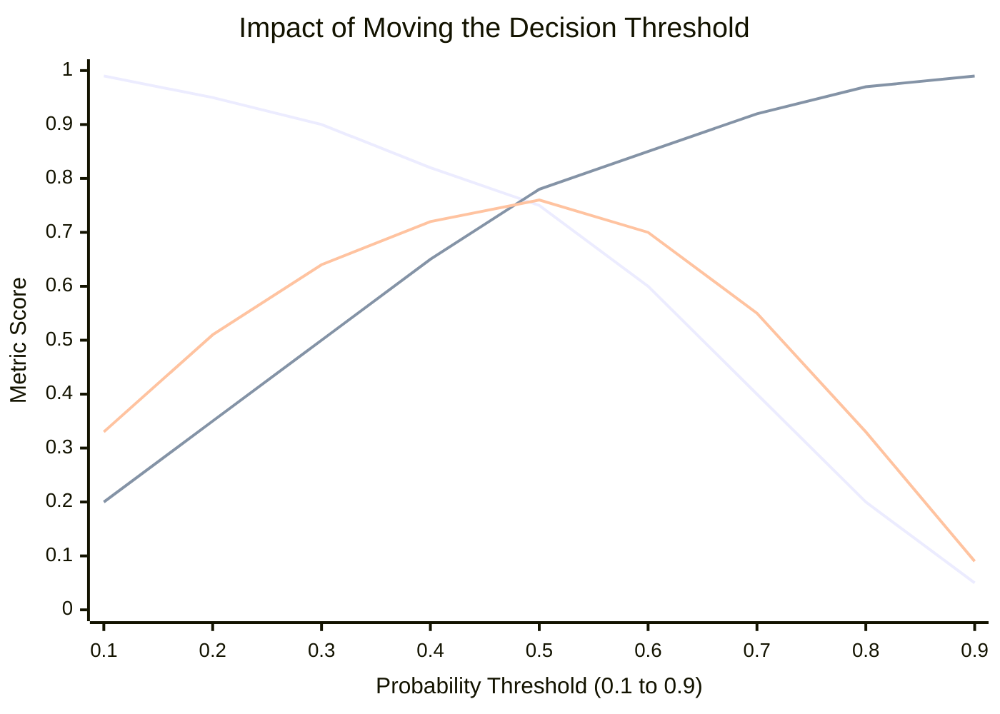

# 📊 Classification Metrics

> **Difficulty**: ⭐⭐☆☆☆ Intermediate | **Prerequisites**: Regression Metrics | **Estimated Reading Time**: 25 Minutes

---

## 📋 Table of Contents
1. [The Accuracy Paradox](#1-the-accuracy-paradox)
2. [The Core Metrics (Precision, Recall, Specificity)](#2-the-core-metrics-precision-recall-specificity)
3. [Combined Metrics (F1, Balanced Accuracy, MCC)](#3-combined-metrics-f1-balanced-accuracy-mcc)
4. [Visualizing Threshold Impacts](#4-visualizing-threshold-impacts)
5. [Key Takeaways](#5-key-takeaways)
6. [What's Next?](#6-whats-next)

---

## 1. The Accuracy Paradox

### 🟢 Beginner Intuition
**Accuracy** is the most intuitive metric: "How many did I get right out of all my guesses?"
*   **Formula**: $\frac{True Positives + True Negatives}{Total Predictions}$
*   **Intuition**: The overall percentage of correct predictions.

However, Accuracy can be **very dangerous** due to the *Accuracy Paradox*. 

### The Failure Scenario
Imagine a dataset with 10,000 transactions. 9,990 are legitimate (Not Fraud), and 10 are Fraudulent. 
If you build a completely useless model that just says "Not Fraud" for every single transaction, it will be **99.9% accurate!** But it completely failed its business objective of catching fraud. This is why we need deeper metrics.

---

## 2. The Core Metrics (Precision, Recall, Specificity)

When diagnosing a model, we split errors into two types: False Positives (Crying Wolf) and False Negatives (Missing the Wolf). 

### Precision (Quality of Positives)
*   **Formula**: $\frac{True Positives}{True Positives + False Positives}$
*   **Intuition**: "Out of all the times my model *claimed* there was a fraud, how many times was it actually right?"
*   **Use Cases**: Spam filters (You don't want a real email going to spam), YouTube recommendations.
*   **Failure Scenario**: A model that is too scared to make a prediction. If it predicts Fraud only *once* all year, and gets it right, it has 100% Precision, even though it missed 9,999 other frauds.

### Recall / Sensitivity / True Positive Rate (Quantity of Positives)
*   **Formula**: $\frac{True Positives}{True Positives + False Negatives}$
*   **Intuition**: "Out of all the *actual* frauds in the real world, how many did my model successfully catch?"
*   **Use Cases**: Cancer detection, airport security (Missing a positive case is catastrophic).
*   **Failure Scenario**: A model that just screams "Fraud!" at everyone. It will catch 100% of the frauds (Recall = 100%), but it will annoy millions of legitimate customers.

### Specificity / True Negative Rate
*   **Formula**: $\frac{True Negatives}{True Negatives + False Positives}$
*   **Intuition**: "Out of all the *actually* legitimate transactions, how many did we correctly leave alone?"
*   **Use Cases**: Drug testing (you want to be absolutely sure a sober person passes).

---

## 3. Combined Metrics (F1, Balanced Accuracy, MCC)

Because Precision and Recall are a tradeoff (increasing one usually decreases the other), we need single metrics that summarize the balance between them.

### 🟡 Intermediate: F1-Score
*   **Formula**: $2 \times \frac{Precision \times Recall}{Precision + Recall}$
*   **Intuition**: The Harmonic Mean of Precision and Recall. We use the harmonic mean instead of a simple average because it heavily punishes extreme imbalance. 
*   **Use Cases**: The default metric when dealing with imbalanced datasets where you care primarily about the Positive class.

### Balanced Accuracy
*   **Formula**: $\frac{Recall + Specificity}{2}$
*   **Intuition**: The arithmetic average of how well the model predicts the Positive class and how well it predicts the Negative class.
*   **Use Cases**: When you care equally about both the minority and majority classes.

### 🔴 Advanced: Matthews Correlation Coefficient (MCC)
*   **Formula**: $\frac{TP \times TN - FP \times FN}{\sqrt{(TP+FP)(TP+FN)(TN+FP)(TN+FN)}}$
*   **Intuition**: A correlation coefficient between the observed and predicted binary classifications. It ranges from -1 (total disagreement) to +1 (perfect prediction), with 0 meaning random guessing.
*   **Advantages**: MCC is generally regarded as the most robust, balanced metric for binary classification, as it is the only metric that completely accounts for all four values in a confusion matrix regardless of class imbalance.

---

## 4. Visualizing Threshold Impacts

Models don't output "Fraud" or "Not Fraud". They output a probability, like $0.82$. We must choose a **Threshold** (usually 0.5) to convert that probability into a hard class. 

Moving this threshold drastically changes our metrics.

### Threshold vs Metrics Chart

*   **Low Threshold (e.g., 0.1)**: The model triggers easily. Recall is high, but Precision is terrible.
*   **High Threshold (e.g., 0.9)**: The model is very conservative. Precision is high, but Recall is terrible.
*   **The Sweet Spot**: The F1 score peaks where Precision and Recall cross over optimally.

---

## 5. Key Takeaways

1.  **Never trust Accuracy on imbalanced data.** It will lie to you.
2.  **Precision vs Recall is a business decision.** If False Positives are expensive, optimize Precision. If False Negatives are expensive, optimize Recall.
3.  **Use MCC or F1** for a single-number summary of an imbalanced model's performance.

---

## 6. What's Next?

Formulas are great, but sometimes you just need to look at exactly where the model is making mistakes. How many Dogs did it think were Cats? How many Cats did it think were Horses?

To see this visually, we construct the most famous visualization in classification: **The Confusion Matrix**.

Navigation:

[← Previous Topic](04-Regression-Metrics.md) | [Back to Index](../README.md) | [Next Topic →](06-Confusion-Matrix.md)
