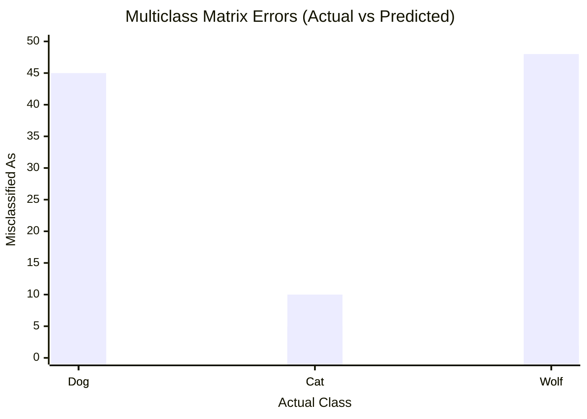

# 🔲 The Confusion Matrix

> **Difficulty**: ⭐⭐☆☆☆ Intermediate | **Prerequisites**: Classification Metrics | **Estimated Reading Time**: 20 Minutes

---

## 📋 Table of Contents
1. [The Diagnostic Tool](#1-the-diagnostic-tool)
2. [Binary Classification: The Four Quadrants](#2-binary-classification-the-four-quadrants)
3. [Practical Example: Spam Detection](#3-practical-example-spam-detection)
4. [Multiclass Classification Heatmaps](#4-multiclass-classification-heatmaps)
5. [Multilabel Classification](#5-multilabel-classification)
6. [Key Takeaways](#6-key-takeaways)
7. [What's Next?](#7-whats-next)

---

## 1. The Diagnostic Tool

If Precision, Recall, and F1-Score are the "Grades" on a model's report card, the **Confusion Matrix** is the detailed feedback telling you *exactly which questions the model got wrong and why*. 

It is the absolute first thing you should look at when evaluating a classifier. All classification metrics are derived directly from the numbers inside this matrix.

---

## 2. Binary Classification: The Four Quadrants

### 🟢 Beginner Intuition
A confusion matrix breaks down predictions into four categories.
Suppose we are predicting if an email is **Spam (Positive)** or **Not Spam (Negative)**.

1. **True Positives (TP)**: The model predicted Spam, and it actually was Spam. (Good job)
2. **True Negatives (TN)**: The model predicted Not Spam, and it actually was Not Spam. (Good job)
3. **False Positives (FP) [Type I Error]**: The model predicted Spam, but it was a crucial email from your boss. (Very bad!)
4. **False Negatives (FN) [Type II Error]**: The model predicted Not Spam, but it was actually a phishing scam. (Also bad!)

### Visualizing the Binary Matrix

| | **Predicted: Negative (0)** | **Predicted: Positive (1)** |
| :--- | :---: | :---: |
| **Actual: Negative (0)** | True Negative (TN) | False Positive (FP) |
| **Actual: Positive (1)** | False Negative (FN) | True Positive (TP) |

---

## 3. Practical Example: Spam Detection

### 🟡 Intermediate Understanding
Let's look at a real output from a Spam filter tested on 1,000 emails.

```python
import matplotlib.pyplot as plt
import seaborn as sns
from sklearn.metrics import confusion_matrix

y_true = [0, 0, 1, 1, 0...] # 0 = Inbox, 1 = Spam
y_pred = [0, 1, 1, 0, 0...]

cm = confusion_matrix(y_true, y_pred)

# Heatmap Visualization
sns.heatmap(cm, annot=True, fmt='d', cmap='Reds', 
            xticklabels=['Predicted Inbox', 'Predicted Spam'],
            yticklabels=['Actual Inbox', 'Actual Spam'])
plt.title('Spam Detection Confusion Matrix')
plt.show()
```

### Analyzing the Output:
Imagine the code above generates this matrix:
*   **TN**: 800 (Correctly kept 800 real emails in the inbox).
*   **TP**: 150 (Correctly sent 150 spam emails to the junk folder).
*   **FP**: 30 (Sent 30 real emails to the junk folder. Users are angry!)
*   **FN**: 20 (Let 20 spam emails into the inbox. Users are annoyed).

**Error Analysis**: The business cost of a False Positive (missing an important email) is much higher than a False Negative (seeing a spam ad). Because we have 30 False Positives, we need to adjust our model's probability threshold to make it *more conservative* about predicting Spam.

---

## 4. Multiclass Classification Heatmaps

### 🔴 Advanced Concepts
In multi-class problems (e.g., classifying images of Animals into 10 categories), the confusion matrix becomes a $10 \times 10$ grid. 

The diagonal represents correct predictions. The off-diagonal elements are where the true power of the matrix shines: **Error Analysis**.

### Multi-Class Error Analysis Chart

*(Imagine a heatmap where the intersection of Actual: Dog and Predicted: Wolf is glowing bright red).*

If you see that your model perfectly classifies Cats and Birds, but routinely confuses Dogs with Wolves, you now know *exactly* where to focus your feature engineering. You need to add features that separate Dogs from Wolves (e.g., ear shape, fur patterns) rather than trying to improve the model globally.

---

## 5. Multilabel Classification

What if an image can contain *both* a Dog and a Cat? This is Multilabel Classification.

In Multilabel scenarios, we do not use a single massive confusion matrix. Instead, we use **One-vs-Rest (OvR)** matrices.
If you have 3 labels (Dog, Cat, Bird), you will generate 3 separate $2 \times 2$ binary confusion matrices:
1. Is there a Dog vs No Dog?
2. Is there a Cat vs No Cat?
3. Is there a Bird vs No Bird?

This allows you to calculate Precision and Recall independently for every single label in your dataset.

---

## 6. Key Takeaways

1.  **Always Plot It**: Never rely solely on an F1-score. Look at the matrix to see *how* the model is failing.
2.  **Analyze the Errors**: The off-diagonal numbers tell you exactly what new features you need to engineer.
3.  **Cost Matrices**: In the real world, multiply the FP and FN counts by their actual dollar-value business cost to calculate the true financial impact of your model.

---

## 7. What's Next?

We know that moving a model's probability threshold changes the Confusion Matrix (trading False Positives for False Negatives). But how do we visualize *all possible thresholds at once* to pick the best one?

To do this, we use the most famous curve in Machine Learning: **The ROC Curve and AUC**.

Navigation:

[← Previous Topic](05-Classification-Metrics.md) | [Back to Index](../README.md) | [Next Topic →](07-ROC-And-AUC.md)
