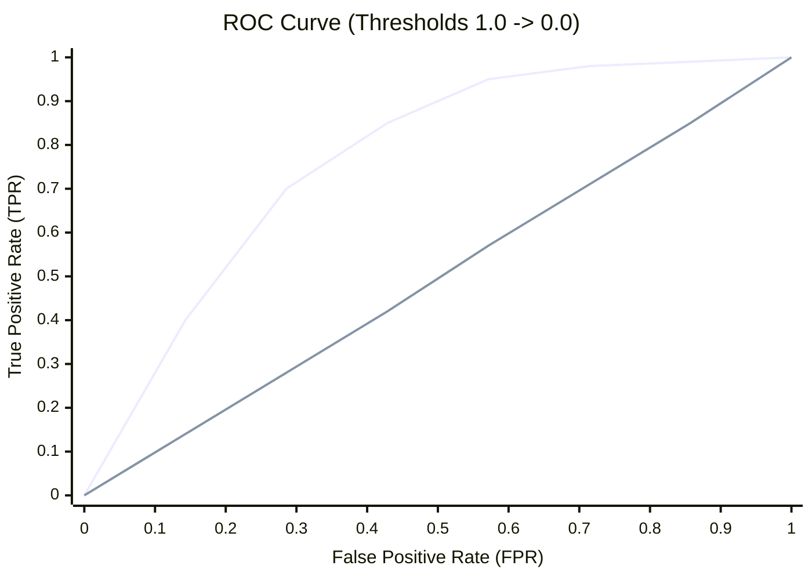
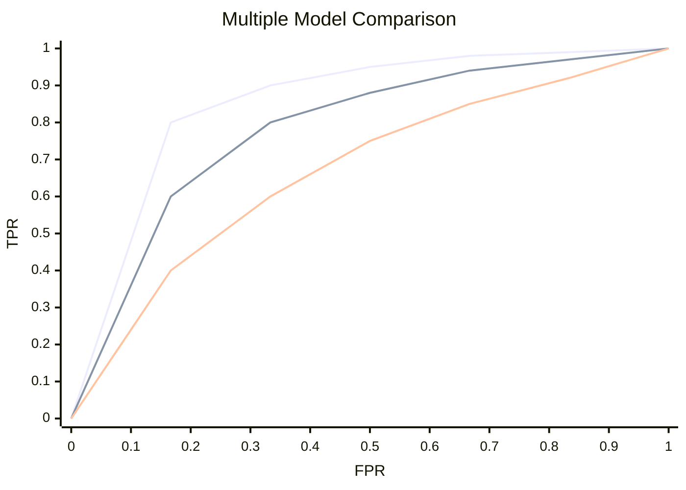

# 📈 ROC Curves and AUC

> **Difficulty**: ⭐⭐⭐☆☆ Advanced | **Prerequisites**: Confusion Matrix | **Estimated Reading Time**: 25 Minutes

---

## 📋 Table of Contents
1. [The Problem with Hard Predictions](#1-the-problem-with-hard-predictions)
2. [TPR and FPR (The Axes)](#2-tpr-and-fpr-the-axes)
3. [The ROC Curve Visualized](#3-the-roc-curve-visualized)
4. [Comparing Multiple Models](#4-comparing-multiple-models)
5. [The Area Under the Curve (AUC)](#5-the-area-under-the-curve-auc)
6. [Advanced Interpretations of AUC](#6-advanced-interpretations-of-auc)
7. [Key Takeaways](#7-key-takeaways)
8. [What's Next?](#8-whats-next)

---

## 1. The Problem with Hard Predictions

### 🟢 Beginner Intuition
Most machine learning models (like Random Forests or Logistic Regression) don't actually output "Yes" or "No". They output a **probability**, like "There is a 72% chance this email is spam." 

By default, Scikit-Learn uses a 50% threshold: anything > 50% is Spam. But what if we change that rule?
*   If we use a **10% threshold**, we will catch *every single spam email*, but we will also throw away a lot of good emails.
*   If we use a **90% threshold**, we will never accidentally throw away a good email, but a lot of spam will get through.

How do we decide which threshold is best? We plot them all at once using the **Receiver Operating Characteristic (ROC) Curve**.

---

## 2. TPR and FPR (The Axes)

To plot the curve, we evaluate the model at every possible threshold (from 0.0 to 1.0) and record two numbers:

1.  **True Positive Rate (TPR) / Recall**: On the Y-axis. "Out of all actual Spam, how much did we catch?" (We want this to be 1.0).
2.  **False Positive Rate (FPR)**: On the X-axis. "Out of all legitimate emails, what percentage did we accidentally ruin by calling them Spam?" (We want this to be 0.0).

---

## 3. The ROC Curve Visualized

### 🟡 Intermediate Understanding

As we lower our threshold, both TPR and FPR go up. A perfect model goes straight up the Y-axis to 1.0, and then across the X-axis. A completely useless model follows the diagonal.



*   **Top Left Corner (0, 1)**: The Holy Grail. 100% of frauds caught, 0 legitimate customers blocked.
*   **The Diagonal Line**: Random guessing. For every 10% more fraud you catch, you randomly ruin 10% more legitimate transactions.

### Scikit-Learn Implementation
```python
from sklearn.metrics import roc_curve, roc_auc_score
import matplotlib.pyplot as plt

# CRITICAL: You must pass probabilities, not hard predictions!
y_prob = model.predict_proba(X_test)[:, 1]

fpr, tpr, thresholds = roc_curve(y_test, y_prob)

plt.plot(fpr, tpr, label="Model ROC")
plt.plot([0, 1], [0, 1], 'k--', label="Random Guess")
plt.xlabel("False Positive Rate (FPR)")
plt.ylabel("True Positive Rate (TPR)")
plt.title("ROC Curve")
plt.show()
```

---

## 4. Comparing Multiple Models

The true power of the ROC curve is superimposing multiple algorithms on the same graph to see which one dominates across all thresholds.


*(In this scenario, XGBoost is objectively superior to the other two algorithms regardless of what threshold the business chooses).*

---

## 5. The Area Under the Curve (AUC)

Visuals are great, but sometimes we just need a single number to rank models on a leaderboard. We calculate the mathematical integral of the curve: **The Area Under the Curve (AUC)**.

*   **AUC = 1.0**: Perfect classifier.
*   **AUC = 0.9**: Excellent classifier.
*   **AUC = 0.5**: Worthless classifier (Random guess).

---

## 6. Advanced Interpretations of AUC

### 🔴 Advanced Concepts

Most practitioners know AUC is a "score between 0.5 and 1.0". But what does the number *actually mean* in statistics?

#### The Ranking Interpretation
The AUC is precisely the probability that the classifier will rank a randomly chosen positive instance higher than a randomly chosen negative instance. 
If $AUC = 0.85$, and you randomly pick one actual Spam email and one actual Legitimate email, there is an 85% chance your model gave the Spam email a higher probability score than the Legitimate email.

#### The Probabilistic Interpretation (Mann-Whitney U Test)
Mathematically, the ROC AUC is exactly equivalent to the Mann-Whitney U test statistic. It evaluates the model's ability to successfully separate the distributions of Positive and Negative predictions. If the probability distributions completely overlap, $AUC = 0.5$. If they are completely distinct bumps, $AUC = 1.0$.

### The Great Weakness of ROC
ROC AUC can be highly misleading when dealing with severely imbalanced datasets. If you have 1,000,000 legitimate users and 10 fraudsters, accidentally blocking 1,000 legitimate users barely moves the False Positive Rate (FPR) on the X-axis (1,000 / 1,000,000 = 0.001). The ROC curve looks incredible, but the business is furious. 

---

## 7. Key Takeaways

1.  **Evaluate Probabilities**: ROC curves evaluate the fundamental ranking power of your model, not just its accuracy at a 50% threshold.
2.  **Top Left is Best**: You want a curve that bows heavily toward the top-left corner.
3.  **AUC = Ranking Probability**: An AUC of 0.9 means a 90% chance a random Positive gets a higher score than a random Negative.

---

## 8. What's Next?

If ROC curves break down during highly imbalanced classification, what do we use instead? 

We change the X-axis. Instead of looking at False Positive *Rate*, we look directly at Precision. In the next chapter, we cover the essential tool for rare events: **Precision-Recall Curves**.

Navigation:

[← Previous Topic](06-Confusion-Matrix.md) | [Back to Index](../README.md) | [Next Topic →](08-Precision-Recall-Curves.md)
