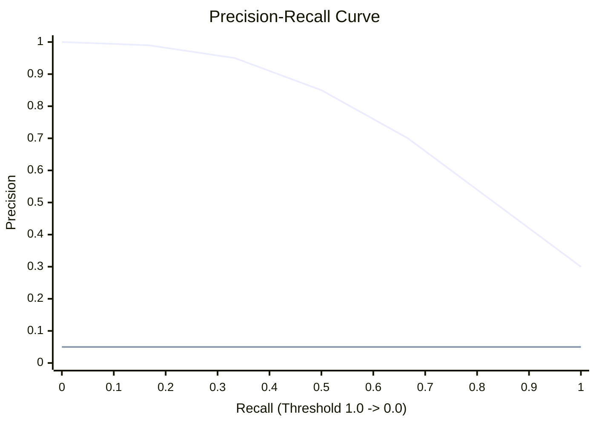

# 📉 Precision-Recall Curves

> **Difficulty**: ⭐⭐⭐☆☆ Advanced | **Prerequisites**: ROC & AUC | **Estimated Reading Time**: 20 Minutes

---

## 📋 Table of Contents
1. [The Needle in the Haystack](#1-the-needle-in-the-haystack)
2. [The ROC Illusion (Class Imbalance)](#2-the-roc-illusion-class-imbalance)
3. [The Precision-Recall Tradeoff](#3-the-precision-recall-tradeoff)
4. [Visualizing the PR Curve](#4-visualizing-the-pr-curve)
5. [ROC vs. PR: Which to Use?](#5-roc-vs-pr-which-to-use)
6. [Key Takeaways](#6-key-takeaways)
7. [What's Next?](#7-whats-next)

---

## 1. The Needle in the Haystack

### 🟢 Beginner Intuition
If you are looking for needles in a haystack, you care about:
1.  The needles you found (**True Positives**).
2.  The needles you missed (**False Negatives**).
3.  The pieces of hay you mistakenly thought were needles (**False Positives**).

You **DO NOT** care about how many pieces of hay you correctly identified as hay (**True Negatives**). There are millions of pieces of hay. You only care about the needles.

ROC curves use True Negatives in their math (False Positive Rate). **Precision-Recall (PR) curves ignore True Negatives entirely.**

---

## 2. The ROC Illusion (Class Imbalance)

### 🟡 Intermediate Understanding
Why do we need a new curve? Because ROC curves can lie to you when data is highly imbalanced.

Imagine a Credit Card Fraud dataset:
*   999,900 Legitimate Transactions (Negatives)
*   100 Fraudulent Transactions (Positives)

If your model flags 1,000 legitimate transactions as fraud (False Positives), the business is furious because 1,000 customers got their cards blocked.
But look at the ROC math: 
$FPR = \frac{FP}{FP + TN} = \frac{1000}{1000 + 998900} = 0.001$

The False Positive Rate is 0.1%. The ROC curve will look incredible! It creates an **illusion** of high performance because the massive number of True Negatives dilutes the mistakes.

Look at the Precision math for the same model (assuming it caught 50 frauds):
$Precision = \frac{TP}{TP + FP} = \frac{50}{50 + 1000} = 0.047$

The Precision is 4.7%. The model is terrible. The PR curve will expose this immediately.

---

## 3. The Precision-Recall Tradeoff

Just like ROC, the PR curve evaluates the model across all possible probability thresholds (0.0 to 1.0).

*   **High Threshold (0.9)**: The model only fires when it is absolutely certain. Precision is very high, but Recall is low (you miss a lot of fraud).
*   **Low Threshold (0.1)**: The model flags everything. Recall is very high (you caught all the fraud), but Precision is terrible (you blocked thousands of good customers).

---

## 4. Visualizing the PR Curve



*   **Top Right Corner (1, 1)**: The perfect model. 100% Precision and 100% Recall.
*   **The Baseline**: Unlike ROC (where the baseline is always 0.5), the baseline for a PR curve is the ratio of positive classes in your dataset. If fraud is 5% of your data, the baseline is a horizontal line at Y = 0.05.

### Scikit-Learn Implementation
```python
from sklearn.metrics import precision_recall_curve, average_precision_score
import matplotlib.pyplot as plt

# Probabilities!
y_prob = model.predict_proba(X_test)[:, 1]

precision, recall, thresholds = precision_recall_curve(y_test, y_prob)
ap = average_precision_score(y_test, y_prob)

plt.plot(recall, precision, label=f"Model (AP = {ap:.2f})")
plt.xlabel('Recall (True Positive Rate)')
plt.ylabel('Precision (Positive Predictive Value)')
plt.title('Precision-Recall Curve')
plt.legend()
plt.show()
```

### 🔴 Advanced: Average Precision (AP)
Instead of ROC AUC, we calculate the Area Under the PR Curve (AUC-PR) or **Average Precision (AP)**. 
$AP = \sum_n (R_n - R_{n-1}) P_n$
It calculates the weighted mean of precisions achieved at each threshold, with the increase in recall from the previous threshold used as the weight.

---

## 5. ROC vs. PR: Which to Use?

Here is the definitive guide on which curve to use in industry:

| Scenario | Distribution | Which Curve? | Reason |
| :--- | :--- | :--- | :--- |
| **Spam Filter** | ~50% Inbox / 50% Spam | **ROC Curve** | Both classes are roughly equal. We care about TNs. |
| **Cat vs Dog** | 50% Cat / 50% Dog | **ROC Curve** | Balanced classes. |
| **Fraud Detection** | 99.9% Good / 0.1% Fraud | **PR Curve** | Highly imbalanced. We only care about the minority class. |
| **Cancer Detection**| 99% Healthy / 1% Sick | **PR Curve** | TNs will dwarf and hide False Positives on an ROC curve. |

---

## 6. Key Takeaways

1.  **Imbalance dictates the metric**: If your dataset is highly skewed, ROC will lie to you. Use PR curves.
2.  **Top Right is Best**: On a PR curve, you want the line to hug the top-right corner.
3.  **Baseline Changes**: The random baseline of a PR curve is not 0.5, it is the fraction of positives in your dataset.

---

## 7. What's Next?

We've spent the last few chapters talking about Evaluating our models on the Validation and Test sets. But what happens if our Test set is too small, and our evaluation is just a lucky (or unlucky) fluke?

To get a truly robust evaluation that isn't dependent on a single random split, we must use **Cross-Validation**.

Navigation:

[← Previous Topic](07-ROC-And-AUC.md) | [Back to Index](../README.md) | [Next Topic →](09-Cross-Validation.md)
