# 🔀 Cross Validation

> **Difficulty**: ⭐⭐☆☆☆ Intermediate | **Prerequisites**: Train/Test Split | **Estimated Reading Time**: 25 Minutes

---

## 📋 Table of Contents
1. [The Flaw in Train/Test Split](#1-the-flaw-in-train-test-split)
2. [Standard K-Fold](#2-standard-k-fold)
3. [Stratified K-Fold](#3-stratified-k-fold)
4. [Advanced K-Fold Variations](#4-advanced-k-fold-variations)
5. [Group K-Fold & TimeSeriesSplit](#5-group-k-fold--timeseriessplit)
6. [Practical Recommendations](#6-practical-recommendations)
7. [What's Next?](#7-whats-next)

---

## 1. The Flaw in Train/Test Split

### 🟢 Beginner Intuition
If you randomly split a deck of cards into a "Train" pile and a "Test" pile, you might accidentally put all four Aces into the Test pile. Your model would never learn what an Ace looks like during training, and it would fail the test. 

Even worse, if your dataset is very small, your model's evaluation score will depend entirely on how "lucky" or "unlucky" the random split was. To fix this, we use **Cross Validation (CV)**. We shuffle the deck, split it into 5 equal piles, and take turns using each pile as the "Test" pile while learning from the other 4. 

---

## 2. Standard K-Fold

### 🟡 Intermediate Understanding
**K-Fold** is the standard workhorse of model evaluation. 

1. Divide data into $K$ equal subsets (folds).
2. For $i=1$ to $K$:
   - Train the model on $K-1$ folds.
   - Evaluate the model on fold $i$.
3. Average the $K$ evaluation scores to get the final estimated performance.

### Visualizing K-Fold

```mermaid
gantt
    title 5-Fold Cross Validation
    dateFormat X
    axisFormat %s
    
    section Fold 1
    Test (20%)       :crit, a1, 0, 2
    Train (80%)      :a2, 2, 10
    
    section Fold 2
    Train (20%)      :a3, 0, 2
    Test (20%)       :crit, a4, 2, 4
    Train (60%)      :a5, 4, 10
    
    section Fold 3
    Train (40%)      :a6, 0, 4
    Test (20%)       :crit, a7, 4, 6
    Train (40%)      :a8, 6, 10
```


### Variance Comparison
By doing this 5 times, we don't just get an average score (e.g., 85% Accuracy). We get the **Variance** of the score (e.g., $85\% \pm 5\%$). If one fold scores 99% and another scores 60%, your model is highly unstable and deeply dependent on the specific data it sees.

---

## 3. Stratified K-Fold

Standard K-Fold is random. If you are predicting a rare disease (1% of population), a standard random fold might accidentally contain zero sick patients.

**Stratified K-Fold** mathematically guarantees that the ratio of classes (e.g., 99% Healthy, 1% Sick) is perfectly preserved in *every single fold*. 

**Rule of Thumb**: ALWAYS use Stratified K-Fold for Classification tasks. Use Standard K-Fold for Regression tasks.

```python
from sklearn.model_selection import cross_val_score, StratifiedKFold
from sklearn.ensemble import RandomForestClassifier

model = RandomForestClassifier()
skf = StratifiedKFold(n_splits=5, shuffle=True, random_state=42)

# Scikit-Learn handles the loop automatically
scores = cross_val_score(model, X, y, cv=skf, scoring='accuracy')

print(f"Scores for each fold: {scores}")
print(f"Average Accuracy: {scores.mean():.2f} +/- {scores.std():.2f}")
```

---

## 4. Advanced K-Fold Variations

### 🔴 Advanced Concepts

### Repeated K-Fold
Even Stratified K-Fold has some randomness in *which* specific healthy patients go into *which* fold. If your dataset is very small (e.g., 200 rows), you should use **Repeated K-Fold** (e.g., run a 5-Fold CV, but repeat the entire process 10 times with different random shuffles, resulting in 50 scores).

### Leave-One-Out Cross Validation (LOOCV)
$K$ is set to the total number of data points $N$. You train on $N-1$ points and test on exactly 1 point. You repeat this $N$ times. 
*   **Advantage**: Zero randomness. Theoretically unbiased.
*   **Disadvantage**: Computationally catastrophic. If you have 100,000 rows, you must train your model 100,000 times. Only use LOOCV on tiny datasets (< 500 rows).

---

## 5. Group K-Fold & TimeSeriesSplit

These are specialized splits that prevent massive data leakage.

### Group K-Fold (Medical / Image Data)
Imagine you have 10 X-Ray images of Patient A, and 10 X-Ray images of Patient B.
If you use standard K-Fold, Patient A's images will be split across both the Train and Test sets. The model will just memorize Patient A's bone structure, not what pneumonia looks like. 
**Group K-Fold** ensures that all images belonging to a specific "Group" (Patient) are kept entirely inside a single fold.

### TimeSeriesSplit (Financial Data)
You cannot use K-Fold on Time Series data because you would be training on 2024 to predict 2022 (Data Leakage). 
**TimeSeriesSplit** uses an expanding window.

```mermaid
gantt
    title TimeSeriesSplit
    dateFormat X
    axisFormat %s
    
    section Split 1
    Train    :a1, 0, 2
    Test     :crit, a2, 2, 4
    
    section Split 2
    Train    :a3, 0, 4
    Test     :crit, a4, 4, 6
    
    section Split 3
    Train    :a5, 0, 6
    Test     :crit, a6, 6, 8
```



---

## 6. Practical Recommendations

Which method should you use and when?

| Dataset Type | Recommended CV Strategy |
| :--- | :--- |
| **Standard Regression** | K-Fold (usually 5 or 10 splits) |
| **Standard Classification** | Stratified K-Fold |
| **Very Small Dataset (< 500 rows)** | Repeated Stratified K-Fold or LOOCV |
| **Multiple rows from same user/entity** | Group K-Fold |
| **Dates / Sequential Data** | TimeSeriesSplit |
| **Massive Dataset (> 1M rows)** | Simple 80/20 Train/Test Split (CV is too slow and variance is low anyway) |

---

## 7. What's Next?

We've learned how to split our data reliably. Now we need to look *inside* the training process. How do we know if our model needs more data, or if it has reached its maximum potential?

To answer this, we plot the model's performance as it learns using **Learning Curves**.

Navigation:

[← Previous Topic](08-Precision-Recall-Curves.md) | [Back to Index](../README.md) | [Next Topic →](10-Learning-Curves.md)
