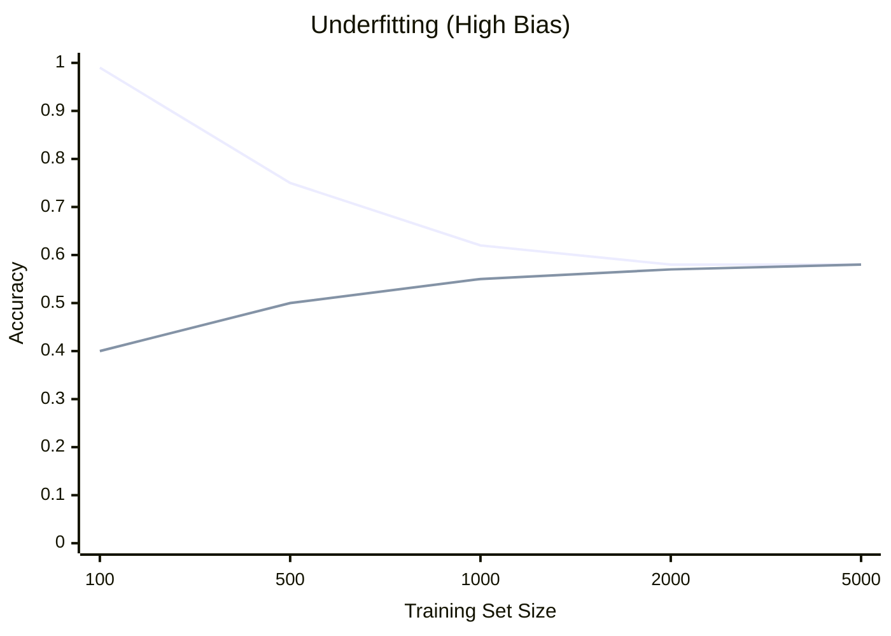
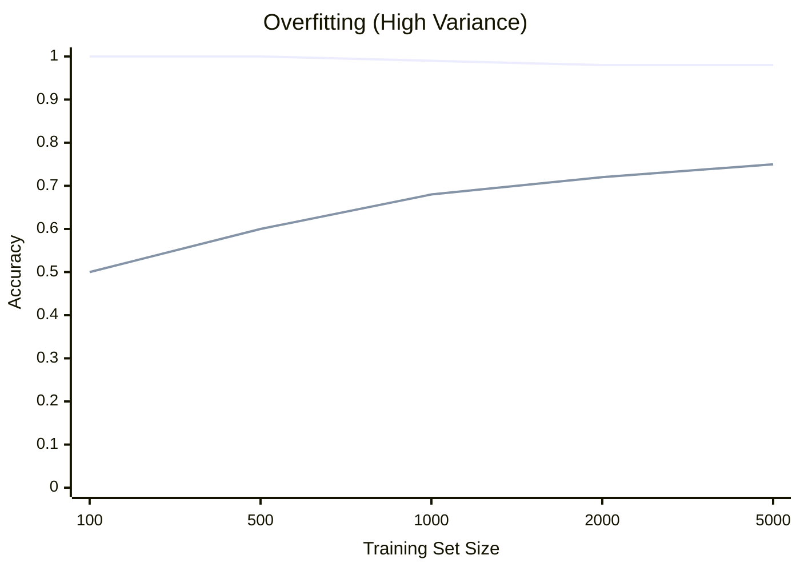
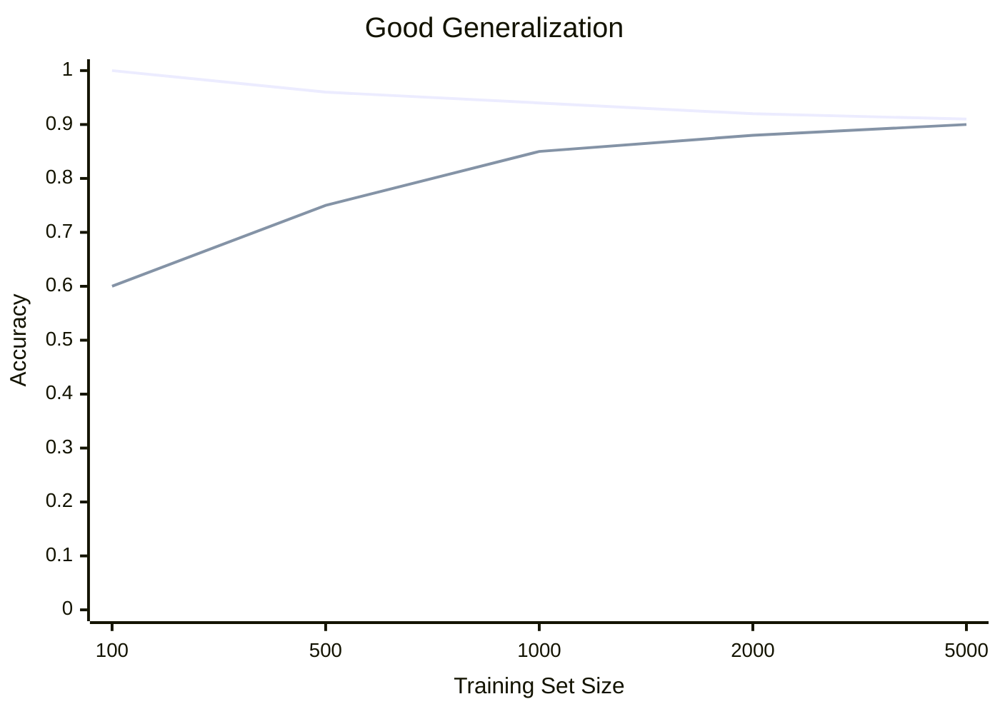

# 📈 Learning Curves

> **Difficulty**: ⭐⭐⭐☆☆ Advanced | **Prerequisites**: Bias-Variance Tradeoff | **Estimated Reading Time**: 20 Minutes

---

## 📋 Table of Contents
1. [The Value of Data (Sample Complexity)](#1-the-value-of-data-sample-complexity)
2. [Visualizing Learning Curves](#2-visualizing-learning-curves)
3. [Diagnosing Underfitting (High Bias)](#3-diagnosing-underfitting-high-bias)
4. [Diagnosing Overfitting (High Variance)](#4-diagnosing-overfitting-high-variance)
5. [The Good Fit](#5-the-good-fit)
6. [Business Implications (Stop Buying Data)](#6-business-implications-stop-buying-data)
7. [Key Takeaways](#7-key-takeaways)
8. [What's Next?](#8-whats-next)

---

## 1. The Value of Data (Sample Complexity)

### 🟢 Beginner Intuition
A Learning Curve is a simple plot that answers a million-dollar business question: **"Do we need more data?"**

It shows how your model improves as you feed it more examples. 
*   If you give a model 10 examples, it memorizes them easily (perfect Training score) but fails the test (terrible Validation score).
*   If you give it 10,000 examples, it struggles to memorize them all, but it actually learns the *real* pattern, so its Validation score improves.

---

## 2. Visualizing Learning Curves

### 🟡 Intermediate Understanding
We plot the Training Score and the Validation Score on the Y-axis against the Number of Training Examples on the X-axis.

```python
import matplotlib.pyplot as plt
from sklearn.model_selection import learning_curve
import numpy as np

# cv=5 ensures we use Cross-Validation to get stable curves
train_sizes, train_scores, val_scores = learning_curve(
    estimator=model, X=X, y=y, train_sizes=np.linspace(0.1, 1.0, 10), cv=5
)

train_mean = np.mean(train_scores, axis=1)
val_mean = np.mean(val_scores, axis=1)

plt.plot(train_sizes, train_mean, label='Training Score')
plt.plot(train_sizes, val_mean, label='Validation Score')
plt.title('Learning Curve')
plt.xlabel('Number of Training Examples')
plt.ylabel('Score (e.g., Accuracy)')
plt.legend()
plt.show()
```

---

## 3. Diagnosing Underfitting (High Bias)

### 🔴 Advanced Diagnosis

If your model is too simple for the problem (e.g., trying to use Linear Regression to predict complex nonlinear stock movements), your Learning Curve will look like this:



**Symptoms**:
1. Both curves converge quickly.
2. They converge at a **very low score** (e.g., 58%).
3. The gap between them disappears.

**The Fix**: Adding more data will do absolutely nothing. The lines are already flat. You must increase model complexity (e.g., switch to a Random Forest) or add new features.

---

## 4. Diagnosing Overfitting (High Variance)

If your model is too powerful for the amount of data it has (e.g., an immense Deep Neural Network trained on 500 rows of data), it will simply memorize the noise.



**Symptoms**:
1. The Training score stays extremely high.
2. There is a **massive gap** between Training and Validation.
3. The Validation curve is still visibly climbing upward.

**The Fix**: Because the Validation curve is still climbing, **adding more data will help!** Alternatively, if you cannot get more data, you must reduce model complexity or add regularization.

---

## 5. The Good Fit

A perfectly tuned model will show a slight decline in training score (as it becomes impossible to perfectly memorize a massive dataset), while the Validation curve climbs up to meet it at a highly acceptable performance level.



---

## 6. Business Implications (Stop Buying Data)

Data Scientists often tell executives: *"Our model is only 80% accurate. We need to spend $50,000 to acquire and label 500,000 more rows of data."*

Before spending that money, **you must plot a Learning Curve**.

If the curve has already flatlined (asymptoted) at 10,000 rows, acquiring 500,000 more rows is a complete waste of money. The model has hit its theoretical ceiling based on its current architecture and features. You don't need more rows; you need better features or a better algorithm.

---

## 7. Key Takeaways

1.  **Learning Curves answer the Data Question**: They tell you definitively if gathering more data will actually improve your model.
2.  **Look for the Gap**: A huge gap between Train and Validation means High Variance (Overfitting). You need more data or a simpler model.
3.  **Look at the Ceiling**: If both curves are flat at a bad score, you have High Bias (Underfitting). More data is useless.

---

## 8. What's Next?

Learning curves track performance across *Training Set Size*. But what if we want to track performance across *Hyperparameters*? Like, what happens to the model as we increase a Tree's depth from 1 to 50?

For that, we use the sister visualization: **Validation Curves**.

Navigation:

[← Previous Topic](09-Cross-Validation.md) | [Back to Index](../README.md) | [Next Topic →](11-Validation-Curves.md)
