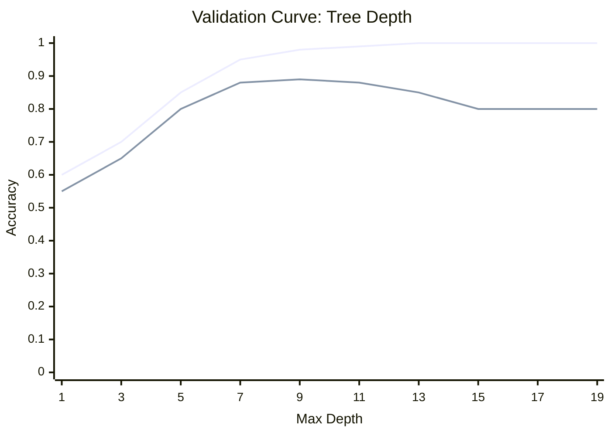

# 🎢 Validation Curves

> **Difficulty**: ⭐⭐⭐☆☆ Advanced | **Prerequisites**: Learning Curves | **Estimated Reading Time**: 20 Minutes

---

## 📋 Table of Contents
1. [The X-Axis Difference](#1-the-x-axis-difference)
2. [Hyperparameter Impact Examples](#2-hyperparameter-impact-examples)
3. [Visualizing Parameter vs Performance](#3-visualizing-parameter-vs-performance)
4. [Interpretation Guide](#4-interpretation-guide)
5. [Key Takeaways](#5-key-takeaways)
6. [What's Next?](#6-whats-next)

---

## 1. The X-Axis Difference

### 🟢 Beginner Intuition
While a *Learning Curve* changes the **amount of data** on the X-axis, a *Validation Curve* changes a **specific model setting** (like the maximum depth of a tree) on the X-axis. 

It helps us find the "Goldilocks" setting—not too simple, not too complex.

---

## 2. Hyperparameter Impact Examples

Every algorithm has different "knobs" you can turn. Turning them to the extreme left or right almost always results in Underfitting or Overfitting.

### 1. Decision Trees: `max_depth`
*   **Low Depth (1 or 2)**: The tree can only ask 1 or 2 questions. It is too simple. **Underfitting**.
*   **High Depth (50+)**: The tree asks enough questions to give every single data point its own leaf. It memorizes the data perfectly. **Overfitting**.

### 2. Random Forests: `n_estimators` (Number of Trees)
*   **Low Estimators (10)**: The forest is too small to average out individual tree biases. High Variance.
*   **High Estimators (1000)**: Unlike depth, increasing estimators generally *does not cause overfitting*. It actually reduces variance. However, it plateaus, so using 10,000 trees instead of 500 just wastes compute time without improving the model.

### 3. Logistic Regression / SVM: `C` (Inverse Regularization Strength)
*   **Low C (0.001)**: High regularization. The model is forced to keep its weights incredibly small, preventing it from learning complex patterns. **Underfitting**.
*   **High C (1000)**: Low regularization. The model is allowed to assign massive weights to specific features to perfectly fit the training data. **Overfitting**.

---

## 3. Visualizing Parameter vs Performance

### 🟡 Intermediate Understanding

To visualize this, we plot the Training Score and the Validation Score on the Y-axis against the hyperparameter value on the X-axis.

```python
from sklearn.model_selection import validation_curve
import numpy as np
import matplotlib.pyplot as plt
from sklearn.ensemble import RandomForestClassifier

# We are testing tree depths from 1 to 20
param_range = np.arange(1, 21, 2)
train_scores, test_scores = validation_curve(
    RandomForestClassifier(), X, y, param_name="max_depth", 
    param_range=param_range, cv=5, scoring="accuracy"
)

train_mean = np.mean(train_scores, axis=1)
train_std = np.std(train_scores, axis=1)
test_mean = np.mean(test_scores, axis=1)
test_std = np.std(test_scores, axis=1)

plt.plot(param_range, train_mean, label="Training score", color="blue")
plt.plot(param_range, test_mean, label="Validation score", color="orange")

# Always plot the variance band!
plt.fill_between(param_range, train_mean - train_std, train_mean + train_std, alpha=0.2, color="blue")
plt.fill_between(param_range, test_mean - test_std, test_mean + test_std, alpha=0.2, color="orange")

plt.title("Validation Curve for Random Forest Max Depth")
plt.xlabel("Max Depth")
plt.ylabel("Accuracy")
plt.legend()
plt.show()
```

---

## 4. Interpretation Guide

### 🔴 Advanced Concepts

Here is the ultimate guide to reading the curve generated by the code above.



#### Zone 1: The Left Side (Depth 1 to 3)
*   **Observation**: Both Training and Validation scores are low and close together.
*   **Diagnosis**: Underfitting (High Bias). The model is too simple.

#### Zone 2: The Right Side (Depth 11 to 19)
*   **Observation**: Training score hits 1.0 (perfect). Validation score drops significantly and plateaus.
*   **Diagnosis**: Overfitting (High Variance). The model is memorizing the training data.

#### Zone 3: The Sweet Spot (Depth 9)
*   **Observation**: This is the exact peak of the orange Validation line.
*   **The Decision**: This is the parameter you should choose for production. It achieves the maximum possible generalization score.

---

## 5. Key Takeaways

1.  **X-Axis is the Key**: Learning Curves test Data Volume. Validation Curves test Model Complexity.
2.  **Find the Peak**: You are looking for the exact hyperparameter value where the Validation Score hits its absolute maximum before declining or plateauing.
3.  **Watch the Gap**: As soon as the Training Score pulls far away from the Validation Score, you have entered the Overfitting zone.

---

## 6. What's Next?

A Validation curve is amazing for tuning *one* hyperparameter. But a Random Forest has `max_depth`, `n_estimators`, `min_samples_split`, and `max_features`. 

How do we tune 5 hyperparameters simultaneously when there are millions of possible combinations? For that, we need automated **Hyperparameter Tuning**.

Navigation:

[← Previous Topic](10-Learning-Curves.md) | [Back to Index](../README.md) | [Next Topic →](12-Hyperparameter-Tuning.md)
