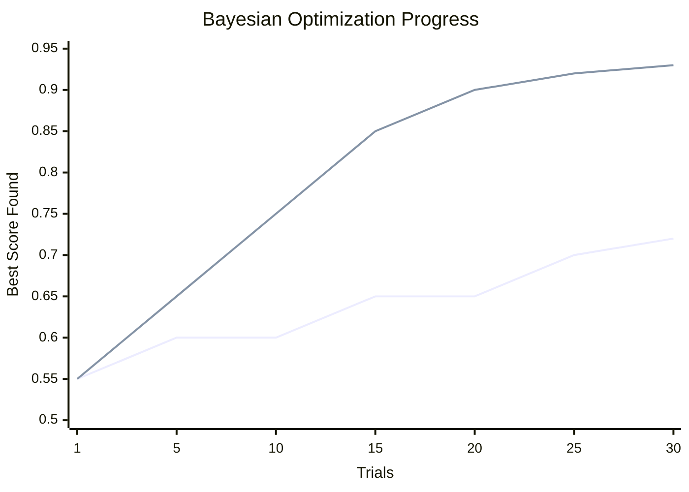

# 🎛️ Hyperparameter Tuning

> **Difficulty**: ⭐⭐⭐☆☆ Advanced | **Prerequisites**: Validation Curves | **Estimated Reading Time**: 30 Minutes

---

## 📋 Table of Contents
1. [The "Dumb" Searches: Grid vs Random](#1-the-dumb-searches-grid-vs-random)
2. [Visualizing Search Spaces](#2-visualizing-search-spaces)
3. [The Smart Search: Bayesian Optimization](#3-the-smart-search-bayesian-optimization)
4. [Modern Tooling (Optuna & Hyperopt)](#4-modern-tooling-optuna--hyperopt)
5. [Computational Cost Analysis](#5-computational-cost-analysis)
6. [Key Takeaways](#6-key-takeaways)
7. [What's Next?](#7-whats-next)

---

## 1. The "Dumb" Searches: Grid vs Random

### 🟢 Beginner Intuition
You have a model with several different dials (hyperparameters) you can turn. You want to find the perfect combination of dial settings.

1.  **Grid Search**: You systematically try every single possible combination of the dials. It is exhaustive, brute-force, and takes forever.
2.  **Random Search**: You just spin the dials randomly a set number of times (e.g., 100 times) and pick the best one. Surprisingly, this usually finds a better model faster!

### 🟡 Intermediate Understanding

```python
from sklearn.model_selection import GridSearchCV, RandomizedSearchCV

param_grid = {
    'n_estimators': [50, 100, 200],
    'max_depth': [10, 20, 30],
    'min_samples_split': [2, 5, 10]
}

# Grid Search (3x3x3 = 27 combinations * 5 folds = 135 model fits)
grid = GridSearchCV(model, param_grid, cv=5)

# Random Search (Tests 10 random combinations * 5 folds = 50 model fits)
from scipy.stats import randint
param_dist = {'n_estimators': randint(50, 200), 'max_depth': randint(10, 30)}
random = RandomizedSearchCV(model, param_dist, n_iter=10, cv=5)
```

---

## 2. Visualizing Search Spaces

Why does Random Search usually beat Grid Search? 
Because not all hyperparameters are equally important.

If `max_depth` drastically changes performance, but `min_samples_split` barely does anything, Grid Search wastes huge amounts of time testing `min_samples_split` values while keeping `max_depth` the same. Random Search explores a unique value of `max_depth` on every single iteration.

### Search Space Visualization
```mermaid
scatter-chart
    title "Grid Search (Wastes time on unimportant parameters)"
    x-axis "Important Parameter (e.g., max_depth)"
    y-axis "Unimportant Parameter"
    point [1, 1]
    point [1, 2]
    point [1, 3]
    point [2, 1]
    point [2, 2]
    point [2, 3]
    point [3, 1]
    point [3, 2]
    point [3, 3]
```

```mermaid
scatter-chart
    title "Random Search (Explores the important parameter thoroughly)"
    x-axis "Important Parameter (e.g., max_depth)"
    y-axis "Unimportant Parameter"
    point [1.2, 2.5]
    point [1.8, 1.1]
    point [2.1, 3.0]
    point [2.9, 1.5]
    point [3.5, 2.8]
    point [1.5, 1.8]
    point [2.5, 2.2]
    point [3.2, 1.2]
    point [3.8, 3.2]
```

---

## 3. The Smart Search: Bayesian Optimization

### 🔴 Advanced Concepts
Grid and Random search are "dumb"—they do not learn from their previous attempts. If a `max_depth` of 2 is terrible, and 3 is terrible, Grid Search will still blindly test 4, 5, and 6.

**Bayesian Optimization** acts like a human. It uses a probabilistic model (usually a Gaussian Process or Tree Parzen Estimator) to model the mapping from hyperparameters to the evaluation score. 

It balances:
*   **Exploitation**: Testing parameters very close to the best ones we've found so far.
*   **Exploration**: Testing entirely new, unknown areas of the hyperparameter space just in case there is a hidden peak.

### Optimization Progress


---

## 4. Modern Tooling (Optuna & Hyperopt)

In modern industry, data scientists rarely use Scikit-Learn's built-in search. They use dedicated Bayesian Optimization libraries like **Optuna** or **Hyperopt**.

### Optuna Implementation
Optuna allows you to dynamically define the search space using a `trial` object, and it aggressively prunes unpromising trials before they finish training.

```python
import optuna

def objective(trial):
    # 1. Define the search space dynamically
    max_depth = trial.suggest_int('max_depth', 2, 32)
    n_estimators = trial.suggest_int('n_estimators', 50, 500)
    learning_rate = trial.suggest_float('learning_rate', 1e-4, 1e-1, log=True)
    
    model = XGBClassifier(max_depth=max_depth, n_estimators=n_estimators, learning_rate=learning_rate)
    
    # 2. Evaluate with Cross Validation
    score = cross_val_score(model, X, y, cv=3).mean()
    return score

# 3. Create a study and optimize
study = optuna.create_study(direction='maximize')
study.optimize(objective, n_trials=50)

print("Best trial:", study.best_trial.params)
```

### Performance Heatmaps
Optuna provides native visualization tools like `optuna.visualization.plot_contour()` which generates interactive 2D heatmaps showing exactly which combinations of two parameters (e.g., `max_depth` vs `learning_rate`) yield the highest accuracy.

---

## 5. Computational Cost Analysis

Hyperparameter tuning is the most computationally expensive part of the Machine Learning lifecycle.

**The Equation of Doom**:
$$ Total Cost = (Models \times Folds \times Epochs) \times Dataset Size $$

*   If you have an XGBoost model that takes 5 minutes to train.
*   You want to test a Grid of 100 combinations.
*   You are using 5-Fold Cross Validation.

Total time = $100 \times 5 \times 5 = 2,500$ minutes (almost 2 days).

**Cost Reduction Strategies**:
1.  **Successive Halving**: Train 100 configurations on 10% of the data. Take the top 50 configurations and train them on 20% of the data. Repeat until the best configuration is trained on 100% of the data. (Scikit-learn offers `HalvingGridSearchCV`).
2.  **Early Stopping**: Stop training a specific fold if the validation error stops improving after 10 epochs.

---

## 6. Key Takeaways

1.  **Never use Grid Search**: Random Search is mathematically proven to be more efficient for the same compute budget.
2.  **Use Optuna for serious models**: Bayesian Optimization learns from its mistakes and converges on the optimal parameters much faster.
3.  **Do the Math**: Always calculate how long a tuning job will take *before* you hit Enter.

---

## 7. What's Next?

We have discussed evaluation assuming a relatively balanced dataset. But what happens when the class we care about is less than 1% of the data? Accuracy breaks down. ROC breaks down. Standard model training breaks down.

In the next chapter, we tackle the hardest problem in classification: **Imbalanced Classification**.

Navigation:

[← Previous Topic](11-Validation-Curves.md) | [Back to Index](../README.md) | [Next Topic →](13-Imbalanced-Classification.md)
