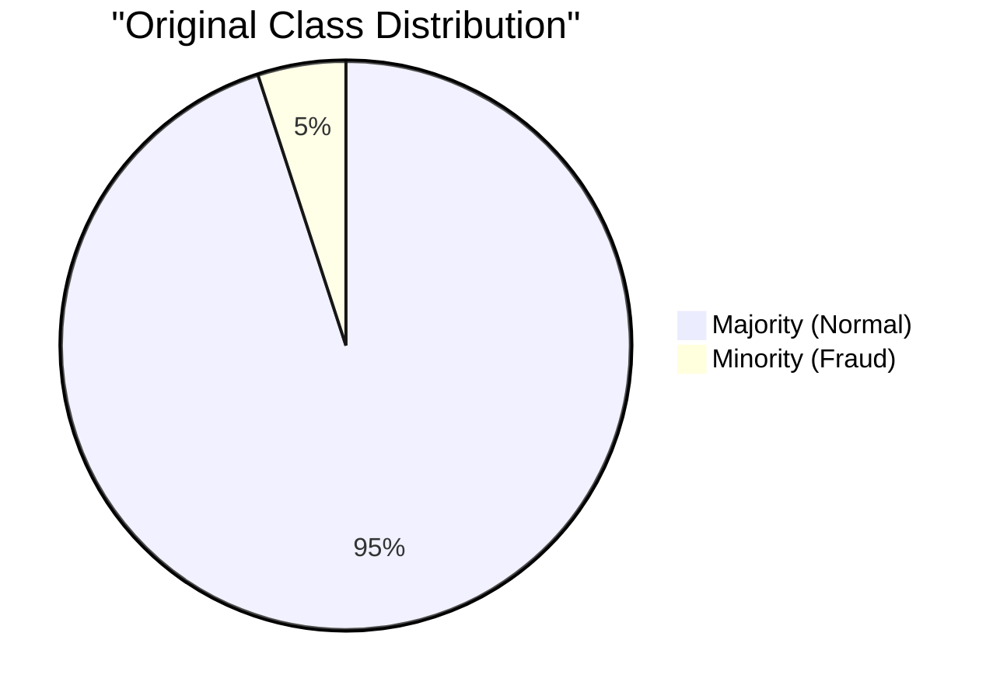
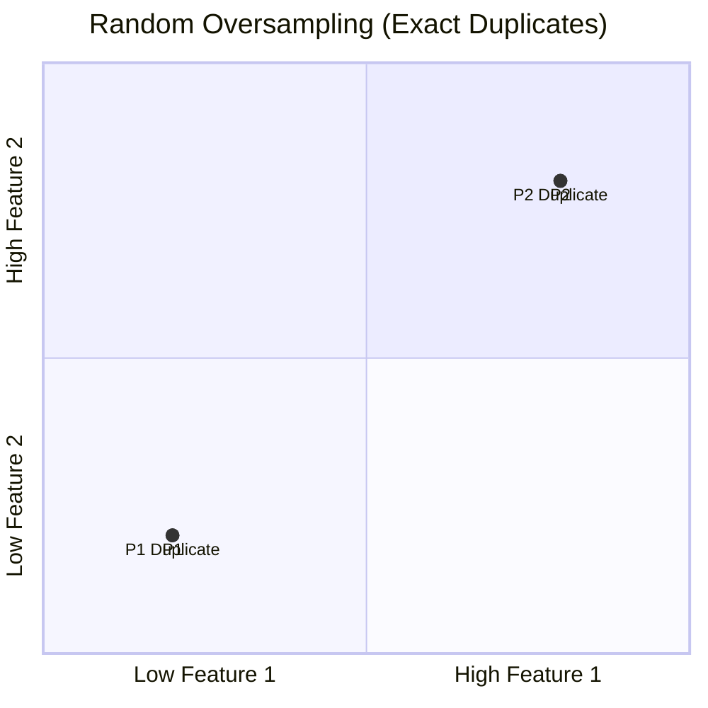
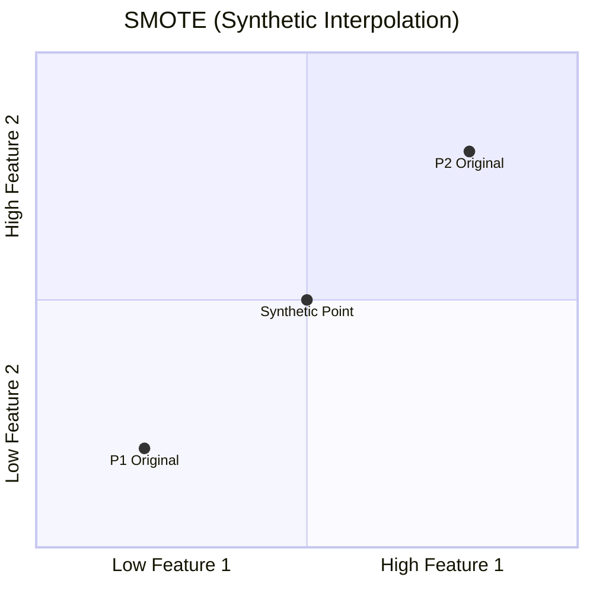

# ⚖️ Imbalanced Classification

> **Difficulty**: ⭐⭐⭐☆☆ Advanced | **Prerequisites**: Precision-Recall Curves | **Estimated Reading Time**: 30 Minutes

---

## 📋 Table of Contents
1. [The Accuracy Paradox & Rare Events](#1-the-accuracy-paradox--rare-events)
2. [Why Standard Models Fail](#2-why-standard-models-fail)
3. [Algorithmic Level: Class Weights](#3-algorithmic-level-class-weights)
4. [Data Level: Undersampling & Oversampling](#4-data-level-undersampling--oversampling)
5. [Advanced Resampling: SMOTE & ADASYN](#5-advanced-resampling-smote--adasyn)
6. [Key Takeaways](#6-key-takeaways)
7. [What's Next?](#7-whats-next)

---

## 1. The Accuracy Paradox & Rare Events

### 🟢 Beginner Intuition
The hardest problems in Machine Learning are not predicting normal behavior; they are predicting **Rare Events**. 

*   **Fraud Detection**: 99.9% of credit card swipes are legitimate.
*   **Medical Diagnosis**: 99.5% of mammograms are benign.
*   **Manufacturing**: 99.8% of microchips are perfectly manufactured.

If you build a completely useless model that just says "Legitimate" to every single credit card swipe, it will be **99.9% accurate**. This is the **Accuracy Paradox**. The model looks amazing on paper, but it is completely failing at its job.

---

## 2. Why Standard Models Fail

If you feed an imbalanced dataset into a standard Decision Tree or Logistic Regression algorithm, the math will naturally favor the majority class. 

Why? Because the model is trying to minimize overall error. If it misclassifies one fraudster, the overall error barely changes. If it accidentally misclassifies a thousand normal customers, the error skyrockets. Therefore, the safest mathematical bet for the algorithm is to just predict "Normal" almost every time.

To fix this, we must intervene at either the **Algorithmic Level** or the **Data Level**.

---

## 3. Algorithmic Level: Class Weights

### 🟡 Intermediate Understanding

The easiest, fastest, and most robust way to handle imbalanced data is to leave the data alone and change the algorithm's Loss Function.

We apply **Class Weights** to tell the algorithm: "Making a mistake on a Fraud case is 100 times more painful than making a mistake on a Normal case."

```python
from sklearn.ensemble import RandomForestClassifier

# Instead of treating all data equally...
model_bad = RandomForestClassifier()

# ...we penalize minority class errors heavily
model_good = RandomForestClassifier(class_weight='balanced')
```

When you use `class_weight='balanced'`, Scikit-Learn automatically calculates weights inversely proportional to class frequencies:
$w_j = \frac{n\_samples}{n\_classes \times n\_samples_j}$

---

## 4. Data Level: Undersampling & Oversampling

If algorithm-level adjustments aren't enough, we alter the training dataset so the model sees a balanced 50/50 split.

### The Original Imbalanced Data


### Random Undersampling
We randomly delete rows from the Majority class until it equals the size of the Minority class.
*   **Pro**: Very fast. Reduces training time.
*   **Con**: You are literally throwing away 90% of your valuable data. The model might miss critical nuances in the normal behavior.

### Random Oversampling
We randomly duplicate rows in the Minority class until it equals the size of the Majority class.
*   **Pro**: No data is lost.
*   **Con**: Because the model sees the exact same minority rows over and over, it is highly prone to **Overfitting**.

---

## 5. Advanced Resampling: SMOTE & ADASYN

### 🔴 Advanced Concepts

To fix the overfitting problem of Random Oversampling, we use **SMOTE** (Synthetic Minority Over-sampling Technique). 

Instead of duplicating exact copies of minority rows, SMOTE uses K-Nearest Neighbors to draw lines between existing minority instances and generates *brand new, synthetic* data points along those lines.

### Visualizing SMOTE vs Normal Oversampling



*(Notice how SMOTE creates a new point at [1.25, 1.25] that connects the two original points).*

### ADASYN (Adaptive Synthetic)
ADASYN is an upgrade to SMOTE. While SMOTE generates an equal number of synthetic points for every minority sample, ADASYN generates *more* synthetic data for minority samples that are harder to learn (those deeply embedded inside the majority class cloud).

### The Golden Rule of Resampling

> [!CAUTION]
> **CRITICAL DATA LEAKAGE WARNING**: 
> You MUST split your Train/Test data *before* applying SMOTE or ADASYN. 
> 1. Split into Train and Test.
> 2. Apply SMOTE to the **Training Set ONLY**.
> 3. Evaluate the model on the unaltered, highly-imbalanced **Test Set**.
> 
> If you evaluate your model on SMOTE-generated data, you are testing your model's performance on fake, synthetic data. Your accuracy will be 99%, and the model will fail catastrophically in production.

---

## 6. Key Takeaways

1.  **Accuracy is dead**: Never use accuracy for rare events. Use Precision, Recall, and PR Curves.
2.  **Try Class Weights First**: `class_weight='balanced'` is computationally cheap and often solves the problem without messing with the data.
3.  **Resample the Train Set Only**: If you use SMOTE, never let synthetic data leak into your Validation or Test sets.

---

## 7. What's Next?

We now have an arsenal of evaluation metrics and tuning strategies. But what if we have two different algorithms (e.g., XGBoost and a Neural Network) and their F1-Scores are 0.85 and 0.86 respectively? 

Is the Neural Network actually better, or did it just get lucky on this specific Test set? To answer this definitively, we must use **Statistical Significance Testing**.

Navigation:

[← Previous Topic](12-Hyperparameter-Tuning.md) | [Back to Index](../README.md) | [Next Topic →](14-Model-Comparison-And-Statistical-Testing.md)
