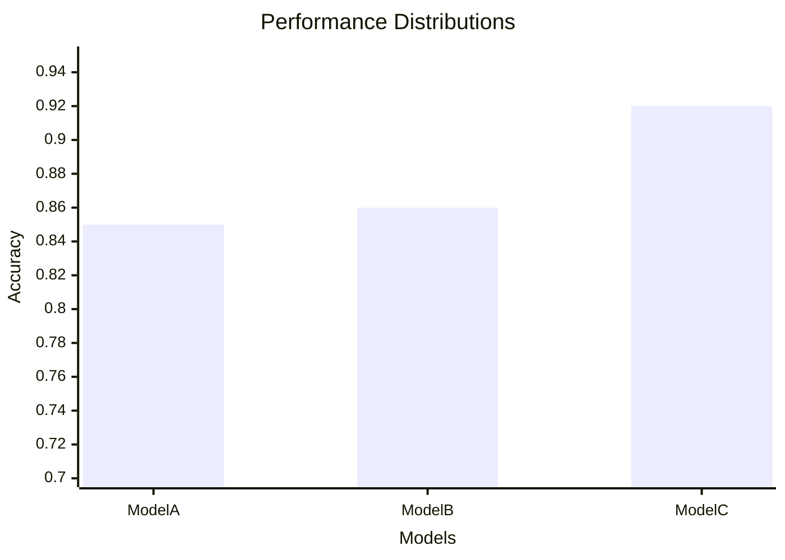

# ⚔️ Model Comparison and Statistical Significance

> **Difficulty**: ⭐⭐⭐⭐☆ Advanced | **Prerequisites**: Cross Validation | **Estimated Reading Time**: 30 Minutes

---

## 📋 Table of Contents
1. [The Fluke Factor (Did it just get lucky?)](#1-the-fluke-factor-did-it-just-get-lucky)
2. [Mean Performance & Variance](#2-mean-performance--variance)
3. [Visualizing Performance Distributions](#3-visualizing-performance-distributions)
4. [Statistical Tests: Paired T-Test](#4-statistical-tests-paired-t-test)
5. [Statistical Tests: Wilcoxon & McNemar](#5-statistical-tests-wilcoxon--mcnemar)
6. [Key Takeaways](#6-key-takeaways)
7. [What's Next?](#7-whats-next)

---

## 1. The Fluke Factor (Did it just get lucky?)

### 🟢 Beginner Intuition
You build a Decision Tree that gets 85% accuracy. You build a Random Forest that gets 86% accuracy. 

Is the Random Forest actually smarter? Or did it just get lucky on the specific test set you used? 

In Machine Learning, 86% is almost never *mathematically* better than 85% by default. To confidently deploy the Random Forest over the Decision Tree, we must prove that the 1% improvement is statistically significant and not just a random fluke.

---

## 2. Mean Performance & Variance

### 🟡 Intermediate Understanding
When comparing two models, we never compare a single Test Set score. We use K-Fold Cross-Validation to generate an *array* of scores (e.g., 10 folds = 10 scores).

We then look at two things:
1.  **Mean Performance**: The average of the 10 scores.
2.  **Variance**: How wildly the scores jump around. 

If Model A averages 85% ($\pm$ 1%), and Model B averages 86% ($\pm$ 8%), Model B is incredibly unstable. Model A is objectively the better choice for production, despite having a lower average!

---

## 3. Visualizing Performance Distributions

The best way to compare models is visually, using Boxplots to show the distribution of Cross-Validation scores.

```python
import matplotlib.pyplot as plt
import seaborn as sns

# Assuming we ran 10-Fold CV
scores_A = [0.84, 0.85, 0.86, 0.84, 0.85, 0.85, 0.84, 0.85, 0.86, 0.85]
scores_B = [0.78, 0.89, 0.81, 0.92, 0.84, 0.88, 0.79, 0.95, 0.82, 0.86]

plt.boxplot([scores_A, scores_B], labels=['Decision Tree (A)', 'Random Forest (B)'])
plt.ylabel('Accuracy')
plt.title('10-Fold CV Performance Distribution')
plt.show()
```

### Interpretation

*(Imagine Model A is a very tight box at 0.85, Model B is a massive, stretched out box centered at 0.86, and Model C is a tight box at 0.92. You would immediately discard B, and mathematically compare A and C).*

---

## 4. Statistical Tests: Paired T-Test

### 🔴 Advanced Concepts
To mathematically prove one model is better than another, we use Hypothesis Testing. 
*   **Null Hypothesis ($H_0$)**: There is no difference between Model A and Model B.
*   **Alternative Hypothesis ($H_A$)**: The models are fundamentally different.

Because both models were evaluated on the *exact same data folds* during Cross Validation, we use a **Paired Student's T-Test**.

```python
from scipy.stats import ttest_rel
import numpy as np

# Cross-validation scores from 10 folds
scores_A = np.array([0.84, 0.85, 0.86, 0.84, 0.85, 0.85, 0.84, 0.85, 0.86, 0.85])
scores_B = np.array([0.91, 0.92, 0.90, 0.93, 0.91, 0.92, 0.91, 0.93, 0.90, 0.92])

# Perform paired t-test
t_stat, p_value = ttest_rel(scores_A, scores_B)

print(f"P-Value: {p_value:.4f}")
if p_value < 0.05:
    print("Reject Null Hypothesis: Model B is statistically significantly better.")
else:
    print("Accept Null Hypothesis: The difference is just statistical noise.")
```

---

## 5. Statistical Tests: Wilcoxon & McNemar

The Paired T-Test assumes your cross-validation scores follow a normal (Gaussian) distribution. In reality, they often do not.

### Wilcoxon Signed-Rank Test
If your scores are not normally distributed, the T-Test is invalid. You must use the **Wilcoxon Signed-Rank Test**, which is the non-parametric equivalent. It looks at the *ranking* of the differences rather than their absolute magnitudes.
```python
from scipy.stats import wilcoxon
stat, p_value = wilcoxon(scores_A, scores_B)
```

### McNemar's Test (For Deep Learning / Massive Datasets)
What if you are training a massive Deep Neural Network, and 10-Fold Cross-Validation would take 3 months? You can only train it once, yielding a single Test Set score.

You cannot use a T-Test on a single score. Instead, you use **McNemar's Test** on the predictions themselves. It creates a $2 \times 2$ contingency table focusing exclusively on where the models *disagree*.

*   Cell A: Both got it right.
*   Cell B: Both got it wrong.
*   **Cell C: Model 1 right, Model 2 wrong.**
*   **Cell D: Model 1 wrong, Model 2 right.**

McNemar's test only looks at C and D. If C and D are roughly equal, the models are the same. If C is vastly larger than D, Model 1 is objectively superior.

```python
from statsmodels.stats.contingency_tables import mcnemar

# Example Contingency Table
table = [[Both_Right, M1_Right_M2_Wrong],
         [M1_Wrong_M2_Right, Both_Wrong]]

result = mcnemar(table, exact=True)
print(f"P-value: {result.pvalue}")
```

---

## 6. Key Takeaways

1.  **Averages Lie**: 86% is not always better than 85% if the variance is massive.
2.  **Use Boxplots**: Always visualize the spread of your Cross Validation folds.
3.  **Prove it Mathematically**: Use T-Tests or Wilcoxon tests for CV folds. Use McNemar's test when CV is impossible.

---

## 7. What's Next?

You have rigorously evaluated, tuned, and statistically proven that your model is the best. You deploy it to production. 

Six months later, the business is losing money because the model's accuracy dropped from 95% to 60%. Why? Because the world changed, and your model didn't. 

In the next chapter, we discuss how to evaluate models *after* they are deployed: **Production Monitoring and Drift**.

Navigation:

[← Previous Topic](13-Imbalanced-Classification.md) | [Back to Index](../README.md) | [Next Topic →](15-Production-Monitoring.md)
