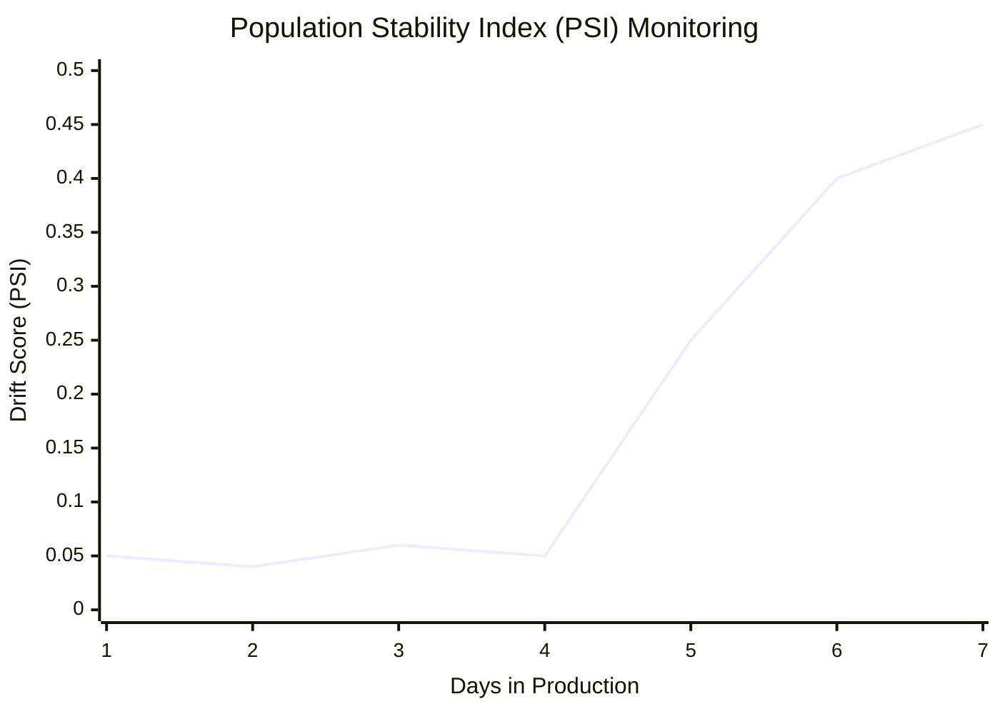

# 🏭 Production Monitoring and Drift

> **Difficulty**: ⭐⭐⭐⭐⭐ Advanced | **Prerequisites**: Model Evaluation | **Estimated Reading Time**: 30 Minutes

---

## 📋 Table of Contents
1. [Models Decay Over Time](#1-models-decay-over-time)
2. [Data Drift vs Concept Drift](#2-data-drift-vs-concept-drift)
3. [The MLOps Monitoring Pipeline](#3-the-mlops-monitoring-pipeline)
4. [Industry Tooling (Evidently AI, MLflow, WhyLabs)](#4-industry-tooling-evidently-ai-mlflow-whylabs)
5. [Retraining Strategies](#5-retraining-strategies)
6. [Key Takeaways](#6-key-takeaways)
7. [What's Next?](#7-whats-next)

---

## 1. Models Decay Over Time

### 🟢 Beginner Intuition
The hardest part of Machine Learning is not deploying the model; it's keeping the model alive.

If you train a model to predict housing prices in 2019, it might have 99% accuracy. If you use that exact same model in 2023, its predictions will be completely wrong because the economy changed, inflation happened, and people moved to different cities. 

Models don't stay smart forever; they decay as the world changes. Because the world is always changing, **Machine Learning is fundamentally a maintenance problem**.

---

## 2. Data Drift vs Concept Drift

### 🟡 Intermediate Understanding

When a model's performance degrades in production, it is usually due to one of two distinct problems.

### Data Drift (Feature Drift)
The distribution of the *input data* ($X$) changes, but the fundamental relationship between $X$ and $y$ remains the same.
*   **Example 1**: A temperature sensor breaks and starts sending values in Fahrenheit instead of Celsius.
*   **Example 2**: A marketing campaign accidentally targets teenagers instead of adults. The model was trained on adult data, so it fails on the teen data.
*   **Detection**: Easy. You just compare the statistical distribution of the live data to the training data.

### Concept Drift
The fundamental relationship between the input ($X$) and the output ($y$) changes. The data might look exactly the same, but the universe's rules have shifted.
*   **Example 1**: During the 2020 pandemic, the concept of "normal purchasing behavior" changed entirely overnight. Buying 50 rolls of toilet paper went from "anomaly/hoarding" to "standard behavior."
*   **Example 2**: Fraudsters discover a new way to steal credit cards that your model has never seen.
*   **Detection**: Very difficult. You must wait for the true labels ($y$) to eventually arrive and calculate the model's actual error.

---

## 3. The MLOps Monitoring Pipeline

### 🔴 Advanced Concepts

In production, you cannot calculate Accuracy or F1-Score in real-time because **you don't immediately know the true labels** (e.g., you don't know if a 30-year mortgage will default until 30 years later).

Instead, MLOps Engineers use statistical divergence metrics to measure if the live incoming data looks mathematically different from the data the model was trained on.

### Drift Dashboard Visualization

*(Notice the massive spike on Day 5. An alerting system would trigger an immediate Slack message to the Data Science team).*

### Statistical Drift Tests:
1.  **Population Stability Index (PSI)**: The industry standard for measuring shifts in categorical or binned continuous distributions. A PSI > 0.2 indicates significant drift.
2.  **Kolmogorov-Smirnov (K-S) Test**: Checks if two continuous samples are drawn from the exact same distribution.
3.  **Wasserstein Distance (Earth Mover's Distance)**: Measures the minimum "cost" to transform the live distribution into the training distribution.

---

## 4. Industry Tooling (Evidently AI, MLflow, WhyLabs)

Modern data scientists do not write these statistical tests from scratch. They use dedicated MLOps platforms.

### Evidently AI
Evidently creates interactive HTML reports comparing a Reference Dataset (Training Data) to a Current Dataset (Production Data).
```python
# Conceptual implementation
from evidently.report import Report
from evidently.metric_preset import DataDriftPreset

data_drift_report = Report(metrics=[DataDriftPreset()])
data_drift_report.run(reference_data=train_df, current_data=production_df)
data_drift_report.save_html("drift_dashboard.html")
```

### WhyLabs / Arthur AI
Enterprise platforms that ingest real-time logs from your model endpoints and provide out-of-the-box alerting, slack integrations, and massive scalability for tracking billions of predictions.

### MLflow Model Registry
Used to track which version of a model is currently in production, its hyperparameters, and its historical training metrics, allowing instant rollbacks if a newly deployed model fails.

---

## 5. Retraining Strategies

When drift is detected and an alert fires, what do you do?

1.  **Manual Retraining (Ad-Hoc)**: The Data Scientist opens a Jupyter Notebook, analyzes the new data, drops broken features, and manually trains a new model.
2.  **Scheduled Retraining**: The model automatically retrains itself every Sunday night on the trailing 30 days of data.
3.  **Triggered Retraining (Continuous Training - CT)**: An automated CI/CD pipeline triggers retraining *only* when the Drift Monitor detects a PSI > 0.2.

**Shadow Deployment**: Before replacing the live model, the new model is deployed in "Shadow Mode". It receives live traffic and makes predictions, but those predictions are not sent to the customer. We just log them to ensure the new model isn't crashing before promoting it.

---

## 6. Key Takeaways

1.  **Deployment is Day 1**: A model's life truly begins when it hits production. Decay is inevitable.
2.  **Monitor the Inputs**: Since you don't have true labels in production, you must statistically monitor the input features for Data Drift.
3.  **Automate the Pipeline**: MLOps is about building systems that detect drift, trigger retraining, and evaluate the new model automatically.

---

## 7. What's Next?

If your model denies a user a loan, and they call customer service asking "Why?", you cannot say "Because the Random Forest said so." By law in many countries, you must explain the algorithm's decision.

In our final chapter, we explore how to crack open the black box of Machine Learning: **Interpretability and Explainability**.

Navigation:

[← Previous Topic](14-Model-Comparison-And-Statistical-Testing.md) | [Back to Index](../README.md) | [Next Topic →](16-Interpretability-And-Explainability.md)
