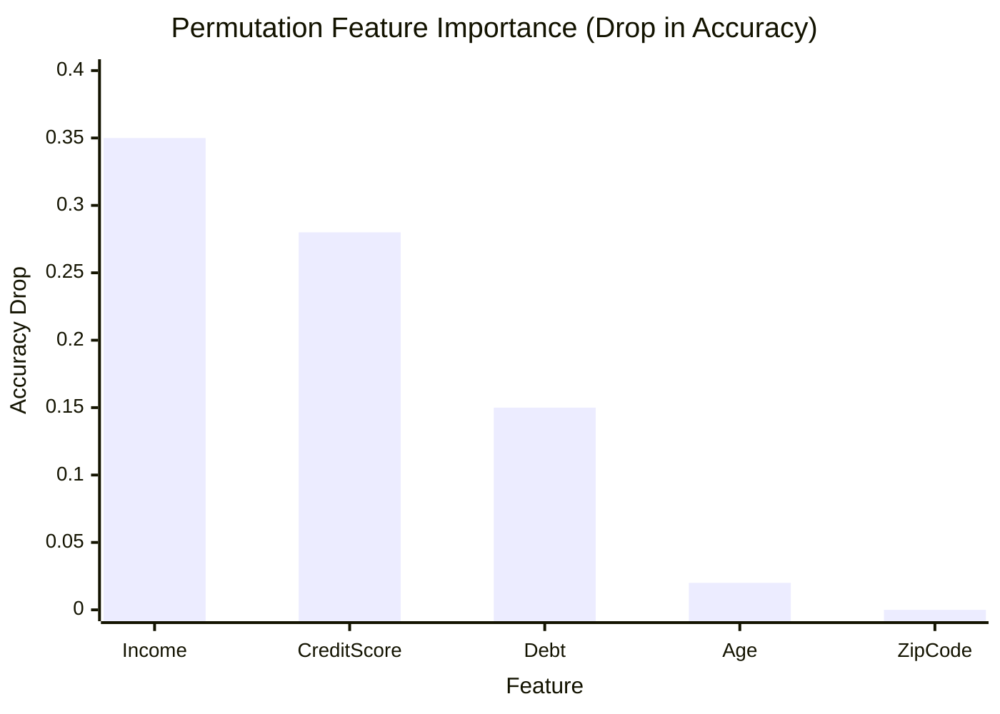
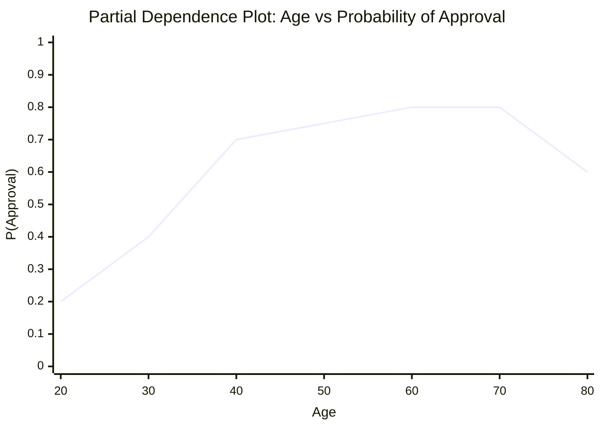
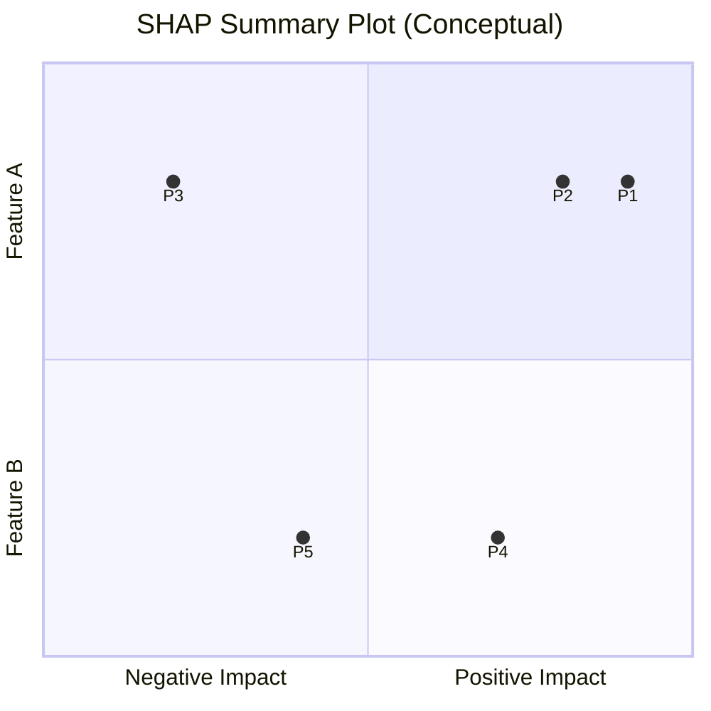

# 🔍 Interpretability and Explainability

> **Difficulty**: ⭐⭐⭐⭐☆ Advanced | **Prerequisites**: Regression/Classification Metrics | **Estimated Reading Time**: 35 Minutes

---

## 📋 Table of Contents
1. [The Black Box Problem](#1-the-black-box-problem)
2. [Global vs Local Explanations](#2-global-vs-local-explanations)
3. [Global Methods: Feature & Permutation Importance](#3-global-methods-feature--permutation-importance)
4. [Partial Dependence Plots (PDP) & ICE](#4-partial-dependence-plots-pdp--ice)
5. [Local Methods: LIME](#5-local-methods-lime)
6. [The Gold Standard: SHAP](#6-the-gold-standard-shap)
7. [Key Takeaways](#7-key-takeaways)

---

## 1. The Black Box Problem

### 🟢 Beginner Intuition
Historically, there was a tradeoff in Machine Learning:
*   **Simple Models** (Linear Regression, Decision Trees): Easy to understand, but terrible at complex tasks.
*   **Complex Models** (Random Forests, XGBoost, Neural Networks): Highly accurate, but complete **Black Boxes**. You put data in, magic happens, and a prediction comes out.

**The Problem**: If a bank denies your mortgage, they cannot legally say, "The Neural Network said no." They must tell you exactly *why* you were denied. Similarly, if a medical AI recommends surgery, a doctor needs to know *why* before cutting someone open. 

**Explainable AI (XAI)** is the suite of tools we use to crack open the Black Box.

---

## 2. Global vs Local Explanations

### 🟡 Intermediate Understanding
When a stakeholder asks "Why?", they are usually asking one of two different questions:

1.  **Global Explainability**: "How does this model work overall? What are the most important factors for predicting house prices in general?"
2.  **Local Explainability**: "Why did the model reject *John Smith's* specific loan application today at 2:00 PM?"

We need different mathematical tools for each question.

---

## 3. Global Methods: Feature & Permutation Importance

### Built-in Feature Importance (Gini/Impurity)
Tree-based models (Random Forests, XGBoost) have built-in `.feature_importances_`.
*   **How it works**: It counts how often a feature was used to split the data across all trees, and how much those splits reduced the error.
*   **The Flaw**: It is heavily biased towards continuous features with many unique values (like `Income`) and ignores categorical features (like `Has_Pet`).

### Permutation Importance
A much more robust Global method that works on *any* algorithm.
*   **How it works**: 
    1. Calculate the model's baseline Accuracy on the Test Set (e.g., 90%).
    2. Take the `Age` column and randomly shuffle the values.
    3. Recalculate the Accuracy. 
    4. If Accuracy drops from 90% to 50%, `Age` was a massively important feature. If it stays at 90%, `Age` is useless.

---

## 4. Partial Dependence Plots (PDP) & ICE

Permutation Importance tells you *which* feature is important, but not *how* it affects the prediction. 

**Partial Dependence Plots (PDP)** show the marginal effect of one feature on the predicted outcome.
If we want to know exactly how `Age` affects the probability of Loan Approval, we plot it:

*(Insight: Approval chances peak around 60, then drop off).*

**ICE Plots (Individual Conditional Expectation)**: PDPs show the average effect across all people. ICE plots draw a separate line for *every single person in the dataset*. This reveals if `Age` affects rich people differently than poor people.

---

## 5. Local Methods: LIME

### 🔴 Advanced Concepts
**LIME** (Local Interpretable Model-agnostic Explanations) is used to explain *one specific prediction*.

*   **How it works**:
    1. You ask LIME: "Why did the Neural Network reject John's loan?"
    2. LIME generates 1,000 fake customers who are very similar to John (e.g., slightly higher income, slightly lower debt).
    3. It feeds these 1,000 fakes to the Neural Network and gets the predictions.
    4. It trains a simple, easily-explainable Linear Regression model *only* on those 1,000 local points.
    5. The coefficients of that Linear model tell you exactly why John was rejected.

---

## 6. The Gold Standard: SHAP

**SHAP** (SHapley Additive exPlanations) is the current industry gold standard. It is rooted in Cooperative Game Theory. 

*   **The Math**: It treats the final prediction (e.g., House Price = $500k) as a "payout" in a game. It treats the features (Bedrooms, Zip Code, Age) as the "players". It mathematically calculates exactly how many dollars each player contributed to the final payout compared to the baseline average house price.

### 1. SHAP Waterfall Plot (Local Explainability)
Explains a single prediction by showing how features push the prediction away from the baseline.

```mermaid
gantt
    title SHAP Waterfall (Predicting House Price)
    dateFormat X
    axisFormat %s
    
    section Baseline ($300k)
    Average House: 0, 300
    
    section Positive Pushes (Red)
    + Excellent Zip Code: 300, 400
    + 4 Bedrooms: 400, 450
    
    section Negative Pushes (Blue)
    - Needs Roof Repair: 400, 450
    
    section Final Prediction ($400k)
    Prediction: 0, 400
```

*(In SHAP, `Prediction = Baseline + Sum of SHAP Values`)*.

### 2. SHAP Summary Plot (Global Explainability)
Combines every single local explanation into one massive global chart.

*(In an actual SHAP summary plot, every dot is a patient/customer. Red dots mean the feature value was high, Blue means low. It instantly shows you if high blood pressure increases or decreases the risk of a heart attack).*

---

## 7. Key Takeaways

1.  **Trust is Mandatory**: In finance, healthcare, and self-driving, an accurate model that cannot be explained is a useless model.
2.  **Global vs Local**: Use Permutation Importance to explain the whole model. Use SHAP Waterfall to explain a single customer.
3.  **Learn SHAP**: SHAP is mathematically rigorous, model-agnostic, and the definitive tool used by modern Data Science teams.

---

**Congratulations!** You have completed the Model Evaluation module. You now know how to partition data, diagnose errors, select metrics, tune parameters, monitor drift, and explain your models like a Senior Machine Learning Engineer.

[← Previous Topic](15-Production-Monitoring.md) | [Return to Model Evaluation Index](../README.md)
