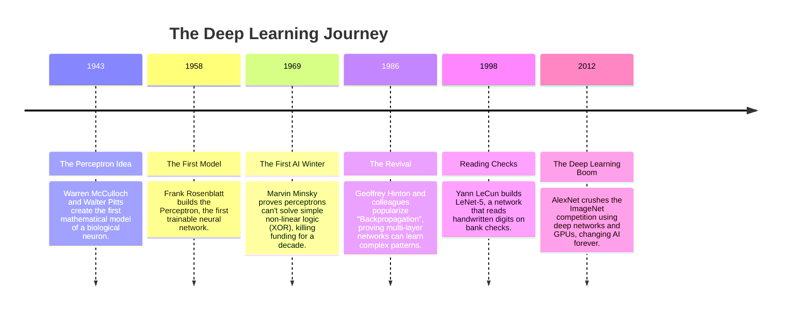
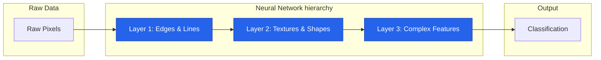

# 🧠 01 - Introduction to Neural Networks

---

## 📋 Table of Contents
1. [Why Neural Networks Exist](#why-neural-networks-exist)
2. [A Brief History of Deep Learning](#a-brief-history-of-deep-learning)
3. [What Makes Neural Networks Different](#what-makes-neural-networks-different)
4. [Real-World Examples](#real-world-examples)
5. [What's Next](#whats-next)

---

## 🧐 Why Neural Networks Exist

Traditional machine learning algorithms—like Linear Regression, Decision Trees, or Support Vector Machines—are incredibly powerful. If you have a clean Excel spreadsheet (tabular data) where you want to predict a house's price based on its square footage and number of bedrooms, traditional ML is your best tool.

But what happens when your data isn't a neat spreadsheet? What if you want to understand the world the way humans do?

### Where Traditional ML Fails

Traditional ML struggles with **unstructured data**. 

Imagine trying to teach a linear regression model to recognize a picture of a cat. To the computer, a 100x100 pixel image is just a grid of 10,000 numbers representing color intensity. A traditional ML model tries to look at these 10,000 independent numbers and draw a straight line (or plane) to separate "cat" from "dog". 

It doesn't work. The relationship between raw pixels and the concept of a "cat" is far too complex and nonlinear.

This is exactly why Neural Networks exist. They solve problems linear models cannot:

1. **Image Recognition:** Finding patterns in millions of pixels (e.g., self-driving cars seeing stop signs).
2. **Speech Recognition:** Transcribing complex audio waveforms into text (e.g., Siri, Alexa).
3. **Language Understanding:** Grasping the context, sentiment, and meaning of billions of text sequences (e.g., ChatGPT).

---

## 📜 A Brief History of Deep Learning

Deep Learning is not a new concept; it is decades old. It has survived periods of extreme hype and long "AI Winters" where funding dried up completely.

---

## 💡 What Makes Neural Networks Different

The true power of a neural network lies in its ability to **automatically learn hierarchical representations**.

In traditional ML, engineers have to perform "Feature Engineering." If they wanted a model to detect a face, they had to write mathematical formulas to find edges, shapes, and skin tones.

A Neural Network does this automatically. You just give it raw pixels, and it learns the features on its own, layer by layer:

- **Layer 1 (The Low Level):** Learns to detect basic edges (vertical lines, horizontal lines).
- **Layer 2 (The Mid Level):** Combines edges to detect shapes (circles, squares, corners).
- **Layer 3 (The High Level):** Combines shapes to detect complex objects (eyes, ears, noses).
- **Output Layer:** Combines the complex objects to say "This is a human face."

### Visual Intuition

### Real-World Example: The Corporate Committee

Think of a Neural Network like a large corporate committee deciding whether to invest in a new product.

1. **The Inputs:** Market data, consumer trends, competitor prices.
2. **The Junior Analysts (Hidden Layer 1):** They look at the raw data and form basic opinions.
3. **The Senior Managers (Hidden Layer 2):** They listen to the junior analysts, weight their opinions (ignoring the bad analysts, trusting the good ones), and form complex strategies.
4. **The Board of Directors (Output Layer):** They take the managers' strategies and make the final "Invest" or "Don't Invest" prediction.

If they lose money, the CEO yells at the board, the board yells at the managers, and the managers yell at the analysts. Everyone adjusts who they trust for next time. This "yelling backward" is exactly how neural networks learn (a process we will later learn is called **Backpropagation**).

---

## 🚀 What's Next

### Key Takeaways
- Neural networks were invented to handle unstructured data (images, audio, text) where traditional ML fails.
- They are "feature learning" machines—they automatically figure out what patterns in the data are important.
- The history of AI is filled with "winters" and booms, largely driven by available computing power (GPUs) and massive datasets.

### Common Mistakes
- **Using a Neural Network for everything:** Neural networks are slow to train, hard to interpret, and require massive data. If you have a simple tabular dataset, use an XGBoost or Random Forest model instead. Neural networks are not a magical hammer for every nail.

### Practical Recommendations
- Always establish a baseline performance using a traditional ML model before you spend hours building and training a deep neural network.

### Next Topic
Now that we understand *why* neural networks exist, it's time to look under a microscope at their fundamental building block: the Artificial Neuron.

[← Back to Index](./README.md) | [Next Topic: Artificial Neurons →](./02-Artificial-Neurons.md)
