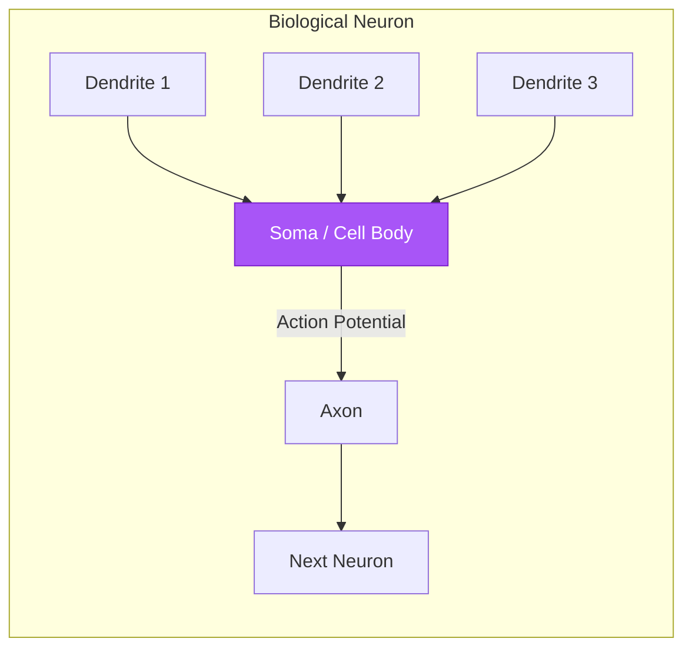
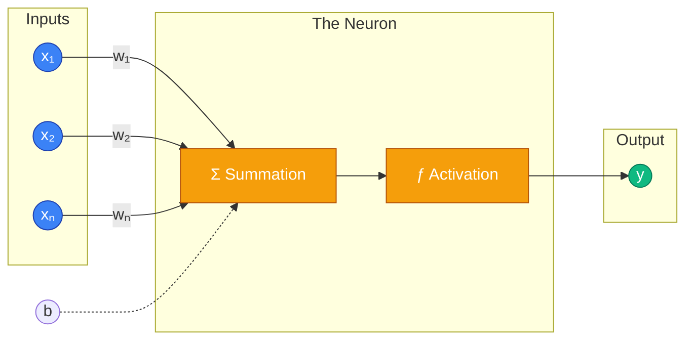

# 🧠 02 - Artificial Neurons

---

## 📋 Table of Contents
1. [The Biological Inspiration](#the-biological-inspiration)
2. [The Anatomy of an Artificial Neuron](#the-anatomy-of-an-artificial-neuron)
3. [The Mathematical Formula](#the-mathematical-formula)
4. [What's Next](#whats-next)

---

## 🧬 The Biological Inspiration

Before we dive into the math, let's look at where the idea for Neural Networks came from: the human brain.

Your brain contains roughly 86 billion neurons. These biological cells communicate with each other through electrical and chemical signals. 

A biological neuron has three main parts you need to care about:
1. **Dendrites:** The "receivers" that collect signals from other neurons.
2. **Soma (Cell Body):** The "processor" that sums up all the incoming signals.
3. **Axon:** The "transmitter" that fires an electrical pulse to the next neuron *if* the incoming signals are strong enough.

Computer scientists in the 1940s and 50s thought: *"What if we could recreate this mechanism mathematically?"*

**Note:** Modern deep learning has diverged significantly from biology. Today, artificial neurons are just mathematical functions. We use the biological analogy for intuition, but don't assume neural networks actually work like a human brain.

---

## ⚙️ The Anatomy of an Artificial Neuron

An Artificial Neuron (sometimes called a Node) is a mathematical function that takes in numbers, does some basic arithmetic, and outputs a new number.

It operates in three distinct steps:

1. **Receive Inputs & Weights:** It takes incoming data and multiplies it by a "weight" (which dictates how important that input is).
2. **Sum & Add Bias:** It adds all those weighted inputs together, plus a special number called the "bias".
3. **Activate:** It passes that sum through an "Activation Function" to decide what its final output should be.

### Visualizing the Artificial Neuron

Let's break down the components:

- **Inputs ($x$):** The data coming in. This could be pixels of an image, or the output from a previous layer of neurons.
- **Weights ($w$):** The importance of each input. If a weight is large, that input strongly influences the neuron's decision. If a weight is near zero, the neuron ignores that input. (These are what the network "learns" during training).
- **Bias ($b$):** A constant number added to the sum. It allows the neuron to shift its activation threshold left or right. It's like a base-level tendency for the neuron to fire, regardless of the inputs.
- **Summation ($\Sigma$):** The neuron calculates the dot product of the inputs and weights, and adds the bias.
- **Activation Function ($f$):** A mathematical gate that squishes or transforms the sum into a useful output range (e.g., between 0 and 1). We will dedicate an entire lesson to these later.

---

## 🧮 The Mathematical Formula

Conceptually, the artificial neuron is doing a very simple calculation. It computes a linear combination of its inputs, and then applies a non-linear function.

For a neuron with $n$ inputs:

$$ z = (x_1 \cdot w_1) + (x_2 \cdot w_2) + \dots + (x_n \cdot w_n) + b $$

Using summation notation, this is written as:

$$ z = \sum_{i=1}^{n} (x_i \cdot w_i) + b $$

And using linear algebra (Vector Dot Product), which is how computers actually calculate this extremely fast:

$$ z = \mathbf{w}^T \mathbf{x} + b $$

Finally, the output $y$ (or "activation" $a$) is the result of passing $z$ through the activation function $f$:

$$ y = f(z) $$

### A Concrete Example
Imagine an artificial neuron deciding whether you should go outside today based on two inputs:
- $x_1$: Is it raining? (1 for yes, 0 for no)
- $x_2$: Are your friends going? (1 for yes, 0 for no)

The neuron has learned weights:
- $w_1 = -5$ (You really hate rain)
- $w_2 = 3$ (You like your friends)
- Bias $b = 1$ (You generally like going outside)

**Scenario:** It is raining ($x_1=1$), but your friends are going ($x_2=1$).

1. Calculate the sum: 
   $z = (1 \times -5) + (1 \times 3) + 1$
   $z = -5 + 3 + 1 = -1$

2. Apply a step activation function (if $z > 0$, output 1, else 0):
   $y = f(-1) = 0$

Output is 0. The neuron has decided you should stay inside. 

---

## 🚀 What's Next

### Key Takeaways
- Artificial neurons are loosely inspired by biology, but are fundamentally just math functions.
- A neuron takes inputs, multiplies them by weights, adds a bias, and passes the result through an activation function.
- **Weights** determine the importance of an input. **Biases** shift the neuron's sensitivity.

### Common Mistakes
- **Confusing Artificial with Biological:** Don't assume deep learning models "think" like humans just because they use the word "neuron". They are performing high-dimensional geometry and calculus.
- **Forgetting the Bias:** Beginners sometimes try to build neurons without a bias term. Without a bias, the neuron's decision boundary is forced to pass through the origin $(0,0)$, severely limiting what it can learn.

### Practical Recommendations
- When reading PyTorch or TensorFlow code, a "Dense" or "Linear" layer is just a collection of these artificial neurons running this exact $z = \mathbf{w}^T \mathbf{x} + b$ math simultaneously using matrix multiplication.

### Next Topic
Now that you know what a single artificial neuron is, let's look at the earliest attempt to use one for machine learning: the Perceptron.

[← Previous Topic](./01-Introduction-To-Neural-Networks.md) | [Next Topic: The Perceptron →](./03-Perceptron.md)
