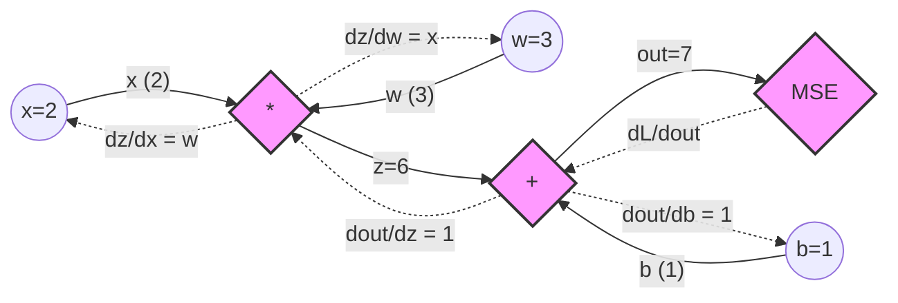

# 🔄 Backpropagation & Computational Graphs

> **Prerequisites**: Multilayer Perceptron, Multivariate Calculus (Chain Rule) | **Difficulty**: ⭐⭐⭐⭐⭐ Advanced

---

## 📋 Table of Contents
1. [The Big Picture: Gradient-Based Optimization](#1-the-big-picture-gradient-based-optimization)
2. [Computational Graphs](#2-computational-graphs)
3. [The Calculus of Backpropagation (Chain Rule)](#3-the-calculus-of-backpropagation-chain-rule)
4. [The 4 Fundamental Equations of Backpropagation](#4-the-4-fundamental-equations-of-backpropagation)
5. [Visualizing the Backward Pass](#5-visualizing-the-backward-pass)
6. [The Problem of Vanishing & Exploding Gradients](#6-the-problem-of-vanishing--exploding-gradients)
7. [Project Ideas & What's Next](#7-project-ideas--whats-next)

---

## 1. The Big Picture: Gradient-Based Optimization

In neural networks, our goal is to minimize a Loss Function $L(\mathbf{y}, \mathbf{\hat{y}})$ *(covered in depth in [Loss Functions](./04-Loss-Functions-Deep-Dive.md))*. 

To minimize $L$, we must update our weights $\mathbf{W}$ and biases $\mathbf{b}$ in the direction of the negative gradient:
$$\mathbf{W}^{[l]} \leftarrow \mathbf{W}^{[l]} - \alpha \frac{\partial L}{\partial \mathbf{W}^{[l]}}$$

**The problem:** How do we calculate $\frac{\partial L}{\partial \mathbf{W}^{[l]}}$ for a weight matrix buried 50 layers deep in the network?
**The solution:** Backpropagation (Reverse-Mode Automatic Differentiation).

---

## 2. Computational Graphs

To understand Backpropagation, we must model neural network operations as a **Computational Graph**. 

A computational graph represents mathematical expressions as a directed acyclic graph (DAG).
- **Nodes** represent variables (tensors).
- **Edges** represent operations (matrix multiplication, addition, activation).

### Forward Pass
During the forward pass, we compute the values of all nodes from left (inputs) to right (loss).

Let's look at a single neuron:
$$x, w \xrightarrow{*} z_1 \xrightarrow{+b} z_2 \xrightarrow{\text{sigmoid}} \hat{y} \xrightarrow{\text{loss}} L$$

### Backward Pass
During the backward pass, we compute the derivatives from right (loss) to left (inputs). Every node that computed an operation $f(x)$ during the forward pass must now compute its local derivative $f'(x)$ and multiply it by the gradient flowing in from downstream.

---

## 3. The Calculus of Backpropagation (Chain Rule)

Backpropagation is simply the application of the Calculus Chain Rule across the computational graph.

If $y = f(u)$ and $u = g(x)$, then:
$$\frac{\partial y}{\partial x} = \frac{\partial y}{\partial u} \cdot \frac{\partial u}{\partial x}$$

### The "Upstream Gradient" and "Local Gradient"
At any given node $z$ in our graph, we receive an **Upstream Gradient** from the node ahead of it: $\frac{\partial L}{\partial z_{\text{out}}}$.

The node knows its own **Local Gradient**: $\frac{\partial z_{\text{out}}}{\partial z_{\text{in}}}$.

The node calculates the **Downstream Gradient** to pass backward:
$$\text{Downstream} = \text{Upstream} \times \text{Local}$$
$$\frac{\partial L}{\partial z_{\text{in}}} = \frac{\partial L}{\partial z_{\text{out}}} \cdot \frac{\partial z_{\text{out}}}{\partial z_{\text{in}}}$$

*(Note: When dealing with vectors and matrices, these derivatives are Jacobian matrices, and the multiplications are tensor dot products).*

---

## 4. The 4 Fundamental Equations of Backpropagation

Let's generalize this to a full Neural Network layer $l$. 

Let the "error" at layer $l$ be defined as the derivative of the loss with respect to the pre-activation $Z$:
$$d\mathbf{Z}^{[l]} = \frac{\partial L}{\partial \mathbf{Z}^{[l]}}$$

For a batch of $m$ examples, the 4 fundamental equations of backpropagation are:

**1. Error at the Output Layer ($L$)**:
If using a standard setup like Sigmoid + Binary Cross-Entropy or Softmax + Categorical Cross-Entropy, the math simplifies elegantly to just the difference between predictions and targets:
$$d\mathbf{Z}^{[L]} = \mathbf{A}^{[L]} - \mathbf{Y}$$

**2. Error at Hidden Layer ($l$)**:
To get the error at layer $l$, we take the error from layer $l+1$, push it backward through the weights $\mathbf{W}^{[l+1]}$, and multiply by the derivative of the activation function at layer $l$:
$$d\mathbf{Z}^{[l]} = (\mathbf{W}^{[l+1]})^T d\mathbf{Z}^{[l+1]} \odot g'^{[l]}(\mathbf{Z}^{[l]})$$
*(where $\odot$ is the Hadamard/element-wise product, and $g'$ is the derivative of the activation function)*.

**3. Gradient of Weights ($l$)**:
The gradient for the weights is the outer product of the error and the activations from the previous layer:
$$d\mathbf{W}^{[l]} = \frac{1}{m} d\mathbf{Z}^{[l]} (\mathbf{A}^{[l-1]})^T$$

**4. Gradient of Biases ($l$)**:
The gradient for the biases is the sum of the errors across the batch dimension:
$$d\mathbf{b}^{[l]} = \frac{1}{m} \sum_{i=1}^{m} d\mathbf{Z}^{[l](i)}$$

---

## 5. Visualizing the Backward Pass

Here is a Python script that visually graphs a simple computational node.

---

## 6. The Problem of Vanishing & Exploding Gradients

Look at Equation 2 again:
$$d\mathbf{Z}^{[l]} = (\mathbf{W}^{[l+1]})^T d\mathbf{Z}^{[l+1]} \odot g'^{[l]}(\mathbf{Z}^{[l]})$$

In a deep network (e.g., 50 layers), computing the error at layer 1 requires multiplying by the weight matrices of all 49 subsequent layers: $\mathbf{W}^{[50]} \dots \mathbf{W}^{[2]}$.

1. **Vanishing Gradients**: If the weights are initialized with values $< 1$, multiplying them 50 times results in an exponentially small gradient ($\approx 0$). The early layers receive no error signal and never learn. This is compounded by activation functions like Sigmoid, whose derivative $g'(z)$ is strictly $< 0.25$.
2. **Exploding Gradients**: If weights are initialized $> 1$, the gradient explodes to $\infty$ (NaN), destroying the model instantly.

**Solutions to Vanishing/Exploding Gradients:**
- **ReLU Activation**: Its derivative is exactly 1 (for $z>0$), preventing the exponential decay caused by $g'(z)$. *(See [Activation Functions](./03-Activation-Functions.md))*
- **Smart Initialization**: Initialize weights so the variance of the outputs equals the variance of the inputs. *(See [Weight Initialization](./07-Weight-Initialization.md))*
- **Residual Connections**: Used in ResNets, these add a $+ \mathbf{X}$ to the output, meaning the derivative is $+1$, creating a "gradient highway" that bypasses the deep multiplication chain.

---

## 7. Project Ideas & What's Next

### Project Ideas
- 🟢 **Manual Backprop**: Write out a computational graph for $f(x,y,z) = (x+y) \cdot \max(0, z)$. Given $x=1, y=2, z=-1$, compute the forward pass values, and then manually compute $\frac{\partial f}{\partial x}$, $\frac{\partial f}{\partial y}$, and $\frac{\partial f}{\partial z}$ on paper.
- 🟡 **Micrograd Clone**: Build a tiny autograd engine from scratch in Python, similar to Andrej Karpathy's `micrograd`. Create a `Value` class that stores its `data` and its `grad`, and overrides operators (`__add__`, `__mul__`) to build the computational graph dynamically.

### What's Next
| Next | Why |
|------|-----|
| [Activation Functions](./03-Activation-Functions.md) | We saw how the derivative of the activation function affects backprop. Let's look at all modern activations. |
| [Optimizers Deep Dive](./05-Optimizers-Deep-Dive.md) | Now that we have the gradients $dW$, how do we best update $W$? SGD is too slow. We need Adam. |

---

[← Perceptron And MLP](./01-Perceptron-And-MLP.md) | [Back to Index](../README.md) | [Next: Activation Functions →](./03-Activation-Functions.md)
