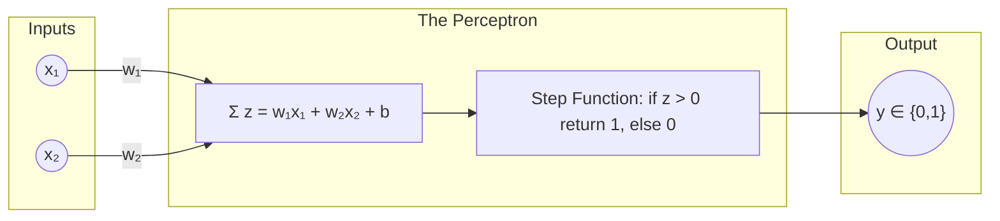

# 🧠 03 - The Perceptron

---

## 📋 Table of Contents
1. [What is a Perceptron?](#what-is-a-perceptron)
2. [Binary Classification & Decision Boundaries](#binary-classification--decision-boundaries)
3. [The Perceptron Learning Algorithm](#the-perceptron-learning-algorithm)
4. [The Fatal Flaw: The XOR Problem](#the-fatal-flaw-the-xor-problem)
5. [What's Next](#whats-next)

---

## 🤖 What is a Perceptron?

Invented in 1958 by Frank Rosenblatt, the **Perceptron** is the simplest form of an artificial neural network. It consists of exactly *one* artificial neuron. 

It takes multiple inputs, weights them, sums them up, adds a bias, and passes the result through a **Step Function** to output either a `0` or a `1`. 

Because it only outputs `0` or `1`, the Perceptron is fundamentally a **Binary Classifier**.

---

## 📏 Binary Classification & Decision Boundaries

Imagine you are trying to classify whether an email is "Spam" (1) or "Not Spam" (0) based on two features:
- $x_1$: Number of times the word "Free" appears.
- $x_2$: Number of times the word "Money" appears.

If you plot these emails on a 2D graph, a Perceptron attempts to draw a **straight line** that perfectly separates the Spam from the Not Spam. This separating line is called a **Decision Boundary**.

### The Math of the Line
The equation of the perceptron before the step function is $z = w_1x_1 + w_2x_2 + b$. 
The step function transitions from 0 to 1 exactly when $z = 0$. 
Therefore, the decision boundary is the line where:

$$ w_1x_1 + w_2x_2 + b = 0 $$

If a data point falls on one side of the line ($z > 0$), the Perceptron predicts `1`. If it falls on the other side ($z \le 0$), it predicts `0`.

Because the boundary is a straight line, the Perceptron is a **linear classifier**. It can only solve problems that are *linearly separable*.

---

## 🧠 The Perceptron Learning Algorithm

How does the Perceptron figure out where to draw this line? How does it find the right weights ($w$) and bias ($b$)?

It learns through trial and error using the **Perceptron Learning Rule**.

1. **Initialize:** Start with random weights and a random bias.
2. **Predict:** For a given data point, calculate the output $\hat{y}$.
3. **Compare:** Compare the prediction $\hat{y}$ to the true label $y$.
4. **Update:** 
   - If the prediction was correct ($\hat{y} = y$), do nothing.
   - If the prediction was wrong ($\hat{y} \ne y$), adjust the weights and bias slightly to pull the decision boundary closer to the correct side of that point.

The mathematical update rule looks like this:

$$ w_i \leftarrow w_i + \alpha (y - \hat{y}) x_i $$
$$ b \leftarrow b + \alpha (y - \hat{y}) $$

Where $\alpha$ (alpha) is the **Learning Rate**—a small number that controls how drastically the line moves after a mistake.

If the data is linearly separable, this algorithm is mathematically guaranteed to eventually find a line that separates the classes perfectly (The Perceptron Convergence Theorem).

---

## ☠️ The Fatal Flaw: The XOR Problem

In 1969, Marvin Minsky and Seymour Papert published a book demonstrating a massive limitation of the Perceptron: it cannot solve the **XOR (Exclusive OR)** problem.

XOR is a simple logic gate that outputs `1` only if the inputs are different, and `0` if they are the same.

| Input $x_1$ | Input $x_2$ | Output (XOR) |
|-------------|-------------|--------------|
| 0           | 0           | 0            |
| 0           | 1           | 1            |
| 1           | 0           | 1            |
| 1           | 1           | 0            |

If you plot these four points on a graph:

- (0,1) and (1,0) are class `1` (Let's say, Blue).
- (0,0) and (1,1) are class `0` (Let's say, Red).

**Try drawing a single straight line that separates the Blue points from the Red points.**

You can't. It is geometrically impossible. 

Because the Perceptron can only draw a single straight line, it completely fails to learn XOR. This realization devastated the field of neural networks, plunging AI research into its first major "winter." Funding dried up for over a decade.

### The Solution
How do you solve XOR? You don't use one straight line. You use *two* lines, or a curved boundary. 

To do that, you need more than one neuron. You need a **network** of neurons, organized in multiple layers. 

---

## 🚀 What's Next

### Key Takeaways
- A Perceptron is a single artificial neuron with a step activation function.
- It is a linear classifier that draws a straight-line decision boundary.
- It learns by updating its weights only when it makes a mistake.
- It cannot learn patterns that are not linearly separable, such as the XOR problem.

### Common Mistakes
- **Expecting too much from a Perceptron:** You will rarely, if ever, use a raw Perceptron in modern deep learning. We use them conceptually to understand the origins of the field. Modern networks use different activation functions (like ReLU or Sigmoid) because the rigid "Step Function" of the Perceptron is too hard to optimize with modern calculus (Backpropagation).

### Practical Recommendations
- The Perceptron learning rule is historically important, but today we train networks using a different algorithm called Gradient Descent. Don't worry about memorizing the Perceptron update formula.

### Next Topic
To solve the XOR problem and build models capable of learning complex, non-linear realities, we must connect multiple neurons together. Let's move from the simple Perceptron to true Multi-Layer Neural Networks.

[← Previous Topic](./02-Artificial-Neurons.md) | [Next Topic: From Perceptrons to Neural Networks →](./04-From-Perceptrons-To-Neural-Networks.md)
