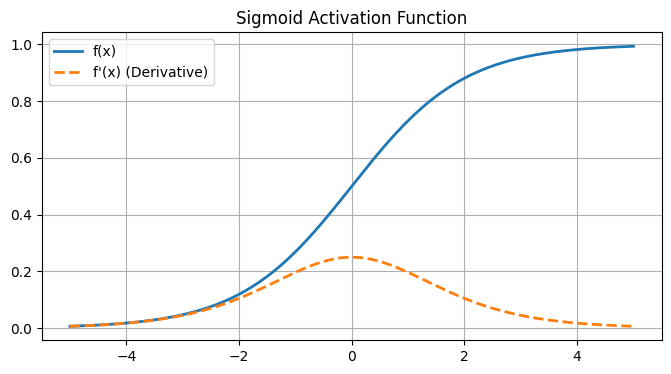
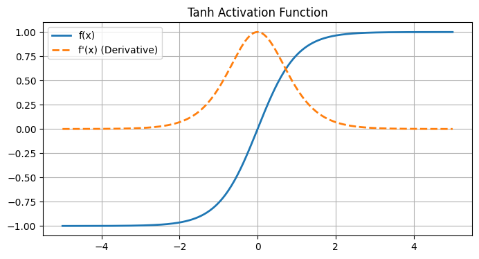
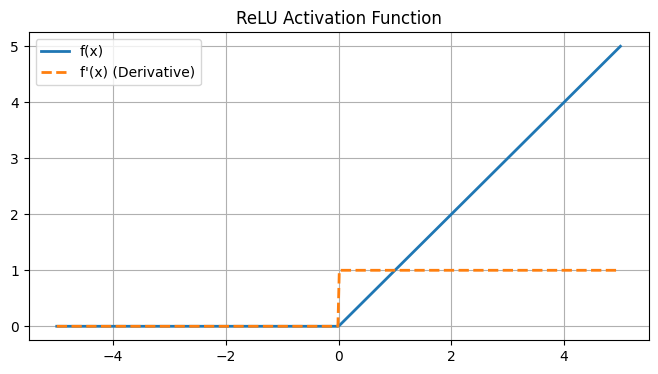
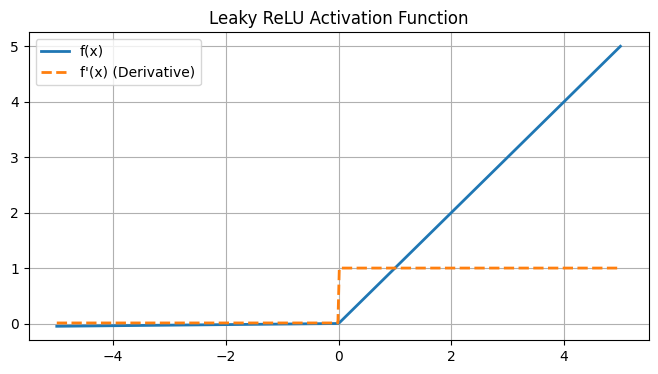
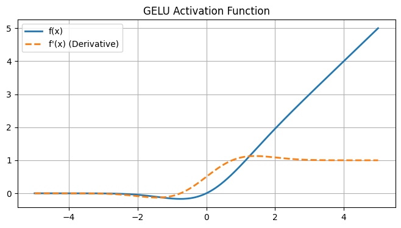

# 🧠 05 - Activation Functions

---

## 📋 Table of Contents
1. [Why We Need Activation Functions](#why-we-need-activation-functions)
2. [Sigmoid](#sigmoid)
3. [Tanh (Hyperbolic Tangent)](#tanh-hyperbolic-tangent)
4. [ReLU (Rectified Linear Unit)](#relu-rectified-linear-unit)
5. [Leaky ReLU](#leaky-relu)
6. [GELU (Gaussian Error Linear Unit)](#gelu-gaussian-error-linear-unit)
7. [Softmax](#softmax)
8. [What's Next](#whats-next)

---

## ⚡ Why We Need Activation Functions

As discussed in the previous lesson, without an activation function, a neural network with 100 hidden layers is mathematically identical to a neural network with 0 hidden layers. The activation function provides the crucial **non-linearity** that allows the network to learn complex patterns.

Furthermore, we care deeply about the **derivative (gradient)** of the activation function. During training (Backpropagation), we need to calculate how much a change in the weight affects the final error. If the derivative is 0, the neuron stops learning completely (a problem known as the "Vanishing Gradient").

Let's explore the most important activation functions, their visual curves, and why they succeed or fail.

*(Note: Run the [Activation Function Visualizer Project](./projects/04-Activation-Function-Visualizer/) to experiment with these curves interactively!)*

---

## 1. Sigmoid

The Sigmoid function squishes any input number into a range between `0` and `1`.

**Formula:** $f(x) = \frac{1}{1 + e^{-x}}$
**Derivative:** $f'(x) = f(x)(1 - f(x))$

### Intuition
It is heavily inspired by probability and biological firing. If the input is a large positive number, the output is close to 1 (firing). If large negative, the output is close to 0 (not firing).

### Strengths
- Smooth, continuous, and easy to differentiate.
- Maps output to probabilities `[0, 1]`.

### Weaknesses
- **Vanishing Gradients:** Look at the derivative curve (dashed line). It peaks at `0.25` and quickly goes to exactly `0` for inputs $> 4$ or $< -4$. When the gradient is 0, the network completely stops learning.
- **Not Zero-Centered:** Outputs are always positive, making gradient updates zig-zag inefficiently.

### Typical Usage
- Output layer of a **Binary Classification** problem. (Never used in hidden layers anymore).

---

## 2. Tanh (Hyperbolic Tangent)

Tanh is a shifted and stretched version of Sigmoid. It squishes inputs into a range between `-1` and `1`.

**Formula:** $f(x) = \frac{e^x - e^{-x}}{e^x + e^{-x}}$
**Derivative:** $f'(x) = 1 - f(x)^2$

### Intuition
By shifting the output to range from `-1` to `1`, the average output of a Tanh neuron is closer to 0. This "zero-centering" makes the math much cleaner for the next layer.

### Strengths
- Zero-centered, which makes training much faster than Sigmoid.
- Steeper derivative than Sigmoid (peaks at `1.0`).

### Weaknesses
- **Vanishing Gradients:** Still suffers from the same problem as Sigmoid. If inputs get too large or small, the derivative flatlines to 0.

### Typical Usage
- Hidden layers in older architectures (like classic RNNs/LSTMs).

---

## 3. ReLU (Rectified Linear Unit)

ReLU is aggressively simple. If the input is positive, return the input. If the input is negative, return 0.

**Formula:** $f(x) = \max(0, x)$
**Derivative:** $1$ if $x > 0$, else $0$

### Intuition
It seems *too* simple to work, but this simple bend at zero provides all the non-linearity a network needs. Because it doesn't "squish" positive numbers, the gradient for positive numbers is always exactly `1`.

### Strengths
- **Solves the Vanishing Gradient Problem (for positive values):** The derivative never shrinks.
- Extremely fast to calculate (just checking if a number is greater than 0).
- Deep networks trained with ReLU converge 6x faster than Tanh.

### Weaknesses
- **The "Dying ReLU" Problem:** If a large negative bias is pushed into a ReLU neuron, it outputs 0. The derivative becomes 0. Once a neuron enters this state, it can *never* update its weights again. It is permanently "dead."

### Typical Usage
- The absolute default standard for **Hidden Layers** in modern neural networks (CNNs, MLPs).

---

## 4. Leaky ReLU

A slight modification to fix the "Dying ReLU" problem. Instead of returning 0 for negative inputs, it returns a very slight slope.

**Formula:** $f(x) = x$ if $x > 0$, else $\alpha x$ (where $\alpha$ is small, e.g., 0.01)

### Intuition
By providing a small slope for negative values, the derivative is never truly 0. This gives "dead" neurons a chance to recover and start learning again.

### Strengths
- Solves the Dying ReLU problem.
- Trains slightly faster than standard ReLU in some cases.

### Weaknesses
- Adds another hyperparameter ($\alpha$) to tune, though typically set to 0.01.

### Typical Usage
- Used as a drop-in replacement for ReLU when you notice neurons "dying" during training (often indicated by a stagnant loss function early on).

---

## 5. GELU (Gaussian Error Linear Unit)

GELU is a smoother version of ReLU based on probability distributions.

**Formula:** $f(x) = x \cdot \Phi(x)$ (where $\Phi(x)$ is the cumulative distribution function for a Gaussian)

### Intuition
Instead of a harsh angle at zero like ReLU, GELU smoothly curves. This allows negative values to exist very slightly before flattening out, and the smooth derivative makes optimization highly stable.

### Strengths
- Empirically outperforms ReLU and Leaky ReLU in advanced architectures.
- Non-monotonic (it dips slightly below zero), which helps with weight regularization.

### Weaknesses
- Computationally more expensive to calculate than ReLU.

### Typical Usage
- The gold standard for **Transformers** and modern Large Language Models (GPT-3, BERT, ViT).

---

## 6. Softmax

Softmax is unique. It doesn't just operate on a single number; it operates on a vector of numbers (an entire layer's output at once). It turns raw scores (logits) into probabilities that sum to 1.

**Formula:** $f(x_i) = \frac{e^{x_i}}{\sum_{j} e^{x_j}}$

### Intuition
If your network predicts three classes (Cat: 4.5, Dog: 1.2, Bird: -0.5), Softmax exponentiates these values (to make them all positive and exaggerate differences) and then divides by the total sum.
The output becomes (Cat: 0.96, Dog: 0.03, Bird: 0.01).

### Typical Usage
- **Output Layer** for Multi-Class Classification problems.

---

## 🚀 What's Next

### Key Takeaways
- **Hidden Layers:** Use ReLU (or GELU for advanced models). Avoid Sigmoid/Tanh due to vanishing gradients.
- **Output Layer (Binary):** Use Sigmoid.
- **Output Layer (Multi-class):** Use Softmax.
- **Output Layer (Regression):** Use Linear (no activation function).

### Common Mistakes
- **Using Softmax in hidden layers:** Softmax forces neurons to compete (sum to 1), which destroys independent feature learning. Only use it at the very end.
- **Using Sigmoid in hidden layers for deep networks:** The vanishing gradient problem will make training impossibly slow.

### Practical Recommendations
- When building your first model, default to `ReLU` for hidden layers. Don't overcomplicate it. If your network isn't learning, switch to `Leaky ReLU`. If you are building a Transformer, use `GELU`.

### Next Topic
We now understand the math of a single neuron and the activation functions that connect them. It is time to step back and watch data flow through the entire system from start to finish.

[← Previous Topic](./04-From-Perceptrons-To-Neural-Networks.md) | [Next Topic: Forward Propagation →](./06-Forward-Propagation.md)
