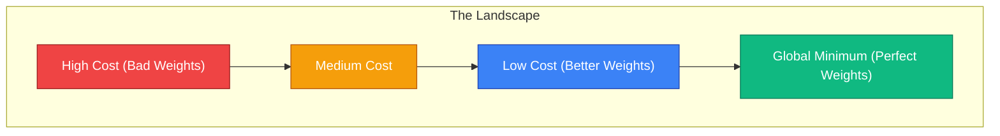

# 🧠 08 - Gradient Descent

---

## 📋 Table of Contents
1. [Why Learning Requires Optimization](#why-learning-requires-optimization)
2. [Visualizing the Cost Landscape](#visualizing-the-cost-landscape)
3. [Gradient Intuition (The Math of the Hill)](#gradient-intuition-the-math-of-the-hill)
4. [The Learning Rate ($\alpha$)](#the-learning-rate-alpha)
5. [What's Next](#whats-next)

---

## 🧗 Why Learning Requires Optimization

Up to this point, we have:
1. **Forward Propagation:** Pushed data through the network to get a prediction.
2. **Loss Function:** Calculated a number representing how wrong the prediction was.

But the network hasn't actually *learned* anything yet. To learn, the network must change its weights and biases so that the next time it sees that data, the Loss Function outputs a smaller number.

How does it know whether to increase or decrease a specific weight? It uses an **Optimization Algorithm**. 

The fundamental optimization algorithm that powers nearly all of modern machine learning is called **Gradient Descent**.

---

## 🏔️ Visualizing the Cost Landscape

Imagine you are blindfolded and dropped onto the side of a mountain. Your goal is to reach the absolute lowest point in the valley (a cabin at the bottom).

- The **Mountain Coordinates (X, Y)** represent your network's **Weights ($w_1, w_2$)**.
- The **Altitude (Z)** represents your **Loss / Cost**.

If you change your coordinates (adjust weights), your altitude changes (loss goes up or down). You want to find the exact combination of weights that results in the minimum possible altitude (minimum loss).

This 3D terrain is called the **Cost Landscape** or **Loss Landscape**.

*(Note: Run the [Gradient Descent Visualization Lab](./notebooks/02-Loss-Landscapes-And-Gradient-Descent.ipynb) to see interactive 3D plots of this landscape!)*

Because you are blindfolded, you cannot just "look" at the valley and walk there. You can only feel the ground directly beneath your feet. 

---

## 📐 Gradient Intuition (The Math of the Hill)

How do you find the bottom while blindfolded?
You tap your foot around in a circle to feel the slope of the ground. 
- Is the ground sloping up to the north?
- Is it sloping down to the east?

You find the direction of the **steepest slope pointing upward**, and then you deliberately take a step in the **exact opposite direction**. 

In Calculus, the vector that points in the direction of steepest ascent is called the **Gradient**. Therefore, taking a step in the opposite direction is called **Gradient Descent**.

### The Update Rule
For every weight $w$ in the network, we update it by subtracting a fraction of the gradient:

$$ w_{new} = w_{old} - \alpha \left( \frac{\partial L}{\partial w} \right) $$

Let's break this down:
- $w_{new}$: The updated weight.
- $w_{old}$: The current weight.
- $\frac{\partial L}{\partial w}$: The **Gradient** (How much the Loss $L$ changes if we slightly change $w$).
- $\alpha$ (Alpha): The **Learning Rate**.

If the gradient is positive (sloping up), we subtract it, moving the weight down the hill. If the gradient is negative (sloping down), subtracting a negative number adds to the weight, moving it forward down the hill.

---

## 🏃 The Learning Rate ($\alpha$)

The Learning Rate ($\alpha$) is the size of the step you take down the mountain. It is arguably the most important **hyperparameter** in deep learning.

### 1. The Goldilocks Zone (Just Right)
If the learning rate is tuned perfectly (e.g., `0.01`), you take reasonable steps. You smoothly walk down the hill and settle perfectly at the global minimum in a reasonable amount of time.

### 2. Too Small ($\alpha = 0.000001$)
You take microscopic baby steps. It might take years to reach the bottom of the valley. Furthermore, you might get stuck in a small pothole (a **Local Minimum**) and never have enough momentum to step out of it to find the true valley.

### 3. Too Large ($\alpha = 100$)
You take massive, giant leaps. Instead of stepping down the hill, you leap completely across the valley to the other side. The next step leaps you even higher up the opposite mountain. Your loss explodes to infinity. This is called **Divergence**.

---

## 🚀 What's Next

### Key Takeaways
- Training a neural network means finding the lowest point in a mathematical landscape (minimizing loss).
- Gradient Descent is the process of calculating the slope (gradient) and taking a step in the opposite direction.
- The Learning Rate dictates the step size. If it's too big, the network explodes. If it's too small, the network takes forever to train.

### Common Mistakes
- **Assuming the landscape is a smooth bowl:** In deep learning, the cost landscape is not a neat bowl. It is a terrifying, chaotic mountain range with millions of dimensions, false valleys, and flat plains. Simple Gradient Descent often gets stuck.

### Practical Recommendations
- Always start tuning a network by playing with the learning rate. It is the single parameter most likely to determine whether your network learns or fails completely. Try standard values like `0.001` or `3e-4` first.

### Next Topic
We know that we need to calculate the gradient $\frac{\partial L}{\partial w}$ to take a step. But in a deep network with 50 layers and 1 billion weights, how do we efficiently calculate the exact slope for a weight buried in Layer 2? 

We use the most important algorithm in AI history: **Backpropagation**.

[← Previous Topic](./07-Loss-Functions.md) | [Next Topic: Backpropagation →](./09-Backpropagation.md)
