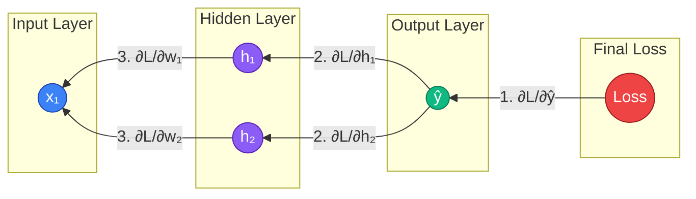

# 🧠 09 - Backpropagation

---

## 📋 Table of Contents
1. [The Problem: Blame Assignment](#the-problem-blame-assignment)
2. [The Solution: The Chain Rule](#the-solution-the-chain-rule)
3. [Visualizing Gradient Flow](#visualizing-gradient-flow)
4. [Step-by-Step Mathematical Example](#step-by-step-mathematical-example)
5. [What's Next](#whats-next)

---

## 🕵️ The Problem: Blame Assignment

In the previous lesson, we learned that to update a weight using Gradient Descent, we need to know its **Gradient** ($\frac{\partial L}{\partial w}$). We need to know exactly how much a tiny change in that specific weight will affect the final Loss.

For the very last layer of the network, this is easy. The output layer is directly connected to the Loss Function. 

But imagine a network with 10 hidden layers. If the final prediction is terrible, who is to blame? 
- Is it a weight in Layer 9?
- Is it a bias in Layer 4?
- Is it an activation function in Layer 1?

This is the **Credit Assignment Problem**. How do we calculate the exact slope for a weight buried deep inside the network, separated from the loss function by hundreds of other mathematical operations?

The answer is **Backpropagation** (Backward Propagation of Errors), the algorithm that revived the AI industry in 1986.

---

## 🔗 The Solution: The Chain Rule

Backpropagation is literally just the **Chain Rule** from high school calculus, applied iteratively backwards through the network.

The Chain Rule states that if a variable $z$ depends on $y$, and $y$ depends on $x$, then how $z$ changes with respect to $x$ is just the product of how $z$ changes with $y$, and how $y$ changes with $x$.

$$ \frac{\partial z}{\partial x} = \frac{\partial z}{\partial y} \cdot \frac{\partial y}{\partial x} $$

### The Corporate Analogy

Let's return to the Corporate Committee analogy.

The CEO (Loss Function) realizes the company lost $10,000. 
1. The CEO calculates exactly how much the Board of Directors (Output Layer) is to blame. ($\frac{\partial L}{\partial \text{Output}}$)
2. The Board of Directors looks at the advice they received from the Senior Managers (Layer 2). They multiply the CEO's blame by how much they trusted each manager. The blame is passed backward.
3. The Senior Managers look at the advice they got from the Junior Analysts (Layer 1). They multiply the blame they received from the Board by how much they trusted the analysts. The blame is passed backward again.

By multiplying the blame backward layer by layer, *every single person* in the company receives an exact number representing how much they personally contributed to the $10,000 loss. They then update their internal trust (weights) accordingly.

---

## 🌊 Visualizing Gradient Flow

Forward Propagation moves left-to-right.
Backpropagation moves right-to-left.

Notice how gradients **split** when going backward through a node that has multiple inputs, and gradients **sum** when multiple paths converge on a single node. 

---

## 🧮 Step-by-Step Mathematical Example

Let's trace the math for a single weight ($w_1$) connecting the Input to the Hidden Layer.

To find $\frac{\partial L}{\partial w_1}$, we start at the end (Loss) and multiply our way back to $w_1$.

1. **How does the prediction change the loss?**
   Calculate $\frac{\partial L}{\partial \hat{y}}$ (Derivative of the Loss Function).
   
2. **How does the output sum change the prediction?**
   Calculate $\frac{\partial \hat{y}}{\partial z_{out}}$ (Derivative of the Output Activation Function).
   
3. **How does the hidden activation change the output sum?**
   Calculate $\frac{\partial z_{out}}{\partial a_{hidden}}$ (This is simply the weight connecting them).
   
4. **How does the hidden sum change the hidden activation?**
   Calculate $\frac{\partial a_{hidden}}{\partial z_{hidden}}$ (Derivative of the Hidden Activation Function, e.g., ReLU).
   
5. **How does $w_1$ change the hidden sum?**
   Calculate $\frac{\partial z_{hidden}}{\partial w_1}$ (This is simply the input $x_1$).

### The Final Chain Rule Equation
To get the final gradient for $w_1$, we multiply all those pieces together:

$$ \frac{\partial L}{\partial w_1} = \frac{\partial L}{\partial \hat{y}} \cdot \frac{\partial \hat{y}}{\partial z_{out}} \cdot \frac{\partial z_{out}}{\partial a_{hidden}} \cdot \frac{\partial a_{hidden}}{\partial z_{hidden}} \cdot \frac{\partial z_{hidden}}{\partial w_1} $$

Once the computer calculates this single number, it performs Gradient Descent:
$$ w_1 = w_1 - \alpha \left( \frac{\partial L}{\partial w_1} \right) $$

*(Note: Run the [Backpropagation Playground Project](./notebooks/03-Backpropagation-And-Computational-Graphs.ipynb) to see this math execute step-by-step on a computational graph).*

---

## 🚀 What's Next

### Key Takeaways
- Backpropagation is the algorithm used to calculate gradients for every weight in a network.
- It is an application of the Calculus Chain Rule.
- It works by calculating the error at the output and propagating that error backward through the layers.

### Common Mistakes
- **Trying to code Backprop by hand in production:** In the real world, you will almost never write the calculus for backpropagation yourself. Frameworks like PyTorch and TensorFlow use **Autograd** (Automatic Differentiation), which builds a computational graph during the forward pass and automatically calculates all gradients for you instantly. However, understanding the underlying math is critical for debugging why a network isn't learning.

### Practical Recommendations
- When you call `loss.backward()` in PyTorch, the framework is executing the exact Chain Rule multiplication sequence described above.

### Next Topic
We have the gradients, and we know we need to subtract them using a Learning Rate. But simple Gradient Descent is slow and prone to getting stuck. Can we make the optimization process smarter?

[← Previous Topic](./08-Gradient-Descent.md) | [Next Topic: Optimization Algorithms →](./10-Optimization-Algorithms.md)
