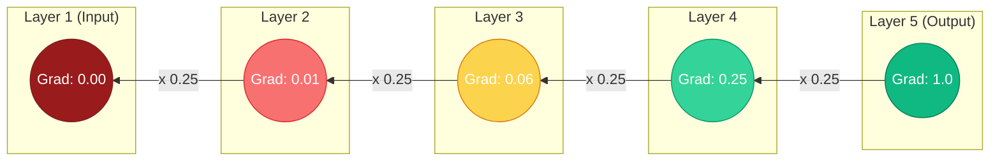

# 🧠 12 - Vanishing and Exploding Gradients

---

## 📋 Table of Contents
1. [The Problem: Multiplicative Chaos](#the-problem-multiplicative-chaos)
2. [Vanishing Gradients](#vanishing-gradients)
3. [Exploding Gradients](#exploding-gradients)
4. [How to Fix It (The Solutions)](#how-to-fix-it-the-solutions)
5. [What's Next](#whats-next)

---

## 🌪️ The Problem: Multiplicative Chaos

Backpropagation relies on the **Chain Rule**, which means it calculates gradients by continually *multiplying* numbers together as it moves backward from the Output Layer to the Input Layer.

Imagine a network with 10 hidden layers. To calculate the gradient for Layer 1, the algorithm has to multiply 10 gradients together:
$g_1 = g_{10} \times g_9 \times g_8 \dots \times g_2$

What happens when you multiply a number by `0.9` ten times?
$0.9^{10} = 0.34$ (It shrinks).

What happens when you multiply a number by `0.9` one hundred times?
$0.9^{100} = 0.00002$ (It vanishes).

Conversely, what happens if you multiply a number by `1.1` one hundred times?
$1.1^{100} = 13,780$ (It explodes).

Because deep networks require endless sequential multiplication, gradients are incredibly unstable. They tend to either shrink to absolutely nothing, or blow up to infinity. 

---

## 👻 Vanishing Gradients

**The Cause:**
Vanishing gradients occur when the numbers being multiplied during backpropagation are consistently less than `1.0`. 
This is almost always caused by using the **Sigmoid** or **Tanh** activation functions in deep networks. The derivative of Sigmoid maxes out at `0.25`. If you multiply `0.25` by itself 10 times, the gradient becomes mathematically indistinguishable from zero.

**The Symptoms:**
- The network's training loss barely drops. It flatlines almost immediately.
- The weights in the layers closest to the input never change. Layer 1 stays at its random initialization.
- The network's final accuracy is terrible, often no better than random guessing.

---

## 💥 Exploding Gradients

**The Cause:**
Exploding gradients occur when the numbers being multiplied are consistently greater than `1.0`. 
This happens when you initialize your weights too large, or when training Recurrent Neural Networks (RNNs) on very long sequences of text. 

**The Symptoms:**
- The training loss drops rapidly, but then suddenly jumps to `NaN` (Not a Number).
- The network's weights become `NaN` or `Infinity`.
- The optimization path violently leaps out of the cost landscape valley.

---

## 🛠️ How to Fix It (The Solutions)

Modern deep learning has effectively solved these issues, which is why we can now train networks with thousands of layers. If you encounter vanishing or exploding gradients, apply the following fixes:

### 1. Change the Activation Function (Fixes Vanishing)
Stop using Sigmoid and Tanh in hidden layers.
Switch to **ReLU** or **Leaky ReLU**. The derivative of ReLU for positive numbers is exactly `1.0`. Multiplying `1.0` by `1.0` a hundred times is still `1.0`. The gradient perfectly passes through.

### 2. Proper Weight Initialization (Fixes Both)
Do not use random Gaussian initializations. 
Use **He Initialization** (if using ReLU) or **Xavier Initialization** (if using Tanh). This ensures the variance of the numbers stays mathematically stable at `1.0` as they flow forward and backward.

### 3. Gradient Clipping (Fixes Exploding)
This is a brute-force software fix used specifically for RNNs and NLP models. You tell the optimizer: "If the gradient ever exceeds `5.0`, just chop it off and force it to be `5.0`." It physically prevents the explosion.

### 4. Residual Connections / ResNets (Fixes Vanishing)
Invented in 2015, Residual Connections allow gradients to "skip" layers entirely. By providing a "highway" that bypasses the math of the hidden layers, the gradient can flow perfectly from Layer 100 all the way back to Layer 1 without being multiplied by anything. 

---

## 🚀 What's Next

### Key Takeaways
- **Vanishing Gradients:** Gradients shrink to 0. Early layers stop learning. Caused by Sigmoid/Tanh.
- **Exploding Gradients:** Gradients blow up to Infinity. The network crashes to `NaN`. Caused by large weights or RNN architectures.
- **The Golden Rule:** Use ReLU and He Initialization to avoid 99% of these problems in standard networks.

### Common Mistakes
- **Assuming NaN loss is a data error:** If your training loss suddenly outputs `NaN` halfway through epoch 1, it is almost certainly an Exploding Gradient. Lower your learning rate and check your weight initialization.

### Practical Recommendations
- *(Run the [Vanishing/Exploding Gradients Lab](./notebooks/05-Vanishing-Exploding-Gradients.ipynb) to deliberately crash a network using bad initialization, and then fix it.)*

### Next Topic
We've covered how to make a network learn effectively. But what happens when it learns *too well*? What happens when it just memorizes the training data instead of actually understanding the concepts? We need Regularization.

[← Previous Topic](./11-Weight-Initialization.md) | [Next Topic: Regularization Techniques →](./13-Regularization-Techniques.md)
