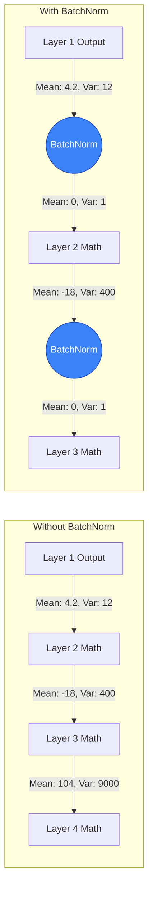

# 🧠 14 - Batch Normalization

---

## 📋 Table of Contents
1. [The Problem: Internal Covariate Shift](#the-problem-internal-covariate-shift)
2. [The Solution: Batch Normalization](#the-solution-batch-normalization)
3. [The Math of BatchNorm](#the-math-of-batchnorm)
4. [Where to Place BatchNorm](#where-to-place-batchnorm)
5. [What's Next](#whats-next)

---

## 🌪️ The Problem: Internal Covariate Shift

Before we feed data into a neural network, we almost always **normalize** the input data. For example, if we have house prices ($500,000) and number of bedrooms (3), we scale them so they both exist between `0` and `1`, or have a mean of `0` and a standard deviation of `1`. 

We do this because if the inputs are on vastly different scales, the cost landscape becomes long and warped, making it incredibly difficult for Gradient Descent to find the bottom. Normalization makes the landscape look like a neat, round bowl.

But here is the problem: **That only fixes Layer 1.**

What about Layer 50? 
As the data passes through Layer 1, it gets multiplied by weights, added to biases, and shoved through a ReLU activation. The neat, normalized data is completely ruined. By the time it reaches Layer 50, the data might have a mean of 400 and a standard deviation of 8,000. 

Furthermore, during training, Layer 49 is constantly updating its weights. This means the distribution of the inputs that Layer 50 receives is *constantly changing* every single step of training. Layer 50 is trying to hit a moving target. 

This chaotic shifting of internal data distributions is called **Internal Covariate Shift**. It makes deep networks highly unstable and forces us to use tiny learning rates.

---

## ⚖️ The Solution: Batch Normalization

Invented in 2015 by Sergey Ioffe and Christian Szegedy, **Batch Normalization (BatchNorm)** is a layer you insert directly into your neural network to fix this problem.

Just like you normalize the raw data before it hits Layer 1, BatchNorm normalizes the internal data before it hits Layer 50. 

It calculates the mean and variance of the data currently flowing through it (the "Batch"), subtracts the mean, and divides by the variance. It forces the internal data stream to immediately reset to a mean of 0 and a standard deviation of 1.

### Visualizing the Flow

By guaranteeing that Layer 50 always receives neatly scaled data, the network becomes incredibly stable.

---

## 🧮 The Math of BatchNorm

BatchNorm performs 4 simple steps:

1. **Calculate Batch Mean ($\mu$):** Find the average of the current mini-batch of data.
2. **Calculate Batch Variance ($\sigma^2$):** Find the variance of the current mini-batch.
3. **Normalize ($z_{norm}$):** Subtract the mean and divide by the standard deviation.
   $$ z_{norm} = \frac{z - \mu}{\sqrt{\sigma^2 + \epsilon}} $$
   *(The $\epsilon$ is just a tiny number like 0.00001 to prevent dividing by zero).*
4. **Scale and Shift ($z_{final}$):** This is the genius part. 

### Why Scale and Shift?
If BatchNorm *strictly* forces the data to have a mean of 0 and variance of 1, it might accidentally destroy useful representations the network worked hard to learn. Sometimes, the network *wants* the data to be shifted.

So, BatchNorm adds two **learnable parameters** to the layer: $\gamma$ (Gamma) for scaling, and $\beta$ (Beta) for shifting.
$$ z_{final} = \gamma \cdot z_{norm} + \beta $$

The network uses Backpropagation to learn the perfect $\gamma$ and $\beta$. If the network decides that mean=0 and var=1 is best, it leaves them alone. If it decides the data *should* have a mean of 5, it learns to set $\beta = 5$. It gives the network the power to choose the exact optimal distribution for the data.

---

## 📍 Where to Place BatchNorm

There has been a long-running debate in the Deep Learning community about exactly where to place the BatchNorm layer relative to the Activation Function (like ReLU).

**Original Paper (Pre-Activation):**
`Linear Math -> BatchNorm -> ReLU`

**Modern Consensus (Post-Activation):**
`Linear Math -> ReLU -> BatchNorm`

In practice, both work well, but placing BatchNorm *after* the activation function tends to yield slightly better results in modern Computer Vision architectures (like ResNets).

---

## 🚀 What's Next

### Key Takeaways
- **Internal Covariate Shift** is the problem of internal data distributions constantly changing during training, destabilizing deep networks.
- **Batch Normalization** fixes this by constantly re-normalizing the data between layers.
- It introduces two learnable parameters ($\gamma$ and $\beta$) so the network can un-normalize the data if it needs to.

### Common Mistakes
- **Using BatchNorm with a Batch Size of 1:** Because BatchNorm calculates the mean of the current *batch*, it completely breaks if your batch size is 1 (the variance of 1 item is 0). If you are forced to use tiny batch sizes due to memory constraints, use **LayerNorm** or **InstanceNorm** instead.

### Practical Recommendations
- BatchNorm is basically a cheat code for deep learning. It allows you to use much larger learning rates, makes the network less sensitive to bad weight initialization, and even acts as a mild regularizer (reducing the need for Dropout). Use it in almost all deep networks.

### Next Topic
We've covered the architecture, the math, the optimizers, and the regularizers. The only thing left before building a complete network is figuring out how to set all the dials (Learning Rate, Batch Size, Layers). It's time for Hyperparameter Tuning.

[← Previous Topic](./13-Regularization-Techniques.md) | [Next Topic: Hyperparameter Tuning →](./15-Hyperparameter-Tuning.md)
