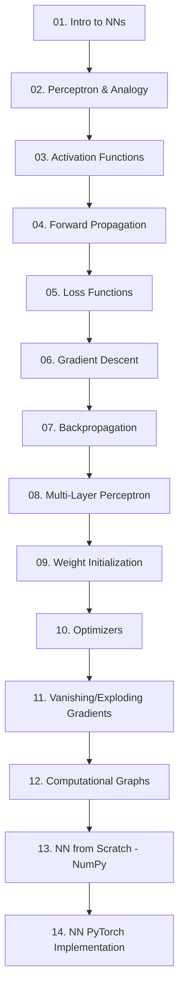

# 🧠 Neural Networks Foundations

Welcome to the **Neural Networks Foundations** module. This module provides a complete, mathematically rigorous, and code-rich journey from the absolute first principles (the Perceptron) to production-grade Deep Neural Networks built in NumPy and PyTorch.

---

## 🗺️ Learning Roadmap

This module is structured logically to build intuition first, back it up with mathematical rigor, implement it in pure NumPy, and finally transition to production-ready PyTorch.



---

## 📂 Directory Structure

Below is the file layout of this module:

- 📄 [01-Introduction-To-Neural-Networks.md](file:///c:/Users/ADMIN/Desktop/Full-ML-DL-CV-and-Data-Science-Roadmap/06-Neural-Networks-Foundations/01-Introduction-To-Neural-Networks.md) — Fundamental concepts and biological inspiration.
- 📄 [02-Perceptron-And-Biological-Analogy.md](file:///c:/Users/ADMIN/Desktop/Full-ML-DL-CV-and-Data-Science-Roadmap/06-Neural-Networks-Foundations/02-Perceptron-And-Biological-Analogy.md) — The biological neuron vs. Rosenblatt's Perceptron, convergence, and XOR.
- 📄 [03-Activation-Functions.md](file:///c:/Users/ADMIN/Desktop/Full-ML-DL-CV-and-Data-Science-Roadmap/06-Neural-Networks-Foundations/03-Activation-Functions.md) — Sigmoid, Tanh, ReLU, Leaky ReLU, Softmax and their derivatives.
- 📄 [04-Forward-Propagation.md](file:///c:/Users/ADMIN/Desktop/Full-ML-DL-CV-and-Data-Science-Roadmap/06-Neural-Networks-Foundations/04-Forward-Propagation.md) — Matrix forms, layer computations, and dimensional alignment.
- 📄 [05-Loss-Functions.md](file:///c:/Users/ADMIN/Desktop/Full-ML-DL-CV-and-Data-Science-Roadmap/06-Neural-Networks-Foundations/05-Loss-Functions.md) — MSE, MAE, BCE, CCE, and their probabilistic interpretations (MLE).
- 📄 [06-Gradient-Descent.md](file:///c:/Users/ADMIN/Desktop/Full-ML-DL-CV-and-Data-Science-Roadmap/06-Neural-Networks-Foundations/06-Gradient-Descent.md) — Batch, Mini-batch, Stochastic Gradient Descent, and learning rate effects.
- 📄 [07-Backpropagation.md](file:///c:/Users/ADMIN/Desktop/Full-ML-DL-CV-and-Data-Science-Roadmap/06-Neural-Networks-Foundations/07-Backpropagation.md) — The Chain Rule, vector/matrix derivatives, and computational paths.
- 📄 [08-Multi-Layer-Perceptron.md](file:///c:/Users/ADMIN/Desktop/Full-ML-DL-CV-and-Data-Science-Roadmap/06-Neural-Networks-Foundations/08-Multi-Layer-Perceptron.md) — Architecture design, stacking layers, Universal Approximation Theorem.
- 📄 [09-Weight-Initialization.md](file:///c:/Users/ADMIN/Desktop/Full-ML-DL-CV-and-Data-Science-Roadmap/06-Neural-Networks-Foundations/09-Weight-Initialization.md) — Xavier, He, zero-init failure, and variance propagation.
- 📄 [10-Optimizers.md](file:///c:/Users/ADMIN/Desktop/Full-ML-DL-CV-and-Data-Science-Roadmap/06-Neural-Networks-Foundations/10-Optimizers.md) — SGD, Momentum, RMSProp, and Adam algorithms from scratch.
- 📄 [11-Vanishing-And-Exploding-Gradients.md](file:///c:/Users/ADMIN/Desktop/Full-ML-DL-CV-and-Data-Science-Roadmap/06-Neural-Networks-Foundations/11-Vanishing-And-Exploding-Gradients.md) — Saturation problems, ReLU fixes, and gradient scaling/clipping.
- 📄 [12-Computational-Graphs.md](file:///c:/Users/ADMIN/Desktop/Full-ML-DL-CV-and-Data-Science-Roadmap/06-Neural-Networks-Foundations/12-Computational-Graphs.md) — Autograd node logic, topological sorting, forward/backward graphs.
- 📄 [13-Neural-Network-From-Scratch-Numpy.md](file:///c:/Users/ADMIN/Desktop/Full-ML-DL-CV-and-Data-Science-Roadmap/06-Neural-Networks-Foundations/13-Neural-Network-From-Scratch-Numpy.md) — Fully modular neural network framework implemented in pure NumPy.
- 📄 [14-Neural-Network-PyTorch-Implementation.md](file:///c:/Users/ADMIN/Desktop/Full-ML-DL-CV-and-Data-Science-Roadmap/06-Neural-Networks-Foundations/14-Neural-Network-PyTorch-Implementation.md) — Clean PyTorch equivalents, training pipelines, and evaluation routines.

### 📓 Interactive Notebooks (`notebooks/`)
1. 📓 [NN_From_Scratch.ipynb](file:///c:/Users/ADMIN/Desktop/Full-ML-DL-CV-and-Data-Science-Roadmap/06-Neural-Networks-Foundations/notebooks/NN_From_Scratch.ipynb)
2. 📓 [Backpropagation_Visualizer.ipynb](file:///c:/Users/ADMIN/Desktop/Full-ML-DL-CV-and-Data-Science-Roadmap/06-Neural-Networks-Foundations/notebooks/Backpropagation_Visualizer.ipynb)
3. 📓 [Activation_Functions_Explorer.ipynb](file:///c:/Users/ADMIN/Desktop/Full-ML-DL-CV-and-Data-Science-Roadmap/06-Neural-Networks-Foundations/notebooks/Activation_Functions_Explorer.ipynb)

### 🛠️ Mini Projects (`projects/`)
1. 📂 [01-NN-From-Scratch-NumPy](file:///c:/Users/ADMIN/Desktop/Full-ML-DL-CV-and-Data-Science-Roadmap/06-Neural-Networks-Foundations/projects/01-NN-From-Scratch-NumPy/) — Multi-layer perceptron built completely from scratch using NumPy.
2. 📂 [02-PyTorch-MLP-Classifier](file:///c:/Users/ADMIN/Desktop/Full-ML-DL-CV-and-Data-Science-Roadmap/06-Neural-Networks-Foundations/projects/02-PyTorch-MLP-Classifier/) — Industry-standard classifier with PyTorch datasets and training modules.
3. 📂 [03-Activation-Function-Comparison-Study](file:///c:/Users/ADMIN/Desktop/Full-ML-DL-CV-and-Data-Science-Roadmap/06-Neural-Networks-Foundations/projects/03-Activation-Function-Comparison-Study/) — Visual analysis of convergence rates using Sigmoid, Tanh, ReLU, and Leaky ReLU.
4. 📂 [04-Gradient-Explosion-Simulator](file:///c:/Users/ADMIN/Desktop/Full-ML-DL-CV-and-Data-Science-Roadmap/06-Neural-Networks-Foundations/projects/04-Gradient-Explosion-Simulator/) — Experiment documenting how initialization and deep layers lead to vanishing/exploding gradients.
5. 📂 [05-XOR-Problem-Solver](file:///c:/Users/ADMIN/Desktop/Full-ML-DL-CV-and-Data-Science-Roadmap/06-Neural-Networks-Foundations/projects/05-XOR-Problem-Solver/) — A step-by-step visual training solution to the classical XOR separation task.

---

## 🚀 Setup & Installation

To run the interactive notebooks and project files locally, setup your virtual environment and install the required dependencies:

```bash
# Create virtual environment
python -m venv venv

# Activate virtual environment (Windows)
.\venv\Scripts\activate

# Install required dependencies
pip install numpy matplotlib torch torchvision
```

---

[← Return to Root Index](../README.md) | [Next: Introduction To Neural Networks →](./01-Introduction-To-Neural-Networks.md)
