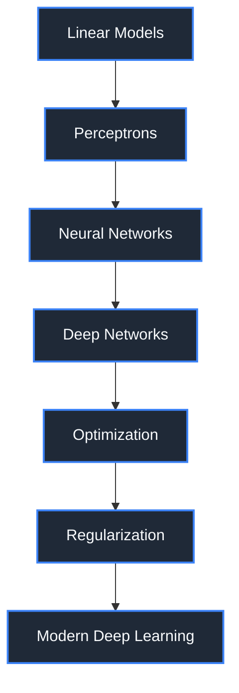

# 🧠 Module 06: Neural Networks Foundations

Welcome to **Neural Networks Foundations**. This module bridges the gap between traditional machine learning and modern deep learning. Here, you will learn exactly how neural networks learn, why they are so powerful, and how to build them from the absolute fundamentals.

---

## 🌟 Module Overview

For decades, traditional machine learning models (like linear regression and random forests) ruled the data world. But as data became unstructured—images, audio, and raw text—these models hit a ceiling. Deep Learning emerged to shatter that ceiling. 

In this module, we strip away the magic of PyTorch and TensorFlow. You will look under the hood of deep learning, learning the pure mathematics and intuition that powers AI today.

**How this module connects to your journey:**
`Supervised Learning` ➡️ `Model Evaluation` ➡️ **`Neural Networks`** ➡️ `Computer Vision` ➡️ `NLP`

---

## 🗺️ Learning Roadmap

---

## 🎯 Learning Outcomes

After completing this module, you will deeply understand:
- **Neural Network Fundamentals:** The architecture of artificial neurons, layers, and deep networks.
- **The Training Process:** How forward propagation computes predictions and loss functions measure error.
- **Backpropagation:** The engine of deep learning. How the chain rule calculates gradients.
- **Optimization:** How algorithms like SGD, Momentum, and Adam update weights to minimize loss.
- **Regularization:** Techniques like Dropout, L2, and Early Stopping to prevent overfitting.
- **Practical Implementation:** How to build a complete neural network from scratch using pure NumPy.

---

## 📚 Topic Navigation

### 🟢 Beginner (Fundamentals)
1. [Introduction to Neural Networks](./01-Introduction-To-Neural-Networks.md)
2. [Artificial Neurons](./02-Artificial-Neurons.md)
3. [The Perceptron](./03-Perceptron.md)
4. [From Perceptrons to Neural Networks](./04-From-Perceptrons-To-Neural-Networks.md)

### 🟡 Intermediate (Training Mechanics)
5. [Activation Functions](./05-Activation-Functions.md)
6. [Forward Propagation](./06-Forward-Propagation.md)
7. [Loss Functions](./07-Loss-Functions.md)
8. [Gradient Descent](./08-Gradient-Descent.md)

### 🔴 Advanced (Learning & Optimization)
9. [Backpropagation](./09-Backpropagation.md)
10. [Optimization Algorithms](./10-Optimization-Algorithms.md)
11. [Weight Initialization](./11-Weight-Initialization.md)
12. [Vanishing and Exploding Gradients](./12-Vanishing-And-Exploding-Gradients.md)
13. [Regularization Techniques](./13-Regularization-Techniques.md)
14. [Batch Normalization](./14-Batch-Normalization.md)

### 🛠️ Practical Application
15. [Hyperparameter Tuning](./15-Hyperparameter-Tuning.md)
16. [Building a Neural Network From Scratch](./16-Building-A-Neural-Network-From-Scratch.md)

---

## 💻 Project Showcase

Knowledge is best solidified through practice. This module includes the following projects:

1. **[Handwritten Digit Classifier](./projects/01-Handwritten-Digit-Classifier/)**: Implement an MNIST classifier in NumPy, TensorFlow, and PyTorch.
2. **[Customer Churn Prediction](./projects/02-Customer-Churn-Prediction/)**: A business-focused neural network project predicting customer retention.
3. **[Neural Network Playground](./projects/03-Neural-Network-Playground/)**: An interactive Streamlit app to visualize training in real-time.
4. **[Activation Function Explorer](./projects/04-Activation-Function-Visualizer/)**: An educational tool to explore non-linearities and their derivatives.
5. **[Optimization Algorithm Visualizer](./projects/05-Optimization-Algorithm-Comparison/)**: A visual comparison of how different optimizers traverse loss landscapes.
6. **[Mini Deep Learning Framework](./projects/06-Neural-Network-From-Scratch-Framework/)**: Build your own lightweight deep learning framework using NumPy.

---

## 🚀 Skills Gained

| Category | Skills Acquired |
|----------|----------------|
| **Technical** | Forward/Backward Propagation, Matrix Calculus, Optimization Algorithms, Regularization |
| **Industry** | Debugging unstable training, hyperparameter tuning, GPU utilization awareness |
| **Interview** | Explaining backpropagation step-by-step, comparing optimizers mathematically |
| **Portfolio** | A custom deep learning framework built entirely from scratch |

---

## ⏱️ Study Guide & Tips

- **Difficulty:** Moderate to Hard (Math Heavy)
- **Estimated Study Time:** 3-4 Weeks (assuming 10-15 hours/week)
- **Philosophy:** Focus heavily on the visual and conceptual intuition before diving into the formulas. Build a strong mental model of how gradients flow backward through a network.
- **Do Not Skip:** Lesson 09 (Backpropagation) and Lesson 16 (NN From Scratch). These are the most critical components of the entire module.

[Start the Module: Introduction to Neural Networks →](./01-Introduction-To-Neural-Networks.md)
