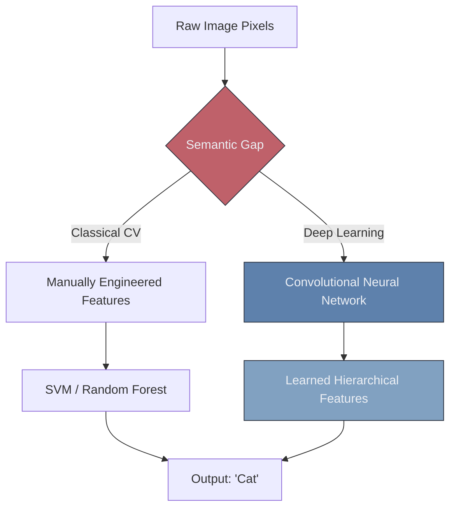

# 🌍 Introduction to Computer Vision

> **Difficulty**: ⭐☆☆☆☆ Beginner | **Prerequisites**: None | **Estimated Reading Time**: 20 Minutes

---

## 📋 Table of Contents
1. [What Problem Does This Solve?](#1-what-problem-does-this-solve)
2. [Intuition](#2-intuition)
3. [Core Capabilities](#3-core-capabilities)
4. [The Evolution of CV](#4-the-evolution-of-cv)
5. [Visual Explanation](#5-visual-explanation)
6. [Implementation Concept](#6-implementation-concept)
7. [Failure Cases](#7-failure-cases)
8. [What's Next?](#8-whats-next)

---

## 1. What Problem Does This Solve?

Human beings effortlessly understand the world through their eyes. We can instantly recognize a friend in a crowd, read a street sign from a distance, or catch a baseball thrown at us. For computers, a digital image or video is nothing but a massive, meaningless grid of numbers. 

**Computer Vision (CV)** solves the problem of granting machines the ability to extract high-level understanding from digital images and videos, allowing them to automate tasks that previously required the human visual system.

---

## 2. Intuition

### 🟢 Beginner
Imagine you are blindfolded and someone hands you a jigsaw puzzle, but you can only feel one piece at a time. It would take you hours to understand what the puzzle is. A computer is "blindfolded" when it looks at an image; it only sees raw numbers. Computer Vision is the set of algorithms that teaches the computer how to take off the blindfold, assemble the puzzle pieces, and understand the big picture.

### 🟡 Intermediate
Computer Vision is an interdisciplinary field that bridges computer science, physics, and neuroscience. It historically relied heavily on **Classical Algorithms** (like Edge Detection and Color Thresholding) where human engineers manually wrote mathematical rules to identify shapes. Today, it relies almost entirely on **Deep Learning** (Specifically Convolutional Neural Networks), allowing the computer to learn its own mathematical rules for identifying patterns.

### 🔴 Advanced
The fundamental challenge of Computer Vision is the **Semantic Gap**. There is a massive mathematical disconnect between the low-level physical pixels captured by a CMOS camera sensor and the high-level semantic concept (e.g., "A dog playing fetch"). Overcoming the semantic gap requires hierarchical feature extraction—building layers of abstraction that transform raw pixel intensities into edges, edges into textures, textures into object parts, and parts into semantic classes.

---

## 3. Core Capabilities

Modern Computer Vision is generally divided into several distinct tasks:
1. **Image Classification**: Assigning a single label to an entire image ("This is a cat").
2. **Object Detection**: Drawing bounding boxes around multiple objects ("There are 2 cars here and 1 pedestrian here").
3. **Image Segmentation**: Classifying every single pixel to find exact boundaries (used heavily in medical imaging).
4. **Pose Estimation**: Tracking the structural joints of a human body.
5. **Facial Recognition**: Identifying specific individuals for security.

---

## 4. The Evolution of CV

The field has undergone three massive paradigms:
1. **The Classical Era (1990s - 2012)**: Engineers used complex math (SIFT, HOG, Haar Cascades) to manually extract features, which were then fed into traditional ML models like SVMs. It was highly interpretable but extremely fragile to lighting and angle changes.
2. **The Deep Learning Era (2012 - 2020)**: AlexNet popularized Convolutional Neural Networks (CNNs). The network learned its own features. Accuracy skyrocketed, but models became "black boxes" that required massive amounts of labeled data.
3. **The Foundation Era (2020 - Present)**: Vision Transformers (ViTs) and Multimodal models (like CLIP and GPT-4 Vision) dominate. Models are now trained on billions of images, allowing them to understand images and text simultaneously without being explicitly fine-tuned for a single task.

---

## 5. Visual Explanation



---

## 6. Implementation Concept

While we will use PyTorch later, this is how quickly you can run a state-of-the-art Computer Vision model today using the HuggingFace `transformers` library:

```python
from transformers import pipeline
from PIL import Image

# Initialize an off-the-shelf Image Classification pipeline
classifier = pipeline("image-classification", model="google/vit-base-patch16-224")

# Load your image
image = Image.open("mystery_animal.jpg")

# Run inference
results = classifier(image)

print(f"I am {results[0]['score']*100:.2f}% confident this is a {results[0]['label']}.")
```

---

## 7. Failure Cases

1. **Adversarial Attacks**: Deep Learning vision models are surprisingly fragile to invisible noise. An attacker can change a few pixels on a Stop Sign (invisible to a human) that perfectly tricks an autonomous car's CV system into thinking it is a Speed Limit sign.
2. **Domain Shift**: A CV model trained exclusively on perfectly lit, high-resolution stock photos of dogs will fail miserably if deployed to a cheap, grainy, black-and-white security camera in the real world.

---

## 8. What's Next?

### Summary
Computer Vision aims to bridge the Semantic Gap between raw numeric pixels and human-level understanding. While classical math paved the way, Deep Learning now dominates the field.

### Why it matters
Computer Vision is the sensory organ of the AI revolution. Without it, autonomous vehicles, robotic manufacturing, automated medical diagnoses, and augmented reality cannot physically exist.

### Next Topic
Before we can build algorithms to process images, we must deeply understand what an image actually is to a computer. We will explore matrices, color channels, and tensor shapes in **Images As Data**.

[← Return to Module Index](./README.md) | [Next: Images As Data →](02-Images-As-Data.md)
