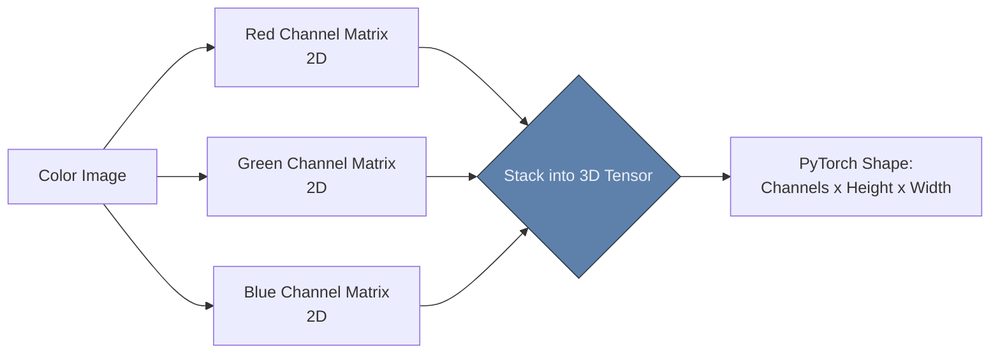

# 🔢 Images as Data

> **Difficulty**: ⭐☆☆☆☆ Beginner | **Prerequisites**: NumPy Fundamentals | **Estimated Reading Time**: 25 Minutes

---

## 📋 Table of Contents
1. [What Problem Does This Solve?](#1-what-problem-does-this-solve)
2. [Intuition](#2-intuition)
3. [Core Mathematics (Tensor Shapes)](#3-core-mathematics-tensor-shapes)
4. [Algorithm Workflow](#4-algorithm-workflow)
5. [Visual Explanation](#5-visual-explanation)
6. [NumPy Implementation](#6-numpy-implementation)
7. [Failure Cases](#7-failure-cases)
8. [What's Next?](#8-whats-next)

---

## 1. What Problem Does This Solve?

If you try to pass a `.jpg` file directly into a Machine Learning model, the code will crash immediately. Neural networks do not understand "pictures". They only understand floating-point matrices. 

Understanding **Images as Data** solves the problem of translating a physical photograph into the exact multi-dimensional mathematical format (a Tensor) required for matrix multiplication during Forward Propagation.

---

## 2. Intuition

### 🟢 Beginner
If you zoom far enough into a digital photograph on your phone, the smooth picture breaks apart into tiny, individual colored squares. These are called **Pixels** (Picture Elements). An image is essentially just an Excel spreadsheet where every single cell contains a number representing the color of that specific square. 

### 🟡 Intermediate
In a standard grayscale (black and white) image, every pixel is represented by a single integer ranging from `0` to `255`. 
- `0` means zero light (Pure Black).
- `255` means maximum light (Pure White).
Therefore, a $28 \times 28$ grayscale image is simply a 2D matrix containing 784 integers.

### 🔴 Advanced
Color images are more complex. Humans perceive color by combining Red, Green, and Blue light. Therefore, a color image requires **3 Channels**. Instead of a 2D matrix, a color image is a 3-Dimensional Tensor. A $1920 \times 1080$ High Definition image is mathematically represented as a tensor of shape `(1080, 1920, 3)`. That single image contains $6,220,800$ individual integers!

---

## 3. Core Mathematics (Tensor Shapes)

**The Framework Divide: Channels First vs. Channels Last**

There is a massive, infamous mathematical discrepancy between the two largest Deep Learning frameworks. You must memorize this to avoid crashing your code.

*   **TensorFlow / OpenCV (Channels Last)**: Images are loaded and processed as `[Height, Width, Channels]`. 
    *   Example: `(224, 224, 3)`
*   **PyTorch (Channels First)**: Images must be permuted to `[Channels, Height, Width]` before passing them into a CNN.
    *   Example: `(3, 224, 224)`

When processing multiple images at once, we add a **Batch Dimension** to the front. A PyTorch batch of 32 images becomes a 4D Tensor: `[32, 3, 224, 224]`.

---

## 4. Algorithm Workflow

When loading an image for Deep Learning:
1. Load the `.jpg` from disk using `PIL` or `cv2`. The output is a `[H, W, 3]` array containing integers `0-255`.
2. **Convert to Float**: Change the data type from `uint8` to `float32`.
3. **Normalize**: Divide all pixels by `255.0` to squash the values into the `[0.0, 1.0]` range. (Neural networks prefer small decimals).
4. **Permute**: If using PyTorch, rearrange the dimensions from `[H, W, C]` to `[C, H, W]`.
5. **Batch**: Use `.unsqueeze(0)` to add the Batch dimension to the front `[1, C, H, W]`.

---

## 5. Visual Explanation



---

## 6. NumPy Implementation

Let's simulate loading and preparing an image purely using NumPy arrays:

```python
import numpy as np

# 1. Simulate loading a 1080p color image (H, W, C)
# Using integers 0-255
raw_image = np.random.randint(0, 256, size=(1080, 1920, 3), dtype=np.uint8)
print(f"Raw shape: {raw_image.shape} | Data type: {raw_image.dtype}")

# 2. Normalize to [0.0, 1.0]
normalized_image = raw_image.astype(np.float32) / 255.0
print(f"Normalized max value: {normalized_image.max()}")

# 3. Permute for PyTorch (C, H, W)
# np.transpose swaps the axes. (2, 0, 1) means:
# Move axis 2 (Channels) to the front.
pytorch_image = np.transpose(normalized_image, (2, 0, 1))
print(f"PyTorch shape: {pytorch_image.shape}")

# 4. Add Batch Dimension (B, C, H, W)
batched_tensor = np.expand_dims(pytorch_image, axis=0)
print(f"Final Batch shape: {batched_tensor.shape}")
```

---

## 7. Failure Cases

1. **OOM (Out Of Memory)**: If you load a batch of 128 High-Resolution $4K$ images directly into GPU VRAM, your code will crash immediately. $4K$ images contain too many pixels. You must aggressively resize images down to smaller squares (like $224 \times 224$) before batching them.
2. **Channel Order Confusion (RGB vs. BGR)**: `PIL` (Python Imaging Library) loads color images in **R-G-B** order. `cv2` (OpenCV) loads color images in **B-G-R** order. If you use OpenCV to load an image, and pass it directly into a PyTorch model expecting RGB, the model's accuracy will plummet because it thinks the red sky is blue!

---

## 8. What's Next?

### Summary
Images are 3-Dimensional mathematical Tensors representing Height, Width, and Color Channels. Preparing them requires specific manipulation of matrix shapes depending on the Deep Learning framework you are using.

### Why it matters
Every single bug you encounter when first learning PyTorch Computer Vision will be a "Tensor Shape Mismatch" error. Mastering these dimensions is the key to debugging.

### Next Topic
Now that we know an image is just a massive matrix, why can't we just flatten it and feed it into a standard Neural Network (like the ones we used for tabular data)? We will explore why that fails catastrophically in **Why Traditional ML Struggles With Images**.

[← Introduction To Computer Vision](01-Introduction-To-Computer-Vision.md) | [Return to Module Index](./README.md) | [Next: Why Traditional ML Struggles →](03-Why-Traditional-ML-Struggles-With-Images.md)
