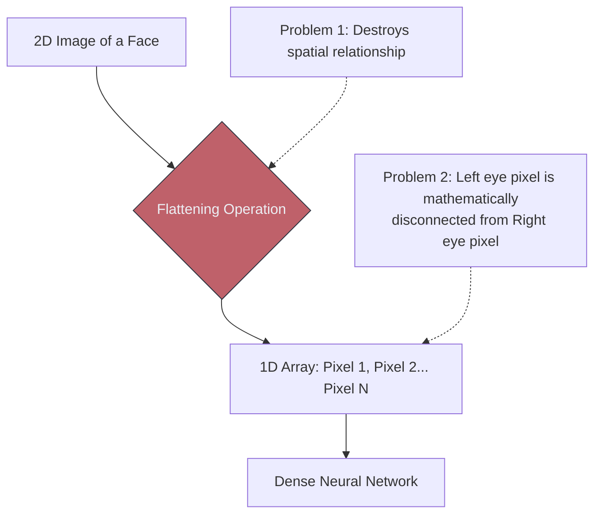

# 🛑 Why Traditional ML Struggles With Images

> **Difficulty**: ⭐⭐☆☆☆ Intermediate | **Prerequisites**: Images As Data, Deep Neural Networks (DNNs) | **Estimated Reading Time**: 25 Minutes

---

## 📋 Table of Contents
1. [What Problem Does This Solve?](#1-what-problem-does-this-solve)
2. [Intuition](#2-intuition)
3. [Core Mathematics (Parameter Explosion)](#3-core-mathematics-parameter-explosion)
4. [Algorithm Workflow (The Classical Approach)](#4-algorithm-workflow-the-classical-approach)
5. [Visual Explanation](#5-visual-explanation)
6. [PyTorch Implementation Concept](#6-pytorch-implementation-concept)
7. [Failure Cases](#7-failure-cases)
8. [What's Next?](#8-whats-next)

---

## 1. What Problem Does This Solve?

Before moving to advanced Convolutional architectures, we must answer a fundamental question: *If a standard, dense Artificial Neural Network (ANN) can approximate any mathematical function, why can't we just use it for images?* 

Understanding why Traditional ML fails provides the exact justification for why Convolutions were invented. It solves the problem of spatial destruction and parameter explosion.

---

## 2. Intuition

### 🟢 Beginner
Imagine you have a beautiful painting of a house. To feed it into a standard Neural Network or a Random Forest, you are forced to take scissors, cut the painting into tiny $1 \times 1$ pixel squares, and lay them all out in a single, massive straight line. By doing this, you completely destroy the picture. The roof is no longer above the door; it's just a random pile of pixels. Traditional ML destroys the structural geometry of the image.

### 🟡 Intermediate
Traditional ML models (like Linear Regression, Random Forests, or Dense MLPs) expect 1-Dimensional tabular vectors. If you have a $28 \times 28$ image, you must use a `Flatten()` operation to turn it into a 1D array of 784 numbers. 
When you flatten an image, you destroy **Spatial Invariance**. If you train a Dense network to recognize a cat in the center of the image, and the cat moves 5 pixels to the left, the flattened 1D array looks completely different. The network will fail to recognize the cat.

### 🔴 Advanced
A Dense layer operates on the principle of **Global Connectivity**: every single input neuron is connected to every single output neuron. This is disastrous for high-resolution images. The visual features of a cat's ear only depend on the few pixels immediately surrounding the ear; they have absolutely zero correlation with the pixels of a cloud in the top right corner of the image. Traditional ML wastes millions of mathematical calculations trying to find correlations between completely unrelated sides of an image.

---

## 3. Core Mathematics (Parameter Explosion)

If the loss of spatial geometry doesn't ruin the model, the **Parameter Explosion** will destroy the hardware.

Let's do the math for passing a standard $1920 \times 1080$ RGB image into a standard Fully Connected (Dense) Neural Network.
1. Input size: $1920 \times 1080 \times 3 = 6,220,800$ input neurons.
2. We add just *one* hidden layer with 1,000 neurons.
3. The number of weights for this single layer is: $6,220,800 \times 1000 \approx 6.2 \text{ Billion Parameters}$.

A single, incredibly shallow Dense layer on a 1080p image requires 6.2 Billion weights. Training this is computationally impossible, and it will instantly overfit to the training data.

---

## 4. Algorithm Workflow (The Classical Approach)

Before Deep Learning, researchers tried to solve this by manually shrinking the input size using Classical Algorithms:
1. Do not pass raw pixels to the ML model.
2. Manually write a mathematical algorithm (like HOG - Histogram of Oriented Gradients) to find edges and textures.
3. Compress the 6 million pixels down to 500 "Feature Numbers".
4. Pass those 500 numbers into a Support Vector Machine (SVM) to classify the image.
5. *The fatal flaw:* If the object rotated slightly, the manual HOG algorithm broke, and the SVM failed.

---

## 5. Visual Explanation



---

## 6. PyTorch Implementation Concept

Proving the Parameter Explosion in PyTorch:

```python
import torch
import torch.nn as nn

# Standard Image dimensions
C, H, W = 3, 224, 224
flattened_size = C * H * W # 150,528

# Define a single Dense Layer
dense_layer = nn.Linear(in_features=flattened_size, out_features=1000)

# Calculate parameters (Weights + Biases)
num_params = sum(p.numel() for p in dense_layer.parameters())

print(f"Flattened Input Size: {flattened_size}")
print(f"Number of parameters in ONE layer: {num_params:,}")
# Output: Number of parameters in ONE layer: 150,529,000
```
*Note: Over 150 million parameters just for a tiny $224 \times 224$ image!*

---

## 7. Failure Cases

1. **Translation Variance**: If you train a Dense network on 1,000 images of stop signs located exactly in the center of the frame, and you show it a stop sign in the bottom-left corner, it will fail completely. It memorized the *pixel locations*, not the *concept* of a stop sign.
2. **Computational Saturation**: Trying to train a dense model on images will result in massive GPU memory spikes and incredibly slow, unstable gradient descent.

---

## 8. What's Next?

### Summary
Standard Machine Learning and Dense Neural Networks fail on images for two reasons: flattening destroys the structural geometry of the object, and dense connections cause a mathematically impossible explosion of parameters.

### Why it matters
This catastrophic failure proves that we need a completely new mathematical operation. We need an operation that looks at local neighborhoods of pixels rather than the whole image at once, and preserves the 2D shape of the input.

### Next Topic
We will solve both the parameter explosion and the spatial destruction simultaneously by introducing the most important concept in Computer Vision: **The Convolution Operation**.

[← Images As Data](02-Images-As-Data.md) | [Return to Module Index](./README.md) | [Next: The Convolution Operation →](04-Convolution-Operation.md)
