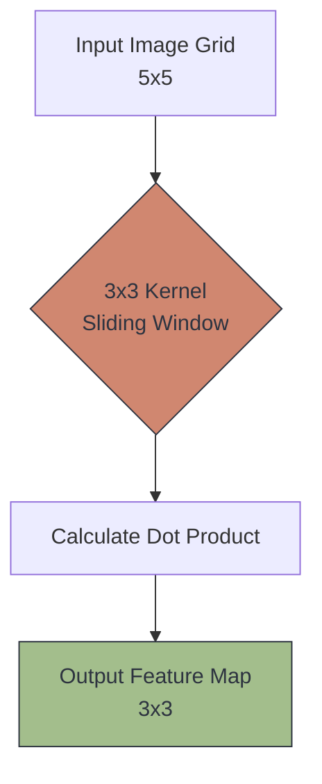

# 🌀 The Convolution Operation

> **Difficulty**: ⭐⭐⭐☆☆ Intermediate | **Prerequisites**: Images As Data | **Estimated Reading Time**: 30 Minutes

---

## 📋 Table of Contents
1. [What Problem Does This Solve?](#1-what-problem-does-this-solve)
2. [Intuition](#2-intuition)
3. [Core Mathematics (The Dot Product)](#3-core-mathematics-the-dot-product)
4. [Algorithm Workflow](#4-algorithm-workflow)
5. [Visual Explanation](#5-visual-explanation)
6. [PyTorch Implementation](#6-pytorch-implementation)
7. [Failure Cases](#7-failure-cases)
8. [What's Next?](#8-whats-next)

---

## 1. What Problem Does This Solve?

Traditional neural networks require flattening images, which destroys their 2D spatial geometry and causes parameter explosions. 

The **Convolution Operation** solves this by sliding a tiny, mathematical "window" (a Kernel) across the 2D image. Instead of learning weights for every single pixel in the image globally, it learns a small set of weights that are re-used (shared) locally across the entire image. This preserves the 2D shape, drastically reduces parameters, and creates **Translation Invariance** (it can find a cat whether it's on the left or the right side of the screen).

---

## 2. Intuition

### 🟢 Beginner
Imagine you are looking for Waldo in a massive "Where's Waldo" poster. You don't stare at the entire poster all at once. You take a magnifying glass, start at the top-left corner, and scan across the page, row by row, looking through your tiny magnifying window. 
A Convolution is exactly this: scanning a mathematical magnifying glass (the Kernel) across the image to find specific patterns.

### 🟡 Intermediate
The "magnifying glass" is a small 2D matrix (usually $3 \times 3$), called a **Kernel** or **Filter**. 
Instead of looking for Waldo, the Kernel might be looking for "Vertical Edges". As it slides over the image, it performs math against the pixels directly underneath it. If the pixels underneath match the pattern the Kernel is looking for, it outputs a high number. If they don't match, it outputs zero.

### 🔴 Advanced
The Convolution operation leverages two profound inductive biases:
1. **Local Connectivity**: The network explicitly assumes that adjacent pixels are highly correlated (the pixels making up a dog's eye are next to each other).
2. **Parameter Sharing**: If a vertical edge is useful to detect in the top-left corner, it is equally useful to detect in the bottom-right corner. Therefore, we use the *exact same $3 \times 3$ kernel weights* across the entire image. This drops the parameter count from billions down to literally just 9 numbers!

---

## 3. Core Mathematics (The Dot Product)

Mathematically, a 2D convolution is the element-wise multiplication of the Kernel and the image patch, followed by a sum.

Assume we have a $3 \times 3$ Kernel ($K$) and it is currently hovering over a $3 \times 3$ patch of pixels ($P$):
$$ Output = \sum_{i=1}^3 \sum_{j=1}^3 K_{i,j} \times P_{i,j} $$

**Example:**
If the Kernel is designed to find horizontal lines, it might look like this:
```text
[  1,  1,  1 ]
[  0,  0,  0 ]
[ -1, -1, -1 ]
```
If this kernel slides over an area of the image where the top pixels are bright (`255`) and the bottom pixels are dark (`0`), the dot product will evaluate to a massively high number, signaling to the network: *"I found a horizontal edge here!"*

---

## 4. Algorithm Workflow

1. Define a Kernel of size $F \times F$ (e.g., $3 \times 3$).
2. Place the Kernel at the top-left corner of the input image.
3. Compute the element-wise dot product and sum the result into a single scalar value.
4. Move the Kernel one pixel to the right (a Stride of 1).
5. Repeat the calculation.
6. When the Kernel reaches the right edge, move it down one row and start at the left again.
7. The resulting output matrix is called a **Feature Map**.

---

## 5. Visual Explanation



---

## 6. PyTorch Implementation

```python
import torch
import torch.nn as nn

# 1. Create a dummy image: [Batch, Channels, Height, Width]
# Let's make a 1x1 black-and-white 5x5 image
image = torch.ones(1, 1, 5, 5)

# 2. Define a Convolutional Layer
# in_channels=1, out_channels=1 (one filter), kernel_size=3x3
conv_layer = nn.Conv2d(in_channels=1, out_channels=1, kernel_size=3, bias=False)

# Let's manually set the kernel weights to detect vertical edges
vertical_edge_kernel = torch.tensor([
    [[[ 1.,  0., -1.],
      [ 1.,  0., -1.],
      [ 1.,  0., -1.]]]]
)
conv_layer.weight.data = vertical_edge_kernel

# 3. Perform the Convolution (Forward Pass)
feature_map = conv_layer(image)

print(f"Original Image Shape: {image.shape}")
print(f"Feature Map Shape: {feature_map.shape}") # Notice it shrinks!
```

---

## 7. Failure Cases

1. **Shrinking Dimensionality**: As the $3 \times 3$ kernel slides across a $5 \times 5$ image, it can only fit horizontally 3 times. The output Feature Map shrinks to $3 \times 3$. If you apply convolutions over and over, the image will rapidly shrink down to $1 \times 1$ and vanish! (We will fix this later using *Padding*).
2. **Receptive Field Limitations**: A $3 \times 3$ kernel can only see 9 pixels. If an object is massive (taking up 500 pixels), a single convolution layer cannot understand what it is looking at. We must stack many layers deep so the network can "zoom out".

---

## 8. What's Next?

### Summary
The Convolution operation is a sliding window mathematical dot product. It searches for specific visual patterns while preserving spatial geometry and reusing a tiny set of weights to prevent parameter explosion.

### Why it matters
This exact mathematical operation is the absolute foundation of everything from basic digit recognition to state-of-the-art autonomous driving models. 

### Next Topic
We understand how the sliding math works. But what exactly are these Kernels looking for? Who tells the Kernel what weights to use? We will explore this in **Filters and Feature Maps**.

[← Why Traditional ML Struggles](03-Why-Traditional-ML-Struggles-With-Images.md) | [Return to Module Index](./README.md) | [Next: Filters And Feature Maps →](05-Filters-And-Feature-Maps.md)
