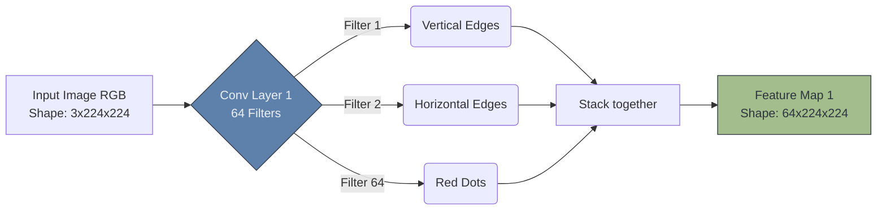

# 🔬 Filters and Feature Maps

> **Difficulty**: ⭐⭐⭐☆☆ Intermediate | **Prerequisites**: Convolution Operation | **Estimated Reading Time**: 25 Minutes

---

## 📋 Table of Contents
1. [What Problem Does This Solve?](#1-what-problem-does-this-solve)
2. [Intuition](#2-intuition)
3. [Core Mechanics (Hierarchical Features)](#3-core-mechanics-hierarchical-features)
4. [Visual Explanation](#4-visual-explanation)
5. [Algorithm Workflow](#5-algorithm-workflow)
6. [Implementation Concept](#6-implementation-concept)
7. [Failure Cases](#7-failure-cases)
8. [What's Next?](#8-whats-next)

---

## 1. What Problem Does This Solve?

A single convolution kernel can only find one specific thing (e.g., a vertical edge). But a real-world object, like a dog, is composed of thousands of different visual patterns: horizontal edges, diagonal curves, brown fur textures, and wet noses. 

Using **Multiple Filters (Channels)** solves this by allowing a single Convolutional layer to search for hundreds of different visual patterns simultaneously, outputting a rich, multi-dimensional **Feature Map** that describes the image.

---

## 2. Intuition

### 🟢 Beginner
If you are inspecting a house, you don't just use your eyes. You might use a thermal camera to look for heat leaks, a moisture meter to look for water damage, and a flashlight to look in dark corners. Each "tool" creates a different map of the house. 
In a CNN, each **Filter** is a different tool. Filter 1 looks for red circles. Filter 2 looks for vertical lines. The network runs all these tools over the image at the same time and stacks the resulting maps on top of each other.

### 🟡 Intermediate
Before Deep Learning, researchers manually created these filters using math (like the Sobel filter for edges). In a CNN, we *do not* manually set the filter weights. We initialize them with random numbers. During Backpropagation, the network uses Gradient Descent to *learn* the exact numbers that form the best possible filters for the specific task it is trying to solve.

### 🔴 Advanced
A "Filter" is mathematically 3-Dimensional. If the input image has 3 color channels (RGB), a $3 \times 3$ filter is actually $3 \times 3 \times 3$ (it has depth). The dot product is calculated across all 3 color channels simultaneously and summed into a single scalar. 
If we use 64 of these 3D filters in our first layer, the output **Feature Map** will have a depth of 64 channels. This means we transformed a 3-channel image into a 64-channel "idea" map!

---

## 3. Core Mechanics (Hierarchical Features)

Because we stack Convolutional layers on top of each other, the Feature Maps become **Hierarchical**.

1. **Layer 1 (Low-Level)**: The filters look directly at the raw pixels. They learn to find incredibly basic things: vertical edges, horizontal edges, and simple color gradients.
2. **Layer 2 (Mid-Level)**: The filters here don't look at pixels; they look at the edges found by Layer 1. They learn to combine those edges into corners, circles, and simple textures (like fur or scales).
3. **Layer 3 (High-Level)**: These filters look at the mid-level shapes and combine them into highly complex semantic objects. Filter #12 might specifically light up when it sees a "Dog's Nose", while Filter #45 lights up when it sees a "Car Wheel".

---

## 4. Visual Explanation



---

## 5. Algorithm Workflow

How the tensor shape morphs through a single PyTorch Conv layer:
1. **Input**: `[Batch, 3_Channels, 224, 224]`
2. **Layer Setup**: `nn.Conv2d(in_channels=3, out_channels=64, kernel_size=3)`
3. **Weights**: PyTorch creates a weight tensor of shape `[64, 3, 3, 3]`. (64 filters, each having depth 3, height 3, width 3).
4. **Operation**: Each of the 64 filters slides across the image independently.
5. **Output**: `[Batch, 64_Channels, 222, 222]` (The spatial dimension shrinks slightly due to the convolution boundaries).

---

## 6. Implementation Concept

```python
import torch
import torch.nn as nn

# 1. Simulate a batch of 1 RGB image
input_image = torch.rand(1, 3, 224, 224)

# 2. Define a layer with 128 different filters
conv_layer = nn.Conv2d(in_channels=3, out_channels=128, kernel_size=3)

# 3. Pass the image through
feature_map = conv_layer(input_image)

print(f"Input Shape: {input_image.shape}")
print(f"Feature Map Shape: {feature_map.shape}")
# Output Feature Map Shape: [1, 128, 222, 222]

# The network learned 128 * 3 * 3 * 3 weights!
print(f"Number of learned weights: {conv_layer.weight.numel()}")
```

---

## 7. Failure Cases

1. **Dead Filters**: Sometimes during training, the math in a specific filter becomes useless (e.g., all zeros), and it stops activating for any image. This is a waste of computational power. Modern architectures use techniques like BatchNorm and specific learning rates to keep filters "alive."
2. **Channel Explosion**: If Layer 1 has 64 filters, Layer 2 has 128, and Layer 3 has 512... the depth of your tensor becomes massive. If you don't reduce the spatial dimensions ($H$ and $W$) quickly, you will instantly run out of GPU Memory. 

---

## 8. What's Next?

### Summary
By using multiple filters simultaneously, a CNN transforms a basic 3-channel RGB image into a deep, rich, multi-channel Feature Map that highlights hierarchical patterns from simple edges to complex object parts.

### Why it matters
This is the "Learning" part of Deep Learning. The network's entire "knowledge" is stored inside the microscopic decimal values of these filter weights.

### Next Topic
We solved the parameter explosion, but as we stack more feature maps, the memory requirement skyrockets. We need a way to mathematically compress these maps while keeping the important information. We will learn this in **Pooling Layers**.

[← The Convolution Operation](04-Convolution-Operation.md) | [Return to Module Index](./README.md) | [Next: Pooling Layers →](06-Pooling-Layers.md)
