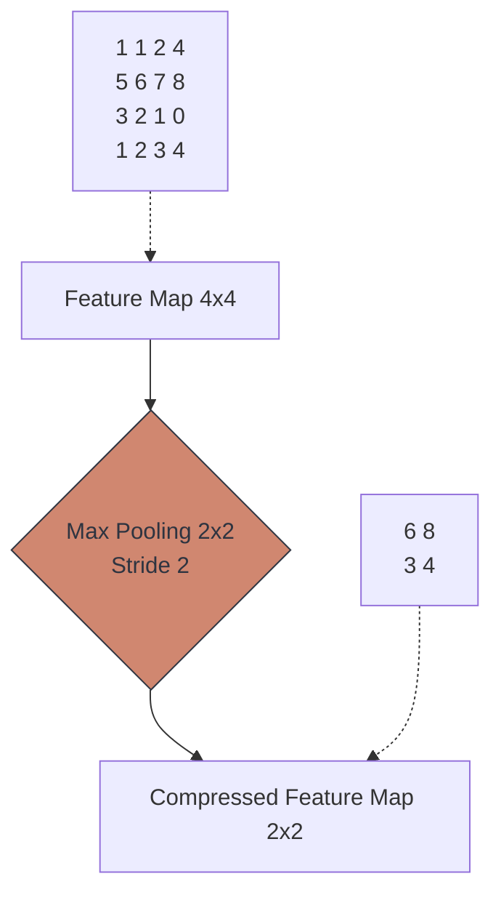

# 🗜️ Pooling Layers

> **Difficulty**: ⭐⭐☆☆☆ Intermediate | **Prerequisites**: Convolution Operation | **Estimated Reading Time**: 20 Minutes

---

## 📋 Table of Contents
1. [What Problem Does This Solve?](#1-what-problem-does-this-solve)
2. [Intuition](#2-intuition)
3. [Core Mechanics (Max vs. Average)](#3-core-mechanics-max-vs-average)
4. [Visual Explanation](#4-visual-explanation)
5. [Algorithm Workflow](#5-algorithm-workflow)
6. [PyTorch Implementation](#6-pytorch-implementation)
7. [Failure Cases](#7-failure-cases)
8. [What's Next?](#8-whats-next)

---

## 1. What Problem Does This Solve?

If we pass a $224 \times 224$ image through a convolution layer with 64 filters, our tensor is now $64 \times 224 \times 224$ (over 3.2 million data points). If we keep doing this for 50 layers, the GPU will run out of memory instantly. 

**Pooling Layers** solve this by aggressively compressing (downsampling) the spatial dimensions (Height and Width) of the feature map without destroying the core visual information. It also grants the network **Spatial Invariance** (making it robust to slight shifts and rotations of the object).

---

## 2. Intuition

### 🟢 Beginner
Imagine taking a massive, highly-detailed 4K photo and resizing it on your computer so it fits as a tiny thumbnail on a website. You lose the fine details, but you can still easily tell that it's a picture of a dog. Pooling is the CNN's way of creating "thumbnails" inside the network to save memory.

### 🟡 Intermediate
Pooling operates exactly like a sliding Convolutional window, but with *no learned weights*. It is a hard-coded mathematical operation. A standard $2 \times 2$ pooling window with a Stride of 2 will look at 4 pixels, and output exactly 1 pixel. This instantly cuts the Height in half, cuts the Width in half, and reduces the total data footprint by 75%.

### 🔴 Advanced
The most powerful side-effect of Pooling is **Translation Invariance**. 
Let's say a convolution filter finds a sharp "Cat Ear" at pixel coordinate $(10, 10)$, resulting in a bright, high-value activation. If the cat moves slightly in the next photo, that ear might move to $(11, 10)$. 
If we use a $2 \times 2$ Max Pooling window over that area, the window looks at 4 pixels and just takes the *Max* value. Because both $(10, 10)$ and $(11, 10)$ fall into the exact same pooling window, the output to the next layer is identical. The network learns that *where exactly* the ear is doesn't matter, as long as it's *roughly* in that area!

---

## 3. Core Mechanics (Max vs. Average)

There are two dominant types of pooling:

1. **Max Pooling**: Takes the maximum value in the window. 
   - *Why?* Because high values in a feature map indicate a strong match for a specific edge or texture. Max pooling ensures that the strongest, most important features survive the compression. Used in almost all early layers.
2. **Average (Global) Pooling**: Takes the mean of all values in the window. 
   - *Why?* Rarely used in early layers because it blurs edges. However, **Global Average Pooling** is used at the very end of modern networks (like ResNet) to completely crush a $7 \times 7$ feature map into a $1 \times 1$ scalar before the final classification layer, completely eliminating the need for massive, heavy Dense layers.

---

## 4. Algorithm Workflow

**Max Pooling (2x2, Stride 2)**
1. A $2 \times 2$ window is placed at the top left of a feature map.
2. The window sees 4 numbers: `[1, 5, 2, 9]`.
3. The output is `9`.
4. The window shifts to the right by 2 pixels (Stride = 2) so it doesn't overlap the previous area.
5. The window sees 4 numbers: `[0, 1, 1, 0]`.
6. The output is `1`.
7. The new feature map is constructed from these maximums.

---

## 5. Visual Explanation



---

## 6. PyTorch Implementation

```python
import torch
import torch.nn as nn

# 1. Create a dummy Feature Map: [Batch, Channels, Height, Width]
feature_map = torch.rand(1, 64, 224, 224)

# 2. Define a Max Pooling Layer
# kernel_size=2, stride=2 will cut the spatial dims exactly in half
max_pool = nn.MaxPool2d(kernel_size=2, stride=2)

# 3. Apply the pooling
compressed_map = max_pool(feature_map)

print(f"Original Shape: {feature_map.shape}")
print(f"Compressed Shape: {compressed_map.shape}")
# Output: Compressed Shape: [1, 64, 112, 112]
# Notice the Channels (64) remain untouched!
```

---

## 7. Failure Cases

1. **Loss of Spatial Information**: Max Pooling is destructive. It throws away 75% of the data. If your task requires absolute, pixel-perfect knowledge of where an object is (like Medical Image Segmentation), aggressive Max Pooling will destroy the fine boundaries of the object. Modern segmentation architectures (like U-Net) use "Skip Connections" to bypass this destruction.
2. **Capsule Networks**: Geoffrey Hinton (the Godfather of AI) famously argued that Max Pooling is a "mistake" because it destroys the geometric relationship between parts (e.g., it knows there is an eye and a mouth, but forgets their exact distance). He proposed Capsule Networks to fix this, though CNNs with pooling still dominate the industry.

---

## 8. What's Next?

### Summary
Pooling layers are hard-coded mathematical downsamplers. By taking the Maximum (or Average) value in a local window, they drastically reduce the memory footprint of the CNN and grant the network the ability to recognize objects even if they shift slightly.

### Why it matters
Without Pooling, training a Deep CNN on a 1080p image would require hundreds of gigabytes of GPU VRAM. It makes Deep Learning computationally feasible.

### Next Topic
We have all the LEGO blocks: Convolutions, Filters, and Pooling. It is time to snap them together to build a complete architecture. We will explore **Building The First CNN**.

[← Filters and Feature Maps](05-Filters-And-Feature-Maps.md) | [Return to Module Index](./README.md) | [Next: Building The First CNN →](07-Building-The-First-CNN.md)
