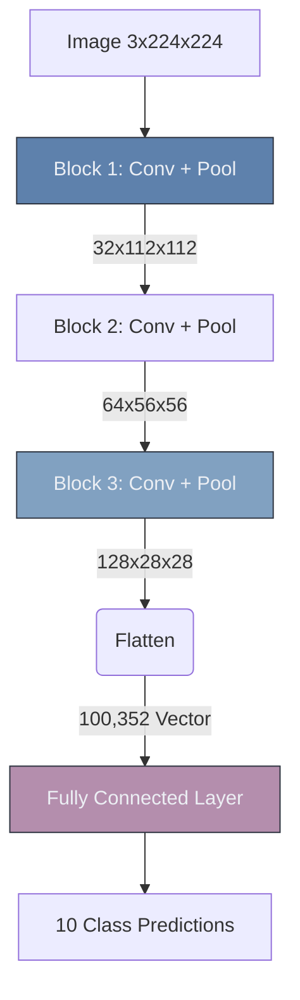

# 🧱 Building The First CNN

> **Difficulty**: ⭐⭐⭐☆☆ Intermediate | **Prerequisites**: Convolution, Pooling | **Estimated Reading Time**: 30 Minutes

---

## 📋 Table of Contents
1. [What Problem Does This Solve?](#1-what-problem-does-this-solve)
2. [Intuition](#2-intuition)
3. [Core Architecture (The VGG Block)](#3-core-architecture-the-vgg-block)
4. [Algorithm Workflow](#4-algorithm-workflow)
5. [Visual Explanation](#5-visual-explanation)
6. [PyTorch Implementation](#6-pytorch-implementation)
7. [Failure Cases](#7-failure-cases)
8. [What's Next?](#8-whats-next)

---

## 1. What Problem Does This Solve?

We understand the individual components: Convolutions find patterns, and Pooling compresses data. But how do we stack them? If you stack them randomly, the network won't learn, or the tensor shapes will crash mid-training.

**Building a CNN architecture** solves the problem of organizing these mathematical operations into a cohesive, sequential pipeline that successfully transforms a 3-channel image into a 1-Dimensional classification prediction.

---

## 2. Intuition

### 🟢 Beginner
Building a CNN is like building a funnel. At the top (the input), the funnel is very wide: the image is huge ($224 \times 224$), but it only has 3 colors (shallow). As the image falls down the funnel, it gets squeezed. The image gets smaller and smaller in height and width (due to pooling), but it gets deeper and deeper (due to adding more filters). At the very bottom, it's just a single long tube of numbers that outputs the final answer.

### 🟡 Intermediate
A standard CNN has two distinct parts:
1. **The Feature Extractor (The Backbone)**: A repeating pattern of `[Conv -> ReLU -> Pool]`. This part learns the visual patterns and physically shrinks the spatial dimensions while increasing the channel depth.
2. **The Classifier (The Head)**: A flattening operation followed by standard Fully Connected (Dense) layers. This part looks at the high-level features extracted by the backbone and makes the final decision (e.g., "I see fur and whiskers $\rightarrow$ It's a Cat").

### 🔴 Advanced
The "Shape Geometry" is the most difficult part for engineers to master. As the tensor flows through the network, you must mathematically track its exact shape.
If the final Convolutional layer outputs a tensor of shape `[Batch, 64, 7, 7]`, you must use a `.view()` or `Flatten()` operation to crush it into `[Batch, 3136]`. If you define your first Fully Connected layer to expect `1000` inputs instead of `3136`, PyTorch will throw a catastrophic mismatch error.

---

## 3. Core Architecture (The VGG Block)

While you can arrange layers however you want, the industry standardized around a specific pattern pioneered by the VGG network:
**The VGG Block**: `[Conv2D -> ReLU -> Conv2D -> ReLU -> MaxPool2D]`

*Why two Convs before a Pool?* 
Two $3 \times 3$ convolutions stacked on top of each other have the exact same "Receptive Field" (they see the same amount of the original image) as a single $5 \times 5$ convolution. However, using two $3 \times 3$ layers uses *far fewer parameters* and applies the non-linear ReLU activation twice, making the network mathematically stronger and lighter.

---

## 4. Algorithm Workflow (The Forward Pass)

1. Input: `[3, 224, 224]`
2. **Block 1**: Conv(32 filters) $\rightarrow$ ReLU $\rightarrow$ MaxPool(2x2).
   - Shape is now: `[32, 112, 112]`. (Channels went up, space went down).
3. **Block 2**: Conv(64 filters) $\rightarrow$ ReLU $\rightarrow$ MaxPool(2x2).
   - Shape is now: `[64, 56, 56]`.
4. **Block 3**: Conv(128 filters) $\rightarrow$ ReLU $\rightarrow$ MaxPool(2x2).
   - Shape is now: `[128, 28, 28]`.
5. **Flatten**: Crush the 3D tensor into a 1D vector.
   - Shape is now: `[128 * 28 * 28]` = `[100352]`.
6. **Dense**: Linear(100352 $\rightarrow$ 10 classes).

---

## 5. Visual Explanation



---

## 6. PyTorch Implementation

```python
import torch
import torch.nn as nn

class SimpleCNN(nn.Module):
    def __init__(self, num_classes=10):
        super(SimpleCNN, self).__init__()
        
        # Part 1: The Feature Extractor Backbone
        self.features = nn.Sequential(
            # Block 1
            nn.Conv2d(in_channels=3, out_channels=16, kernel_size=3, padding=1),
            nn.ReLU(),
            nn.MaxPool2d(kernel_size=2, stride=2), # Halves image size
            
            # Block 2
            nn.Conv2d(in_channels=16, out_channels=32, kernel_size=3, padding=1),
            nn.ReLU(),
            nn.MaxPool2d(kernel_size=2, stride=2)
        )
        
        # Part 2: The Classifier Head
        self.classifier = nn.Sequential(
            # Assuming input was 32x32 (like CIFAR-10)
            # Pool 1: 32 -> 16. Pool 2: 16 -> 8.
            # Channels is 32. Flattened size: 32 * 8 * 8 = 2048
            nn.Flatten(),
            nn.Linear(32 * 8 * 8, 128),
            nn.ReLU(),
            nn.Linear(128, num_classes)
        )
        
    def forward(self, x):
        x = self.features(x)
        x = self.classifier(x)
        return x

# Test the shape flow
model = SimpleCNN()
dummy_batch = torch.rand(1, 3, 32, 32)
output = model(dummy_batch)
print(f"Output shape: {output.shape}") # Expected: [1, 10]
```

---

## 7. Failure Cases

1. **The Shape Mismatch Crash**: If you change your input image size from $32 \times 32$ to $64 \times 64$, your Convolutional Backbone will run perfectly fine (convolutions don't care about input size). But the moment it hits `nn.Linear()`, PyTorch will crash, because the Dense layer mathematically expects a strict `2048` inputs, but the larger image resulted in a larger flattened vector.
2. **Dying ReLU**: If the learning rate is too high, the network will push large negative numbers into the ReLU activation function. ReLU turns all negatives into `0.0`. If a whole layer outputs `0.0`, the gradients become zero, Backpropagation stops, and the network suffers "brain death" and stops learning entirely.

---

## 8. What's Next?

### Summary
A CNN architecture is a funnel. The Feature Extractor uses Convolutions and Pooling to find visual patterns and compress spatial dimensions, while the Classifier flattens those patterns to make a final categorical prediction.

### Why it matters
This is the foundational skeleton for almost all Computer Vision applications. Once you master how to track the tensor shapes flowing through these blocks, you can build any custom architecture.

### Next Topic
We have the car (the architecture), but we haven't turned the engine on. How do we actually teach this network to recognize a cat? We will cover the training loop, loss functions, and optimizers in **The CNN Training Pipeline**.

[← Pooling Layers](06-Pooling-Layers.md) | [Return to Module Index](./README.md) | [Next: CNN Training Pipeline →](08-CNN-Training-Pipeline.md)
