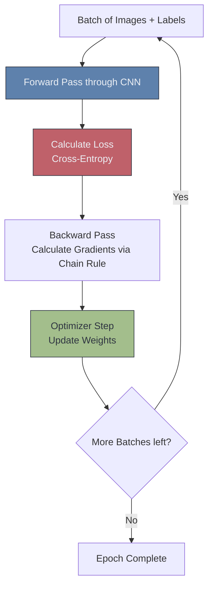

# ⚙️ CNN Training Pipeline

> **Difficulty**: ⭐⭐⭐⭐☆ Advanced | **Prerequisites**: Building The First CNN | **Estimated Reading Time**: 30 Minutes

---

## 📋 Table of Contents
1. [What Problem Does This Solve?](#1-what-problem-does-this-solve)
2. [Intuition](#2-intuition)
3. [Core Mathematics (Cross-Entropy & SGD)](#3-core-mathematics-cross-entropy--sgd)
4. [Algorithm Workflow (The Epoch Loop)](#4-algorithm-workflow-the-epoch-loop)
5. [Visual Explanation](#5-visual-explanation)
6. [PyTorch Implementation](#6-pytorch-implementation)
7. [Failure Cases](#7-failure-cases)
8. [What's Next?](#8-whats-next)

---

## 1. What Problem Does This Solve?

When you initialize a CNN, the weights in all the convolution filters are completely random. If you pass an image of a dog through the network, it will output pure garbage. 

The **Training Pipeline** solves the problem of how to mathematically update those millions of random weights so they actually learn to recognize the visual patterns of a dog. It is the engine of Deep Learning.

---

## 2. Intuition

### 🟢 Beginner
Imagine you are blindfolded and trying to throw a dart at a dartboard. You throw the dart (Forward Pass). Your friend looks at the board and tells you, "You missed high and to the left by 5 inches" (Calculating the Loss). You mentally adjust the angle of your arm based on that feedback (Backpropagation). You throw again, slightly better this time. If you repeat this 1,000 times, you will eventually hit a bullseye every time. 

### 🟡 Intermediate
The pipeline consists of four strict steps that must occur in a loop:
1. **Forward Pass**: The images go through the CNN. The model outputs its predictions (logits).
2. **Loss Function**: We compare the predictions to the actual ground truth labels. We calculate exactly how "wrong" the model is.
3. **Backward Pass (Backpropagation)**: We calculate the Gradient (the slope of the error) for every single weight in the network, figuring out which weights need to increase and which need to decrease.
4. **Optimizer Step**: We actually change the weights by a tiny amount (the Learning Rate) in the correct direction.

### 🔴 Advanced
The computational bottleneck in training is memory. During the Forward Pass, PyTorch must save the intermediate activation tensors for *every single layer* in GPU VRAM (the Computational Graph). Why? Because the Chain Rule of Calculus used during the Backward Pass requires the forward activations to calculate the gradients. If your batch size is too large, saving these intermediate tensors will trigger an Out Of Memory (OOM) error before you even reach the Backward pass.

---

## 3. Core Mathematics (Cross-Entropy & SGD)

**Cross-Entropy Loss**
For multi-class classification, we don't use Mean Squared Error. We use Cross-Entropy. It penalizes the model heavily if it is highly confident about the *wrong* answer.
$$ L = -\sum y_c \log(\hat{y}_c) $$
Where $y_c$ is the true label (a 1 or 0) and $\hat{y}_c$ is the predicted probability.

**Stochastic Gradient Descent (SGD) / Adam**
Once we have the gradient ($\nabla L$), the Optimizer updates the old weight ($W_{old}$) to the new weight ($W_{new}$) using the Learning Rate ($\eta$):
$$ W_{new} = W_{old} - \eta \cdot \nabla L $$

---

## 4. Algorithm Workflow (The Epoch Loop)

An **Epoch** is one complete pass through the entire training dataset.
1. Shuffle the dataset.
2. Load a **Mini-Batch** of 32 images and their 32 labels onto the GPU.
3. Zero out any old gradients in the Optimizer.
4. Pass the 32 images through the model (Forward).
5. Calculate the Loss.
6. Trigger `.backward()` to compute all gradients.
7. Trigger `.step()` to update the weights.
8. Repeat until all batches are processed. This ends 1 Epoch.

---

## 5. Visual Explanation



---

## 6. PyTorch Implementation

```python
import torch
import torch.nn as nn
import torch.optim as optim

# Assume `model` is your CNN and `train_loader` yields batches
model = ...
device = torch.device('cuda' if torch.cuda.is_available() else 'cpu')
model.to(device)

# 1. Define Loss and Optimizer
criterion = nn.CrossEntropyLoss()
optimizer = optim.Adam(model.parameters(), lr=0.001)

# 2. The Epoch Loop
for epoch in range(10): # Train for 10 epochs
    model.train() # Set model to training mode (enables Dropout/BatchNorm updates)
    running_loss = 0.0
    
    for images, labels in train_loader:
        # Move data to GPU
        images, labels = images.to(device), labels.to(device)
        
        # 3. Zero the gradients
        optimizer.zero_grad()
        
        # 4. Forward Pass
        outputs = model(images)
        
        # 5. Calculate Loss
        loss = criterion(outputs, labels)
        
        # 6. Backward Pass
        loss.backward()
        
        # 7. Update Weights
        optimizer.step()
        
        running_loss += loss.item()
        
    print(f"Epoch {epoch+1} | Loss: {running_loss/len(train_loader):.4f}")
```

---

## 7. Failure Cases

1. **Forgetting `optimizer.zero_grad()`**: This is the most famous PyTorch bug. PyTorch *accumulates* gradients by default. If you forget to zero them out at the start of a batch, the gradients from Batch 2 will be mathematically added to the gradients from Batch 1. The weights will explode in random directions, and the loss will quickly reach `NaN`.
2. **Exploding/Vanishing Gradients**: If your network is 100 layers deep, multiplying small numbers via the Chain Rule 100 times results in a gradient of `0.00000001` when it finally reaches Layer 1. The early layers will stop learning entirely. This requires architectural fixes like Residual Connections (ResNet).

---

## 8. What's Next?

### Summary
The Training Pipeline is the engine that actually creates "Artificial Intelligence." By looping through Forward Passes, Loss calculations, Backpropagation, and Optimizer steps, the random filters slowly morph into powerful feature extractors.

### Why it matters
The architecture is just the blueprint. The training loop is where the actual computation and engineering happen. Mastering this loop is mandatory for debugging any deep learning project.

### Next Topic
We glossed over a small detail: why do we use `ReLU` inside the CNN? What happens if we don't use it? We will explore this in **Activation Functions in CNNs**.

[← Building The First CNN](07-Building-The-First-CNN.md) | [Return to Module Index](./README.md) | [Next: Activation Functions in CNNs →](09-Activation-Functions-In-CNNs.md)
