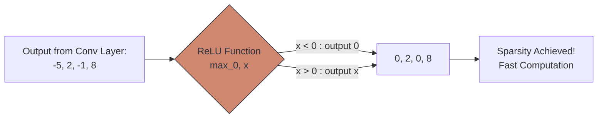

# ⚡ Activation Functions in CNNs

> **Difficulty**: ⭐⭐☆☆☆ Intermediate | **Prerequisites**: Convolution, Training Pipeline | **Estimated Reading Time**: 25 Minutes

---

## 📋 Table of Contents
1. [What Problem Does This Solve?](#1-what-problem-does-this-solve)
2. [Intuition](#2-intuition)
3. [Core Mathematics (ReLU & Variants)](#3-core-mathematics-relu--variants)
4. [Algorithm Workflow](#4-algorithm-workflow)
5. [Visual Explanation](#5-visual-explanation)
6. [PyTorch Implementation](#6-pytorch-implementation)
7. [Failure Cases](#7-failure-cases)
8. [What's Next?](#8-whats-next)

---

## 1. What Problem Does This Solve?

A Convolution operation is just a massive chain of multiplications and additions. If you stack 100 Convolution layers on top of each other, mathematically, they simply collapse into one giant linear equation: $y = (W_1 \cdot W_2 \cdot W_3)x + B$. 

If your network is purely linear, it is impossible for it to learn anything more complex than a straight line. It could never learn the complex curves of a dog's ear. **Activation Functions** solve this by injecting **Non-Linearity** into the network, allowing it to bend and warp its mathematical representations to fit infinitely complex real-world shapes.

---

## 2. Intuition

### 🟢 Beginner
Imagine you are building a physical rollercoaster track using only perfectly straight, rigid pipes (Linear Operations). No matter how many straight pipes you connect, the track will always be a straight line. An Activation Function is like a "joint" that allows you to bend the pipe at specific points. With enough bends, you can build loops, drops, and complex curves!

### 🟡 Intermediate
In the early days of AI, researchers used the **Sigmoid** activation function to inject non-linearity. It squashed all numbers into a range between `[0, 1]`. 
However, Sigmoid has a fatal flaw in Deep CNNs: If a number is very large (e.g., `100`) or very small (e.g., `-100`), the slope (gradient) of the Sigmoid curve at those points is essentially `0.0`. During Backpropagation, when you multiply by `0.0`, the gradient vanishes, and the early layers of the CNN completely stop learning.

### 🔴 Advanced
To solve the Vanishing Gradient problem, the industry adopted **ReLU** (Rectified Linear Unit). 
ReLU is mathematically trivial: If $x < 0$, output $0$. If $x \ge 0$, output $x$. 
Because the gradient of ReLU for all positive numbers is exactly `1.0`, the gradient passes perfectly through 100 layers without ever shrinking! Furthermore, because it turns negative numbers into pure zeros, it creates **Sparsity**. A sparse network (where many neurons are turned off) is computationally incredibly fast and helps prevent overfitting.

---

## 3. Core Mathematics (ReLU & Variants)

**1. ReLU (Rectified Linear Unit)**
$$ f(x) = \max(0, x) $$
- **Pros**: Solves vanishing gradients for positive numbers. Extremely fast to compute.
- **Cons**: The "Dying ReLU" problem. If a neuron's weights are updated in such a way that it only ever receives negative inputs, it will only ever output `0`. Its gradient will be `0`, and it will never recover. It becomes "dead."

**2. Leaky ReLU**
$$ f(x) = \max(0.01x, x) $$
- **Pros**: Fixes Dying ReLU by allowing a tiny, non-zero gradient (slope of `0.01`) for negative numbers, allowing the dead neuron a chance to slowly recover during training.

**3. GELU (Gaussian Error Linear Unit)**
- Used in modern architectures (like Vision Transformers). Instead of a sharp, hard angle at zero, GELU provides a smooth, probabilistic curve based on the Gaussian distribution. It often yields slightly higher accuracy but is computationally heavier.

---

## 4. Algorithm Workflow

Where do activation functions go?
1. **Conv2D**: Performs the linear matrix multiplication.
2. **BatchNorm** (Optional): Normalizes the output.
3. **Activation (ReLU)**: Bends the math.
4. **Pool2D**: Shrinks the spatial size.

This pattern `[Conv -> ReLU -> Pool]` repeats throughout the entire Feature Extractor backbone.

At the very end of the network (The Classifier Head):
- If classifying into multiple categories (Cat, Dog, Bird), use **Softmax** on the final layer to turn logits into probabilities that sum to 100%.
- If classifying Binary (Cat vs Not Cat), use **Sigmoid** on the final layer.

---

## 5. Visual Explanation



---

## 6. PyTorch Implementation

```python
import torch
import torch.nn as nn
import matplotlib.pyplot as plt

# 1. Create a tensor with negative and positive values
x = torch.tensor([-5.0, -2.0, 0.0, 2.0, 5.0])

# 2. Initialize different activation functions
relu = nn.ReLU()
leaky_relu = nn.LeakyReLU(negative_slope=0.1) # Exaggerated slope for demonstration

# 3. Apply functions
print(f"Original:   {x}")
print(f"ReLU:       {relu(x)}")
print(f"Leaky ReLU: {leaky_relu(x)}")

# Output:
# Original:   tensor([-5., -2.,  0.,  2.,  5.])
# ReLU:       tensor([ 0.,  0.,  0.,  2.,  5.])
# Leaky ReLU: tensor([-0.5000, -0.2000,  0.0000,  2.0000,  5.0000])
```

---

## 7. Failure Cases

1. **Sigmoid in Hidden Layers**: If you build a 20-layer CNN and use `nn.Sigmoid()` instead of `nn.ReLU()` in the hidden layers, your model's loss will plateau immediately. The gradients will vanish within the first 3 layers during backpropagation, and your model will fail to train.
2. **ReLU before BatchNorm**: If you place your ReLU *before* your Batch Normalization layer `[Conv -> ReLU -> BatchNorm]`, you ruin the normal distribution assumption of BatchNorm, as all negative values have already been clamped to zero. The correct order is almost always `[Conv -> BatchNorm -> ReLU]`.

---

## 8. What's Next?

### Summary
Activation functions inject vital non-linearity into CNNs. While Sigmoid causes the Vanishing Gradient problem in deep networks, ReLU (and its variants) solve it by providing a clear, steady gradient for positive values and computational sparsity for negative values.

### Why it matters
Without ReLU, Deep Learning as we know it today (networks with hundreds of layers) would be mathematically impossible to train.

### Next Topic
We've built a basic CNN and learned how it trains. But how did the industry scale these networks from 5 layers to 150 layers? We will look at the massive architectural breakthroughs in **Modern CNN Architectures (ResNet)**.

[← CNN Training Pipeline](08-CNN-Training-Pipeline.md) | [Return to Module Index](./README.md) | [Next: Modern CNN Architectures →](10-Modern-CNN-Architectures.md)
