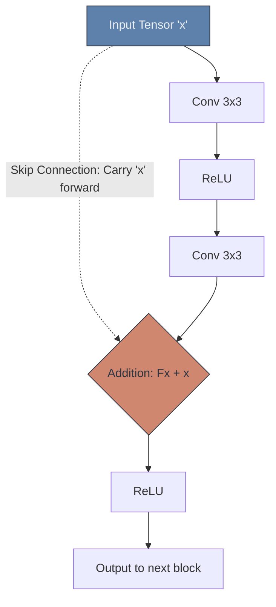

# 🏛️ Modern CNN Architectures (ResNet & Beyond)

> **Difficulty**: ⭐⭐⭐☆☆ Intermediate | **Prerequisites**: Building The First CNN | **Estimated Reading Time**: 30 Minutes

---

## 📋 Table of Contents
1. [What Problem Does This Solve?](#1-what-problem-does-this-solve)
2. [Intuition](#2-intuition)
3. [Core Mechanics (Residual Connections)](#3-core-mechanics-residual-connections)
4. [Algorithm Workflow](#4-algorithm-workflow)
5. [Visual Explanation](#5-visual-explanation)
6. [PyTorch Implementation Concept](#6-pytorch-implementation-concept)
7. [Failure Cases](#7-failure-cases)
8. [What's Next?](#8-whats-next)

---

## 1. What Problem Does This Solve?

If a 10-layer CNN gets 80% accuracy, you would assume a 50-layer CNN would get 90% accuracy. But in reality, before 2015, if you tried to train a 50-layer CNN, the accuracy actually *dropped* dramatically. 

This was the **Degradation Problem**. Because of vanishing gradients and chaotic math, adding more layers physically broke the network. **Modern Architectures** (specifically ResNet) solved the degradation problem, allowing engineers to train networks that are hundreds of layers deep without breaking.

---

## 2. Intuition

### 🟢 Beginner
Imagine trying to whisper a complex secret message down a line of 50 people (the game of Telephone). By the time it reaches the 50th person, the message is completely garbled. This is a deep CNN failing. 
**ResNet** (Residual Networks) fixed this by giving every person a megaphone. They don't just whisper to the next person; they shout the original message directly over the heads of the people next to them to ensure the original, uncorrupted signal survives to the end of the line.

### 🟡 Intermediate
ResNet introduced the **Skip Connection** (or Shortcut). Instead of forcing the data tensor to flow exclusively through every single convolution layer sequentially, the Skip Connection takes the original input tensor and *adds it* to the output of the convolutional block mathematically ($Output = F(x) + x$). 
If the convolution block $F(x)$ learns nothing and outputs zeros, the Skip Connection ensures the original data $x$ still flows safely to the next layer without degradation!

### 🔴 Advanced
Why is it called "Residual"? Without a skip connection, a layer tries to learn the complex, underlying mapping $H(x)$. With a skip connection, the layer's output is added to the input: $H(x) = F(x) + x$. 
Rearranging this: $F(x) = H(x) - x$. 
The network is no longer trying to learn the full mapping. It is only trying to learn the **Residual** (the mathematical difference between the input and the desired output). It is significantly easier for an optimizer to push weights to zero (learning the identity function) than it is to learn a highly complex identity mapping from scratch.

---

## 3. Core Mechanics (Evolution of Architectures)

1. **AlexNet (2012)**: 8 layers. Proved that Deep CNNs trained on GPUs could crush classical computer vision algorithms on the ImageNet challenge. It introduced ReLU and Dropout.
2. **VGG (2014)**: 16-19 layers. Standardized the architecture. Proved that stacking many small $3 \times 3$ convolutions is much better than using large $11 \times 11$ convolutions. However, it was incredibly heavy (138 million parameters) due to its massive Dense layers.
3. **ResNet (2015)**: 50-152 layers. Introduced Skip Connections. It completely eliminated the Vanishing Gradient problem, allowing networks to become unbelievably deep while actually having *fewer* parameters than VGG.
4. **EfficientNet (2019)**: Proved that you cannot just scale a network by randomly making it deeper. EfficientNet uses a "Compound Scaling" mathematical formula to perfectly scale the network's Depth, Width, and Resolution simultaneously, achieving State-of-the-Art accuracy with a fraction of the computational cost.

---

## 4. Algorithm Workflow (The ResNet Block)

Inside a single ResNet Block during the Forward Pass:
1. Receive input tensor $x$.
2. Save a copy of $x$ in memory (the skip connection).
3. Pass $x$ through Conv $\rightarrow$ BatchNorm $\rightarrow$ ReLU $\rightarrow$ Conv $\rightarrow$ BatchNorm to get $F(x)$.
4. Add the saved copy: `output = F(x) + x`. (Element-wise addition).
5. Apply final ReLU.

---

## 5. Visual Explanation



---

## 6. PyTorch Implementation Concept

How simple is a Skip Connection to code?

```python
import torch
import torch.nn as nn

class ResidualBlock(nn.Module):
    def __init__(self, channels):
        super(ResidualBlock, self).__init__()
        # Standard convolution path
        self.conv1 = nn.Conv2d(channels, channels, kernel_size=3, padding=1)
        self.bn1 = nn.BatchNorm2d(channels)
        self.relu = nn.ReLU()
        self.conv2 = nn.Conv2d(channels, channels, kernel_size=3, padding=1)
        self.bn2 = nn.BatchNorm2d(channels)
        
    def forward(self, x):
        # 1. Save the original input!
        identity = x 
        
        # 2. Pass through convolutions
        out = self.conv1(x)
        out = self.bn1(out)
        out = self.relu(out)
        out = self.conv2(out)
        out = self.bn2(out)
        
        # 3. THE SKIP CONNECTION
        # Add the original input back to the mutated output!
        out += identity 
        
        # 4. Final Activation
        out = self.relu(out)
        return out
```

---

## 7. Failure Cases

1. **Shape Mismatches in Skip Connections**: You can only perform the addition `F(x) + x` if the two tensors have the exact same shape. If `F(x)` passed through a Pooling layer or changed its channel depth, the dimensions will mismatch and PyTorch will crash. ResNet solves this by using a $1 \times 1$ convolution on the skip connection path to quickly adjust the shape of $x$ to match $F(x)$ before adding them.
2. **Reinventing the Wheel**: Do not build VGG or ResNet from scratch for production tasks. The architecture has already been perfected. Building it from scratch usually leads to catastrophic initialization bugs.

---

## 8. What's Next?

### Summary
Modern Architectures solved the Degradation Problem. By utilizing Skip Connections, ResNet allowed gradients to flow freely across hundreds of layers, proving that Extreme Depth is the key to unlocking high-accuracy feature extraction.

### Why it matters
Every single modern Computer Vision framework (YOLO, Faster R-CNN, Mask R-CNN, U-Net) relies entirely on ResNet or EfficientNet as their feature-extracting "Backbone."

### Next Topic
We have the perfect architecture (ResNet). But training it requires 1.2 million images and 3 weeks of GPU time. How can we use ResNet if we only have 500 images of our custom dataset? The answer is the most important practical technique in Deep Learning: **Transfer Learning**.

[← Activation Functions in CNNs](09-Activation-Functions-In-CNNs.md) | [Return to Module Index](./README.md) | [Next: Transfer Learning →](11-Transfer-Learning.md)
