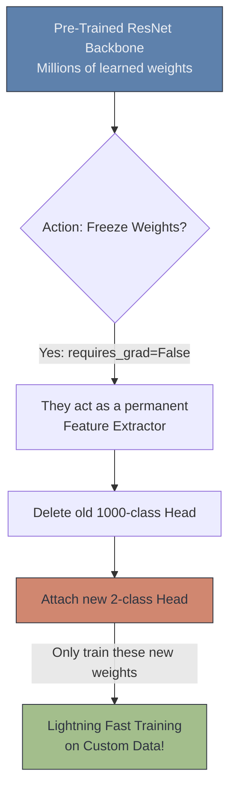

# ♻️ Transfer Learning

> **Difficulty**: ⭐⭐⭐☆☆ Intermediate | **Prerequisites**: Modern Architectures | **Estimated Reading Time**: 30 Minutes

---

## 📋 Table of Contents
1. [What Problem Does This Solve?](#1-what-problem-does-this-solve)
2. [Intuition](#2-intuition)
3. [Core Mechanics (Fine-Tuning vs. Feature Extraction)](#3-core-mechanics-fine-tuning-vs-feature-extraction)
4. [Algorithm Workflow](#4-algorithm-workflow)
5. [Visual Explanation](#5-visual-explanation)
6. [PyTorch Implementation](#6-pytorch-implementation)
7. [Failure Cases](#7-failure-cases)
8. [What's Next?](#8-whats-next)

---

## 1. What Problem Does This Solve?

Training a massive ResNet-50 from scratch requires over a million labeled images (like the ImageNet dataset), massive amounts of compute power, and weeks of training time. 
If a doctor wants to train a model to detect rare lung tumors, they might only have 300 MRI images. If they try to train a ResNet from scratch on 300 images, it will instantly overfit and fail.

**Transfer Learning** solves the "Small Data Problem". It allows us to download a model that a tech giant (like Google or Meta) spent millions of dollars training, and legally "steal" the knowledge it learned, repurposing it for our own custom, small-scale dataset.

---

## 2. Intuition

### 🟢 Beginner
Imagine you want to teach someone to play the Guitar. 
- Scenario A: You try to teach a baby. You have to teach them what music is, what rhythm is, and how to hold an object. (Training from scratch).
- Scenario B: You try to teach a professional Violinist. They already know music theory, rhythm, and string dynamics. You only have to teach them the specific shape of the guitar. (Transfer Learning). 
By starting with an "expert" network, we save incredible amounts of time and data.

### 🟡 Intermediate
A CNN trained on ImageNet (1,000 classes of dogs, cars, planes) has already spent weeks learning how to find vertical edges, geometric shapes, and complex textures in its Backbone layers. These features are universal! A vertical edge on a dog looks exactly like a vertical edge on an MRI scan. 
We can download these pre-trained Backbone weights, freeze them (so they don't change), and only train a brand new, custom Classifier Head for our 2 specific classes (Tumor vs. No Tumor).

### 🔴 Advanced
If your target dataset is significantly different from ImageNet (e.g., Satellite Imagery), simply freezing the Backbone won't be enough, because Satellite imagery requires different high-level features than pictures of dogs.
In this case, we use **Fine-Tuning**. We load the pre-trained weights to give the model a massive head start, but we use a very tiny Learning Rate (e.g., `1e-5`) to gently unfreeze the deepest layers of the Backbone and allow them to slowly adjust to the new satellite data without destroying the foundational edge-detection filters in the early layers.

---

## 3. Core Mechanics (Fine-Tuning vs. Feature Extraction)

There are two distinct ways to perform Transfer Learning:

**1. Feature Extraction (The Frozen Backbone)**
- Freeze `requires_grad = False` for all convolutional layers.
- Delete the final Dense classification layer (which predicts 1000 classes).
- Replace it with a new Dense layer (which predicts your 2 classes).
- Train *only* the new Dense layer.
- *Use when*: You have very little data, and your data looks similar to ImageNet.

**2. Fine-Tuning (The Unfrozen Backbone)**
- Replace the classification head.
- Leave `requires_grad = True` on all layers (or just the final few Conv blocks).
- Train the entire network simultaneously with an exceptionally small Learning Rate.
- *Use when*: You have a medium/large dataset, or your data looks completely alien to ImageNet (like microscopic cell images).

---

## 4. Algorithm Workflow

1. Use `torchvision` to download a pre-trained ResNet-18 model.
2. Iterate through `model.parameters()` and set `param.requires_grad = False`.
3. Inspect the `model.fc` (Fully Connected) layer to see how many `in_features` it expects.
4. Overwrite `model.fc` with a brand new `nn.Linear(in_features, num_your_classes)`. (New layers default to `requires_grad = True`).
5. Pass *only* the weights of `model.fc` into your Optimizer.
6. Train the model for 5-10 epochs.

---

## 5. Visual Explanation



---

## 6. PyTorch Implementation

```python
import torch
import torch.nn as nn
from torchvision import models

# 1. Download pre-trained model
model = models.resnet18(pretrained=True)

# 2. FREEZE the Backbone (Feature Extraction)
for param in model.parameters():
    param.requires_grad = False

# 3. Find the input features of the existing final layer
num_ftrs = model.fc.in_features 

# 4. Replace the final layer. 
# Assume we are doing Binary Classification (Cats vs Dogs = 2 classes)
# New layers automatically have requires_grad=True
model.fc = nn.Linear(num_ftrs, 2)

# 5. Tell the optimizer to ONLY update the new classification head
optimizer = torch.optim.Adam(model.fc.parameters(), lr=0.001)

print("Model is ready! Only the final head will be trained.")
```

---

## 7. Failure Cases

1. **Catastrophic Forgetting**: If you attempt to Fine-Tune the entire network but use a large Learning Rate (like `0.1`), the massive gradients from your new, untrained classification head will propagate backward and violently overwrite the beautifully organized, pre-trained weights in the backbone. The network will instantly "forget" everything it learned on ImageNet. *Always use a Learning Rate 10x to 100x smaller when Fine-Tuning.*
2. **Missing Normalization**: ImageNet models were trained using very specific image normalizations (Mean: `[0.485, 0.456, 0.406]`, Std: `[0.229, 0.224, 0.225]`). If you feed your custom images into the pre-trained model without applying these exact normalization statistics in your preprocessing pipeline, the model will perform terribly because the data distribution is shifted.

---

## 8. What's Next?

### Summary
Transfer learning allows us to leverage massive models trained by tech giants on small, custom datasets. By freezing the early layers (which extract universal geometric features) and only training a new classification head, we achieve incredible accuracy with tiny amounts of data and compute.

### Why it matters
In the modern AI industry, you will almost *never* train a CNN from scratch. Transfer Learning is the default starting point for 99% of commercial Computer Vision projects.

### Next Topic
Transfer Learning solves the problem of small datasets. But what if we want to mathematically multiply the size of our small dataset for free? We will explore **Image Augmentation**.

[← Modern CNN Architectures](10-Modern-CNN-Architectures.md) | [Return to Module Index](./README.md) | [Next: Image Augmentation →](12-Image-Augmentation.md)
