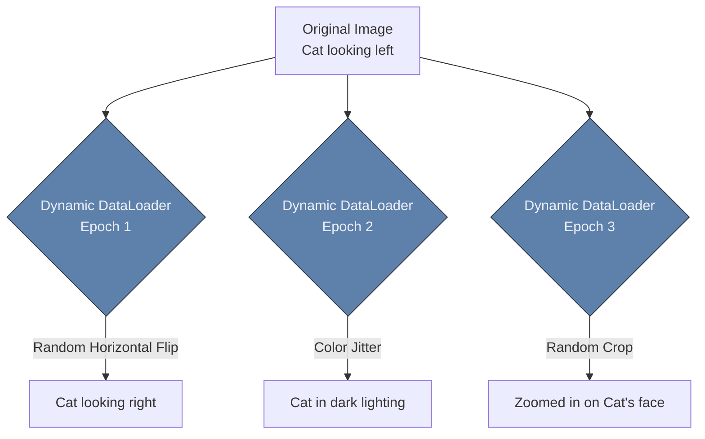

# 🪞 Image Augmentation

> **Difficulty**: ⭐⭐☆☆☆ Intermediate | **Prerequisites**: CNN Training Pipeline | **Estimated Reading Time**: 20 Minutes

---

## 📋 Table of Contents
1. [What Problem Does This Solve?](#1-what-problem-does-this-solve)
2. [Intuition](#2-intuition)
3. [Core Mechanics (Dynamic Transforms)](#3-core-mechanics-dynamic-transforms)
4. [Algorithm Workflow](#4-algorithm-workflow)
5. [Visual Explanation](#5-visual-explanation)
6. [PyTorch Implementation Concept](#6-pytorch-implementation-concept)
7. [Failure Cases](#7-failure-cases)
8. [What's Next?](#8-whats-next)

---

## 1. What Problem Does This Solve?

Deep Learning models are notoriously data-hungry. If you only have 500 images of a rare manufacturing defect, your model will quickly memorize those exact 500 images and fail to generalize to new data (Overfitting). 

**Image Augmentation** solves this by dynamically applying mathematical transformations (like rotating, flipping, or color shifting) to your dataset during training. This mathematically forces the CNN to learn the *concept* of the object, rather than memorizing the specific pixels of the training images. It effectively multiplies the size of your dataset for free.

---

## 2. Intuition

### 🟢 Beginner
If I show you a picture of a cat, and then I flip the picture upside down, you still know it's a cat. But to a computer, an upside-down cat creates a completely different grid of numbers. If the computer has never seen an upside-down cat, it will guess wrong. Augmentation is the process of intentionally messing up the training photos (flipping them, darkening them, zooming in) so the computer learns that a cat is a cat, regardless of the angle or lighting.

### 🟡 Intermediate
Augmentation acts as a heavy **Regularizer**. By constantly changing the training data, you make it mathematically impossible for the CNN to memorize the training set. If the network memorizes that "Tumor = bright spot in the top right corner", we can defeat that memorization by randomly rotating the image 90 degrees. Now the tumor is in the bottom right corner, forcing the network to learn the actual shape of the tumor instead of its location.

### 🔴 Advanced
Modern augmentation goes far beyond simple rotations.
- **Cutout / Random Erasing**: Randomly drawing black boxes over parts of the image. This forces the network to look at the entire object, rather than relying on one specific feature (like the dog's nose).
- **MixUp / CutMix**: Literally blending two images together. We take 50% of a Cat image and 50% of a Dog image, overlay them, and tell the network the label is `[0.5 Cat, 0.5 Dog]`. This smooths the decision boundaries and produces incredibly robust networks.

---

## 3. Core Mechanics (Dynamic Transforms)

A critical misconception about augmentation is that you save the augmented images to your hard drive. **You do not.** 
If you augment a dataset of 10,000 images on your hard drive, you will instantly fill up your SSD.

Augmentations are **Dynamic (On-the-Fly)**. During the Training Loop, when PyTorch loads an image from the hard drive into RAM, it applies a random transformation (like a 15-degree rotation) exactly at that moment. 
- In Epoch 1, the image might be rotated 15 degrees.
- In Epoch 2, the *exact same image* is loaded, but this time it is flipped horizontally.
The network never sees the exact same pixel matrix twice!

---

## 4. Algorithm Workflow

1. Define a robust list of transformations using `torchvision.transforms` or `albumentations`.
2. Crucially: Apply these random transformations **ONLY to the Training Dataset**.
3. For the **Validation / Test Dataset**, apply *no* augmentations (except for basic resizing and normalization). We want to test the model on clean, realistic data.
4. Pass the transformed batches into the DataLoader.

---

## 5. Visual Explanation



---

## 6. PyTorch Implementation Concept

```python
import torchvision.transforms as transforms

# 1. Define heavy augmentation for the TRAINING set
train_transforms = transforms.Compose([
    transforms.RandomResizedCrop(224), # Randomly zoom in and crop
    transforms.RandomHorizontalFlip(p=0.5), # 50% chance to flip
    transforms.ColorJitter(brightness=0.2, contrast=0.2), # Simulate bad lighting
    transforms.RandomRotation(degrees=15), # Slight tilts
    transforms.ToTensor(),
    transforms.Normalize(mean=[0.485, 0.456, 0.406], std=[0.229, 0.224, 0.225])
])

# 2. Define clean transforms for the VALIDATION set
# ABSOLUTELY NO RANDOMNESS HERE!
val_transforms = transforms.Compose([
    transforms.Resize(256),
    transforms.CenterCrop(224), # Deterministic crop
    transforms.ToTensor(),
    transforms.Normalize(mean=[0.485, 0.456, 0.406], std=[0.229, 0.224, 0.225])
])
```

---

## 7. Failure Cases

1. **Domain-Destructive Augmentation**: You must apply logical reasoning to your augmentations. If you are building a model to classify handwritten digits (like the MNIST dataset), and you apply a `RandomVerticalFlip`, the number `6` will become a `9`, but the label will still say `6`. You have just fed garbage into your network. Never flip text or digits!
2. **Medical Imaging Distortions**: If you apply a heavy `ColorJitter` to an X-Ray, you might artificially create bright spots that look exactly like tumors, ruining the dataset. Medical imaging relies strictly on structural augmentations (Elastic Deformations, Rotations) rather than color changes.

---

## 8. What's Next?

### Summary
Image Augmentation prevents overfitting and acts as a powerful regularizer by dynamically transforming training images on-the-fly. This forces the CNN to learn robust, generalized features rather than memorizing static pixels.

### Why it matters
Augmentation is often the single difference between a model that reaches 75% accuracy and a model that achieves 95% accuracy on small datasets.

### Next Topic
We have all the tools to train world-class CNNs. But what happens when the loss doesn't go down? How do we fix a broken network? We will explore this in **CNN Debugging and Best Practices**.

[← Transfer Learning](11-Transfer-Learning.md) | [Return to Module Index](./README.md) | [Next: CNN Debugging →](13-CNN-Debugging-And-Best-Practices.md)
