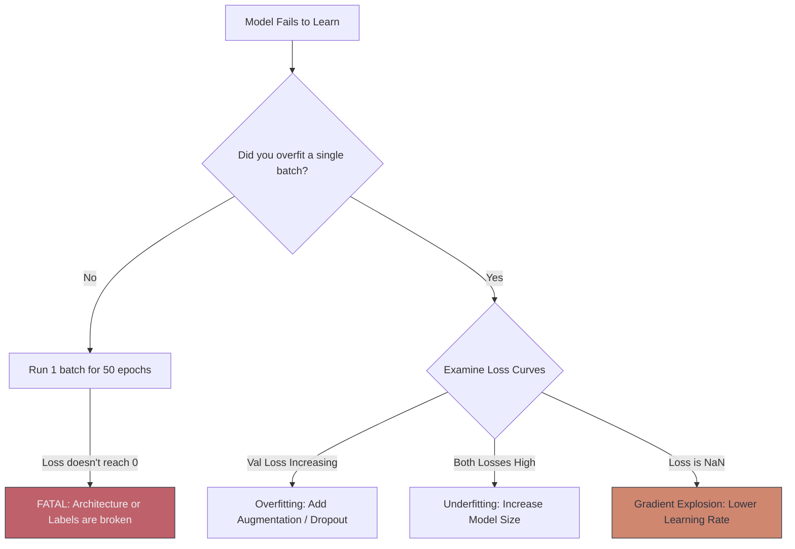

# 🐛 CNN Debugging & Best Practices

> **Difficulty**: ⭐⭐⭐⭐☆ Advanced | **Prerequisites**: CNN Training Pipeline | **Estimated Reading Time**: 30 Minutes

---

## 📋 Table of Contents
1. [What Problem Does This Solve?](#1-what-problem-does-this-solve)
2. [Intuition](#2-intuition)
3. [Core Mechanics (Overfitting vs. Underfitting)](#3-core-mechanics-overfitting-vs-underfitting)
4. [Algorithm Workflow (The Debugging Checklist)](#4-algorithm-workflow-the-debugging-checklist)
5. [Visual Explanation](#5-visual-explanation)
6. [Implementation Concept](#6-implementation-concept)
7. [Failure Cases](#7-failure-cases)
8. [What's Next?](#8-whats-next)

---

## 1. What Problem Does This Solve?

In traditional software engineering, if your code has a bug, it throws an error and crashes. In Deep Learning, if your model has a bug, *it will run perfectly fine silently*. The loss might decrease, the progress bar will move, but the final model will perform terribly in the real world.

**CNN Debugging** solves the problem of diagnosing "Silent Failures" (like data leakage, vanishing gradients, or class imbalance) by establishing strict mathematical and procedural checks before, during, and after training.

---

## 2. Intuition

### 🟢 Beginner
Imagine you are a doctor diagnosing a patient who says "I feel sick," but has no visible symptoms. You can't just guess what's wrong. You have to run tests: check their temperature, check their blood pressure, and look at their history. Debugging a CNN is exactly the same. We check the "Loss Curve" (temperature), we check the "Gradient Flow" (blood pressure), and we look at the raw data (history) to figure out why the network isn't learning.

### 🟡 Intermediate
The absolute Golden Rule of Deep Learning is: **Always overfit a single batch first.**
Before you train on 100,000 images, pass a single batch of 10 images into the network and train it for 50 epochs. Turn off all augmentation and regularization. The loss should drop to absolute zero. If it doesn't, your model architecture is physically broken, or your labels are scrambled.

### 🔴 Advanced
A common silent killer is **Data Leakage**. This happens when information from the Test Set accidentally leaks into the Training Set. For example, if you duplicate an image, and one copy ends up in the Train set and the other in the Test set, the model will falsely score 100% on the Test set because it memorized the image. Always split your Train/Test sets *before* applying any data generation, cropping, or feature extraction.

---

## 3. Core Mechanics (Overfitting vs. Underfitting)

You diagnose the health of a network by plotting the Training Loss and the Validation Loss on a line graph.

1. **Underfitting (High Bias)**: Both Train Loss and Val Loss are very high and not dropping. 
   - *Fix*: Your model is too small (needs more layers), or your Learning Rate is completely wrong (try `3e-4`).
2. **Overfitting (High Variance)**: Train Loss drops to near zero, but Val Loss shoots upwards. The model memorized the training data but fails on new data.
   - *Fix*: Apply heavy Image Augmentation, add Dropout layers, increase weight decay (L2 Regularization), or gather more data.
3. **The Sweet Spot**: Both Train Loss and Val Loss drop together and plateau at a low number. 

---

## 4. Algorithm Workflow (The Debugging Checklist)

When your CNN fails, follow this exact order of operations:
1. **Check the Data**: Print a batch of images to the screen directly from the DataLoader. Do the labels match the pictures? Are the images completely black because of a normalization error?
2. **Check the Shapes**: Add `print(x.shape)` inside the `forward()` pass of your model to trace the tensor dimensions.
3. **Overfit a Batch**: Train on 10 images. Verify loss drops to `0.0`.
4. **Check the Initialization**: Turn off the Loss function. The initial loss for a 10-class problem should be mathematically equal to $-\log(0.1) \approx 2.30$. If the initial loss is `15.0`, your weight initialization is completely broken.
5. **Learning Rate Range Test**: Slowly increase the learning rate from $10^{-6}$ to $1$ to find the steepest drop in loss.

---

## 5. Visual Explanation



---

## 6. Implementation Concept

How to cleanly visualize the data leaving the DataLoader (Step 1 of Debugging):

```python
import matplotlib.pyplot as plt
import torchvision
import numpy as np

def imshow_batch(dataloader, class_names):
    # Grab one batch of images and labels
    images, labels = next(iter(dataloader))
    
    # Make a grid from batch
    out = torchvision.utils.make_grid(images, nrow=4)
    
    # Un-normalize for matplotlib
    # Assuming standard ImageNet normalization
    mean = np.array([0.485, 0.456, 0.406])
    std = np.array([0.229, 0.224, 0.225])
    
    # Permute from PyTorch (C,H,W) to Matplotlib (H,W,C)
    img_np = out.numpy().transpose((1, 2, 0))
    img_np = std * img_np + mean
    img_np = np.clip(img_np, 0, 1)
    
    plt.imshow(img_np)
    plt.title([class_names[x.item()] for x in labels])
    plt.pause(0.001)

# Usage:
# imshow_batch(train_loader, ['Cat', 'Dog', 'Bird'])
```

---

## 7. Failure Cases

1. **The Class Imbalance Trap**: If your dataset has 990 pictures of cats and 10 pictures of dogs, the network will quickly realize that if it just guesses "Cat" 100% of the time, it will achieve 99% accuracy! The loss will look amazing, but the model is completely useless. *Fix: Use a Weighted Cross Entropy Loss or oversample the minority class.*
2. **Silent Normalization Bugs**: PyTorch expects input values between `[0, 1]` or standardized. OpenCV reads images in `[0, 255]`. If you forget `transforms.ToTensor()`, you will feed numbers 255 times larger than the network expects, blowing up the gradients to `NaN` instantly.

---

## 8. What's Next?

### Summary
Silent failures are the hardest part of Deep Learning. By rigorously visualizing the DataLoader output, overfitting single batches, and plotting train/validation loss curves, we can diagnose exactly why a network is failing.

### Why it matters
A Senior AI Engineer doesn't just build architectures; they know how to systematically debug them when they inevitably fail.

### Next Topic
We've debugged the training process, but what is the CNN actually "thinking" when it makes a prediction? Is it looking at the dog's face, or is it cheating by looking at the grass? We will explore this in **Visualizing CNN Predictions (Grad-CAM)**.

[← Image Augmentation](12-Image-Augmentation.md) | [Return to Module Index](./README.md) | [Next: Visualizing CNN Predictions →](14-Visualizing-CNN-Predictions.md)
