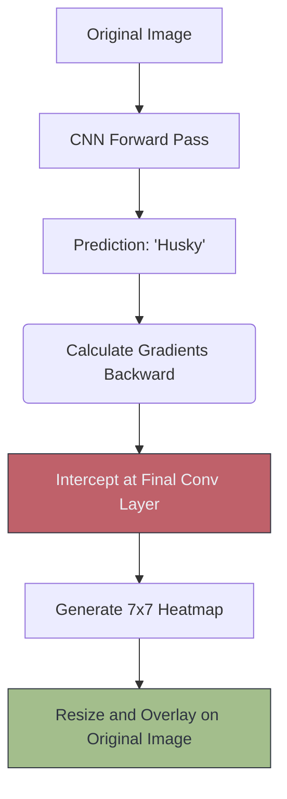

# 🕵️ Visualizing CNN Predictions (Grad-CAM)

> **Difficulty**: ⭐⭐⭐☆☆ Intermediate | **Prerequisites**: Convolution, CNN Debugging | **Estimated Reading Time**: 25 Minutes

---

## 📋 Table of Contents
1. [What Problem Does This Solve?](#1-what-problem-does-this-solve)
2. [Intuition](#2-intuition)
3. [Core Mechanics (Gradients to Pixels)](#3-core-mechanics-gradients-to-pixels)
4. [Algorithm Workflow (Grad-CAM)](#4-algorithm-workflow-grad-cam)
5. [Visual Explanation](#5-visual-explanation)
6. [PyTorch Implementation Concept](#6-pytorch-implementation-concept)
7. [Failure Cases](#7-failure-cases)
8. [What's Next?](#8-whats-next)

---

## 1. What Problem Does This Solve?

A CNN is famously described as a "Black Box." If a medical CNN predicts that an X-Ray shows cancer with 99% confidence, a doctor cannot legally or ethically accept that prediction unless the model can explain *why* it made that decision.

**Visualizing CNN Predictions** (Explainable AI / XAI) solves the Black Box problem by mathematically reverse-engineering the neural network to highlight the exact pixels in the image that caused the model to make its final prediction.

---

## 2. Intuition

### 🟢 Beginner
Imagine you take a multiple-choice test, and the teacher asks you to highlight the sentence in the textbook that gave you the answer. Grad-CAM (Gradient-weighted Class Activation Mapping) is the computer doing exactly this. It takes the original image and overlays a "Heatmap" on top of it. Red areas mean "I looked heavily at these pixels to make my guess," and blue areas mean "I ignored these pixels."

### 🟡 Intermediate
How does it know where to look? It uses the gradients. During the backward pass, if changing a specific pixel in the final convolution layer causes a massive change in the prediction for "Dog," that means that specific pixel is incredibly important for the "Dog" class. We calculate the gradients of the target class flowing backward into the final Convolutional feature map.

### 🔴 Advanced
Why the *final* Convolutional layer? 
Early convolution layers contain high spatial resolution but low semantic meaning (just random edges). Dense layers at the end have high semantic meaning (they know it's a dog) but completely destroy spatial resolution. 
The final Convolution layer is the perfect sweet spot: it still has its 2D shape (e.g., $7 \times 7$), but its filters represent high-level semantic objects (like a snout or an ear). By analyzing this specific layer, we get the best of both worlds.

---

## 3. Core Mechanics (Gradients to Pixels)

**The Grad-CAM Math**
1. We compute the gradient of the score for class $c$ (e.g., "Cat") with respect to the feature maps $A^k$ of a convolutional layer.
2. These gradients flowing back are global-average-pooled to obtain the neuron importance weights $\alpha_k^c$:
   $$ \alpha_k^c = \frac{1}{Z} \sum_i \sum_j \frac{\partial Y^c}{\partial A_{i,j}^k} $$
3. We perform a weighted combination of forward activation maps, followed by a ReLU (to only keep features that have a positive influence on the class):
   $$ L_{\text{Grad-CAM}}^c = ReLU\left(\sum_k \alpha_k^c A^k\right) $$

---

## 4. Algorithm Workflow (Grad-CAM)

1. Load a pre-trained CNN (like ResNet-50).
2. Feed an image of a dog forward through the network.
3. Get the raw prediction score for the "Dog" class.
4. Call `.backward()` on *only* the "Dog" class score.
5. Intercept the gradients as they flow through the final `Conv2d` layer using PyTorch Hooks.
6. Multiply the forward feature maps of that layer by the intercepted gradients.
7. Resize the resulting $7 \times 7$ heatmap back to the original $224 \times 224$ image size.
8. Overlay it as a red/blue colormap on the original photo.

---

## 5. Visual Explanation



---

## 6. PyTorch Implementation Concept

Using the popular `pytorch-grad-cam` library abstracts away the intense hook-management math:

```python
from pytorch_grad_cam import GradCAM
from pytorch_grad_cam.utils.image import show_cam_on_image
from torchvision.models import resnet50
import cv2
import numpy as np

# 1. Load model and choose the target layer (the final Conv block)
model = resnet50(pretrained=True)
target_layers = [model.layer4[-1]] 

# 2. Initialize GradCAM
cam = GradCAM(model=model, target_layers=target_layers, use_cuda=False)

# 3. Load and prepare image (assumes rgb_img is a 0-1 float numpy array)
input_tensor = ... # Standard PyTorch preprocessing

# 4. Generate the heatmap for the highest scoring class
grayscale_cam = cam(input_tensor=input_tensor)[0, :]

# 5. Overlay the heatmap on the original image
visualization = show_cam_on_image(rgb_img, grayscale_cam, use_rgb=True)

# visualization is now a NumPy array you can plot with matplotlib!
```

---

## 7. Failure Cases

1. **The Clever Hans Effect**: A famous real-world failure occurred when a CNN was trained to detect COVID-19 in lung X-Rays. The model achieved 98% accuracy. But when engineers ran Grad-CAM, the heatmap didn't highlight the lungs at all. It highlighted a text watermark ("Portable X-Ray Machine") in the corner. The model realized that only the sickest bed-ridden patients used the portable machine, so it just learned to read the text instead of looking at the lungs! Grad-CAM saved them from deploying a fatally flawed model.
2. **Resolution Limits**: Because Grad-CAM generates the heatmap from the final Conv layer (which is heavily compressed, e.g., $7 \times 7$), it is inherently blurry. It cannot highlight a perfectly sharp border around an object.

---

## 8. What's Next?

### Summary
Grad-CAM allows us to peer inside the "Black Box" of a CNN. By multiplying the forward activations of the final convolution layer by the backward-flowing gradients, we can generate a heatmap that proves exactly what the network was looking at when it made its decision.

### Why it matters
In regulated industries like Healthcare, Finance, and Autonomous Driving, Explainable AI (XAI) is not just a nice-to-have; it is a strict legal requirement.

### Next Topic
We have spent this entire module determining *What* is in an image (Classification). But what if we need to know exactly *Where* it is? We will step into the next evolution of Computer Vision in **Introduction to Object Detection**.

[← CNN Debugging](13-CNN-Debugging-And-Best-Practices.md) | [Return to Module Index](./README.md) | [Next: Intro to Object Detection →](15-Introduction-To-Object-Detection.md)
